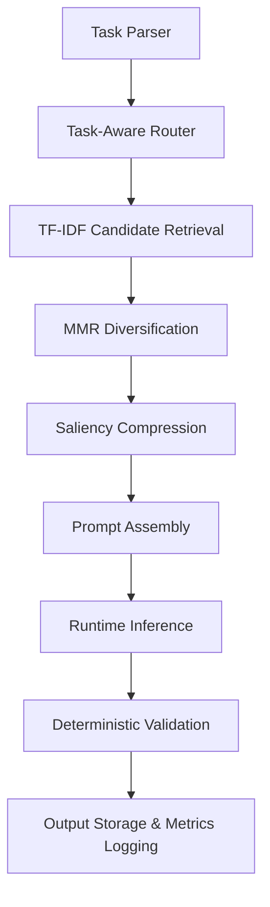

# COG-6 Orchestration Framework

COG-6 is a modular inference-time In-Context Learning (ICL) orchestration framework designed specifically for small language models (SLMs). It operates as a deterministic overlay on top of standard benchmark substrates (such as OpenSeek), focusing on signal density and contextual optimization rather than parameter scale.

## The Problem
Standard long-context ICL pipelines generally inject few-shot examples using simple static slices ($K$-shot limit) or basic nearest-neighbor dense retrieval. When applied to 3B-8B parameter models, these contexts frequently suffer from:
1. **Redundancy:** Similar lexical patterns flood the KV cache without teaching the model new structural variations.
2. **Noise Bleed:** Grammatical filler, URLs, and artifacts consume precious tokens.
3. **Open-Loop Failures:** Models frequently hallucinate outputs or break format constraints when faced with complex long contexts, resulting in failed benchmarks.

## The COG-6 Solution
COG-6 mitigates these issues dynamically via mathematically rigorous retrieval, structural pruning, and deterministic validation—enabling models to maximize contextual utility with zero external ML dependencies.

### Architecture Flow


```mermaid
graph TD;
    A[Task Parser] --> B[Task-Aware Router];
    B --> C[TF-IDF Candidate Retrieval];
    C --> D[MMR Diversification];
    D --> E[Saliency Compression];
    E --> F[Prompt Assembly];
    F --> G[Runtime Inference];
    G --> H[Deterministic Validation];
    H --> I[Output Storage & Metrics Logging];
```

## Core Modules
- **Adaptive TF-IDF Retrieval:** Pre-computes Document Frequencies across the candidate pool and executes weighted retrieval to bypass stop-word pollution.
- **Maximal Marginal Relevance (MMR) Diversification:** Ranks candidates by penalizing them for overlapping too heavily with already-selected examples, dynamically widening the structural permutations in the prompt.
- **Saliency Compression:** Sweeps the selected context blocks using deterministic regex passes to prune @mentions, URLs, tokenizer artifacts, and punctuation trails, keeping context dense.
- **Reflective Validator:** Attempts zero-shot deterministic salvage on chatty SLM hallucinations by pattern-matching valid labels before triggering an expensive repair inference.

## Benchmark Execution

### Setup
COG-6 currently interfaces with Ollama natively, or vLLM via the FlagScale abstraction.

1. Ensure Python 3.10+ is installed.
2. Initialize an Ollama runtime serving `qwen2.5:3b` at `http://localhost:11434/api/generate` (or update `cog6/runtime/router.py` to point to a vLLM `flagscale` endpoint).
3. The OpenSeek benchmark JSON sets must reside in `openseek/competition/LongContext-ICL-Annotation/data/`.

### Running the Orchestrator
To execute the framework in **Baseline Mode** (Standard K-shot injection with no orchestration):
```bash
python run_cog6.py --mode baseline --task openseek-5
```

To execute the framework in **COG-6 Mode** (Full orchestration stack active):
```bash
python run_cog6.py --mode cog6 --task openseek-5
```

### Analyzing Results
You can automatically run the full suite and compare overlap/consistency by using the experimental benchmark scripts:
```bash
python experiments/benchmark_runner.py
python experiments/output_analysis.py
```

All predictions are incrementally checkpointed to the `outputs/` directory in standard JSONL format. Telemetry regarding token reduction and latencies is exported to `experiments/run_metrics.json`.
