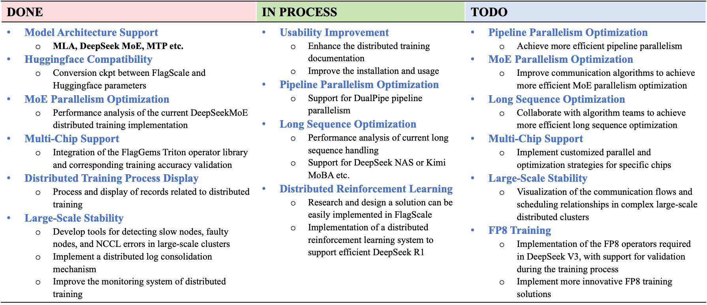

<div align="center">
  
  <hr>
  <div align="center" style="line-height: 1;">
    <a href="https://openseek.baai.ac.cn/"></a>
    <a href="https://huggingface.co/collections/BAAI/openseek-67b6f47eea718e4e5d2c255a"></a>
    <a href="https://discord.gg/dPKWUC7ZP5"></a>
    <a href="https://github.com/FlagAI-Open/OpenSeek/blob/main/wechat.png?raw=true"></a>
    <br>
    <a href="https://github.com/FlagAI-Open/OpenSeek/blob/main/LICENSE"></a>
    <a href="https://github.com/FlagAI-Open/OpenSeek/stargazers"></a>
    <a href="https://github.com/FlagAI-Open/OpenSeek/network"></a>
    <a href="https://github.com/FlagAI-Open/OpenSeek/issues"></a>
    </div>
</div>

<div align="center">

OpenSeek is dedicated to uniting the global open-source community to drive collaborative innovation in algorithms, data, and systems, with the goal of developing next-generation models. 

English| [简体中文](README_zh.md)


</div>

# 📌 Project Overview
OpenSeek is an open source project initiated by the Beijing Academy of Artificial Intelligence (BAAI), aiming to unite the global open source communities to drive collaborative innovation in algorithms, data and systems to develop next-generation models that surpass DeepSeek. Drawing inspiration from large model initiatives like Bigscience and OPT, the project is dedicated to building an independent open source algorithmic innovation system. Since the open sourcing of the DeepSeek model, academia has seen numerous algorithmic improvements and breakthroughs, but these innovations often lack complete code implementations, necessary computational resources, and high-quality data support. The OpenSeek project aims to explore high-quality dataset construction mechanisms through uniting the open source community, promote open sourcing of the entire large model training pipeline, build innovative training and inference code to support various AI chips besides Nvidia, and promote independent technological innovation and application development.

**Objectives of OpenSeek:**
- **Advanced data technology**: Address the challenge of acquiring high-quality data.
- **Multiple AI devices support**: Reduce dependency on specific chips and improve model universality and adaptability.
- **Standalised LLM training baseline**: Promote independent algorithmic innovation and technology sharing through open source collaboration.

**Project:** https://github.com/orgs/FlagAI-Open/projects/1

## 📁 Project Structure

The OpenSeek project is organized into several key directories, each serving a specific purpose in the LLM training and evaluation pipeline.

### Directory Tree

```
OpenSeek/
├── stage1/                      # 🧠 Stage 1: Core OpenSeek modules
│   ├── algorithm/               #   Algorithm innovations and experiments
│   │   ├── hparam_exp/          #     Hyperparameter optimization experiments
│   │   └── mtp_exp/             #     Multi-task Pretraining (MTP) experiments
│   ├── data/                    #   Data processing and dataset tools
│   │   └── cci4_0/              #     CCI4.0-M2 dataset processing pipeline
│   ├── system/                  #   System-level optimizations
│   └── competition/             #   Competition-related code
│
├── openseek/                    # 🧠 OpenSeek Python package
│   └── README.md                #   Package documentation
│
├── configs/                     # ⚙️ Training and experiment configurations
│   ├── OpenSeek-Small-v1-Baseline/  # Baseline model configs
│   └── OpenSeek-Small-v1/           # Production model configs
│
├── examples/                    # 📝 Example code and tutorials
│   ├── baseline/                #   Baseline training example
│   │   ├── setup.sh             #     Environment setup script
│   │   ├── run_exp.sh           #     Training script
│   │   └── README.md            #     Usage documentation
│   ├── nanochat_exp/            #   nanochat integration example
│   │   ├── dataset.py           #     Dataset conversion utilities
│   │   ├── dataloader.py        #     Data loader for nanochat
│   │   └── README.md            #     Usage documentation
│   └── data_mix_exp/            #   Data mixture experiments example
│       ├── config_deepseek_v3_16b.yaml  #     Experiment configuration
│       ├── train_deepseek_v3_16b.yaml   #     Training configuration
│       └── README.md            #     Usage documentation
│
├── docs/                        # 📚 Documentation and guides
│   ├── README_CCI4.0_M2_V1.md      # CCI4.0 dataset documentation
│   ├── README_OPENSEEK_SMALL_V1.md  # Model documentation
│   ├── distributed_training.md      # Distributed training guide
│   ├── algorithm_exp.md             # Algorithm experiments guide
│   └── ...                          # More documentation files
│
├── evaluation/                  # 📊 Model evaluation scripts and tools
│   ├── lighteval/               #   LightEval evaluation framework
│   ├── lm_eval/                 #   Language model evaluation
│   ├── qwen_eval/               #   Qwen-style evaluation
│   ├── adv-reasoning-eval/      #   Advanced reasoning evaluation
│   └── perf/                    #   Performance benchmarking scripts
│       ├── run_latency.sh       #     Latency benchmarking
│       └── run_throughput.sh   #     Throughput benchmarking
│
├── utils/                       # 🔧 Utility scripts and tools
│   ├── hf_utils/                #   HuggingFace utilities and model implementations
│   │   ├── deepseek_v3/         #     DeepSeek V3 model code
│   │   ├── aquila/              #     Aquila model code
│   │   └── tokenizer/           #     Tokenizer implementations
│   ├── convert_deepseek_v3_ckpt.sh  # Checkpoint conversion script
│   └── preprocess_data_args.py  # Data preprocessing utilities
├── docker/                      # 🐳 Docker configuration files
└── figs/                        # 🖼️ Figures and images for documentation
    ├── exp/                     #   Evaluation experiment result images
    └── ...                      #   Other documentation figures
```

### Key Directories Overview

| Directory | Purpose | Key Contents |
|-----------|---------|--------------|
| **`stage1/`** | Stage 1: Core modules organized by function | Algorithm experiments, data processing, system optimizations |
| **`stage1/algorithm/`** | Algorithm innovations | Hyperparameter tuning, MTP experiments |
| **`stage1/data/`** | Data processing | CCI4.0 dataset pipeline and processing tools |
| **`stage1/system/`** | System optimizations | Distributed training, performance improvements |
| **`openseek/`** | Legacy package docs | Reference notes for the historical Python package layout |
| **`examples/baseline/`** | Baseline training example | Standardized training scripts and setup |
| **`examples/nanochat_exp/`** | nanochat integration example | Dataset conversion, data loader for nanochat framework |
| **`examples/data_mix_exp/`** | Data mixture experiments | Configuration and scripts for data mixture strategy experiments |
| **`configs/`** | Training configurations | YAML configs for different model variants |
| **`docs/`** | Documentation | Guides, FAQs, experiment results, dataset docs |
| **`evaluation/`** | Model evaluation | Multiple evaluation frameworks (LightEval, lm_eval, etc.) |
| **`evaluation/perf/`** | Performance benchmarking | Latency and throughput benchmarking scripts |
| **`utils/`** | Utility scripts and tools | Checkpoint conversion, data preprocessing, HuggingFace utilities |
| **`utils/hf_utils/`** | HuggingFace utilities | Model implementations and utilities compatible with HuggingFace |

### Quick Navigation

- **Getting Started**: See [Getting Started](#-getting-started) section
- **Data Processing**: Check `stage1/data/README.md` and `docs/README_CCI4.0_M2_V1.md`
- **Training**: See `examples/baseline/README.md` and `docs/distributed_training.md`
- **Evaluation**: See `evaluation/README.md`
- **Configuration**: See `configs/README.md` 

**Acknowledgments & Contribution Guidelines**

Thanks to FlagScale team for their support for OpenSeek Training. 

- *For system-related improvements*
Please report framework-specific issues to [FlagScale's GitHub Issues](https://github.com/FlagOpen/FlagScale/issues). Code contributions should be submitted via Pull Requests (PRs) to the [FlagScale](https://github.com/FlagOpen/FlagScale).

- *For data & algorithm improvements*
Discussions of dataset implementations, training optimizations, and experimental configurations in [here](https://github.com/FlagAI-Open/OpenSeek/issues).

For detailed information on how to contribute, please refer to our [Contribution Guide](CONTRIBUTING.md). Feel free to contact us.  [[Discord channel](https://discord.gg/dPKWUC7ZP5)]
<div align="center">
  
</div>


# 📢 News
- 🔥[05/06/2025] **Data group**-release bilingual pretrainning dataset CCI4.0-M2-V1 <u>*[[readme](docs/README_CCI4.0_M2_V1.md)]*</u>, **Algo group**-release the pretrained model OpenSeek-Small V1 <u>*[[readme](docs/README_OPENSEEK_SMALL_V1.md)][[download](docs/OpenSeek-Small_V1_download_link)]*.</u>
- 🔥[03/20/2025] #4 online meetup 19:00-20:00 :  [[screen recording]](https://meeting.tencent.com/crm/NL4rAjg489)
- 🔥[03/20/2025] #3 online meetup 19:00-20:00 ：[[screen recording]](https://meeting.tencent.com/crm/NXwDAyLG59)
- 🔥[03/06/2025] #2 online meetup 19:00-20:00 ：[[screen recording]](https://meeting.tencent.com/crm/2pxo8BBDb7)
- 🔥[02/25/2025] #1 online meetup 18:00-19:00 ：[[screen recording]](https://meeting.tencent.com/v2/cloud-record/share?id=e188482b-0105-43f9-b8e7-cf5f1e4d136b&from=3&is-single=false&record_type=2)
- 🔥[02/13/2025] Completed experiments on OpenSeek-PT-1T dataset.

# 🚗 Getting Started

## What is Baseline
The openseek-baseline is used as the baseline for [PAZHOU algorithm competition](https://www.aicompetition-pz.com/topic_detail/25) and also used to evaluate the PRs in openseek. Openseek-baseline is a standarlized LLM training and evaluating pipline, it consist of a [100B dataset](#preparing-the-data), a [training code](#running-the-baseline), [wandb](https://wandb.ai/openseek-team/OpenSeek-Small-v1-Baseline), [checkpoint](https://huggingface.co/BAAI/OpenSeek-Small-v1-Baseline) and [evaluation results](https://huggingface.co/BAAI/OpenSeek-Small-v1-Baseline#evalation). 

## Preparing Environment
1. Clone this repository and enter the directory:
```shell
git clone https://github.com/FlagAI-Open/OpenSeek.git
cd OpenSeek
```
2. Install the [FlagScale](https://github.com/FlagOpen/FlagScale) dependencies:
- Using Docker (Recommend)
```shell
# Pull images
docker pull openseek2025/openseek:flagscale-20250527

# Clone the repository
git clone https://github.com/FlagOpen/FlagScale.git
```

- From Source:
```shell
# Clone the repository
git clone https://github.com/FlagOpen/FlagScale.git

# Install the requirements
./install/install-requirements.sh --env train
```

- For more details, see [FlagScale](https://github.com/FlagOpen/FlagScale) or [readme](docs/FlagScale_Usage.md).

## Preparing the data
Download the [OpenSeek-Pretrain-100B](https://huggingface.co/datasets/BAAI/OpenSeek-Pretrain-100B) dataset to local dir named **OpenSeek-Pretrain-100B** in OpenSeek.

**You can also run the following script to build up your project environment after you have built python environment and activated it:**

```
bash examples/baseline/setup.sh
```

## Running the Baseline
Make sure you have completed the environment installation and configuration as outlined in the [previous section](#preparing-environment) and your **OpenSeek** folder should be like this:

```
OpenSeek
├── OpenSeek-Pretrain-100B (Dataset directory for downloaded datasets.)
├── FlagScale (FlagScale directory cloned from GitHub.)
├── OpenSeek-Small-v1-Baseline (Experiment directory will be created automatically and contains logs and model checkpoints etc.)
├── ...
```

Next, you can run the baseline with a simple command:
```shell
bash examples/baseline/run_exp.sh start
```

> ### How to Verify Your Program is Running Correctly
>
> After executing `bash examples/baseline/run_exp.sh start`, you can follow these steps to confirm your program is running as expected.
>
> 1. navigate to the **OpenSeek root directory**. You'll notice a new folder named `OpenSeek-Small-v1-Baseline` has been created in this directory. This is the **log dir.**
>
> 2. You can view the program's logs and error messages by opening `OpenSeek-Small-v1-Baseline/logs/host_0_localhost.output` with a text editor like `vim`:
>
>    ```
>    vi OpenSeek-Small-v1-Baseline/logs/host_0_localhost.output
>    ```
>
> 3. If the program is running correctly, after approximately **1-2 minutes**, you can execute the following command from the **OpenSeek root directory**:
>
>    ```
>    grep "iteration.*consumed samples" OpenSeek-Small-v1-Baseline/logs/host_0_localhost.output
>    ```
>
>    If the output resembles the example below, it indicates that your program has successfully started:
>
>    ```
>    [default0]: [2025-05-27 15:23:07] iteration        1/    24000 | consumed samples:          1024 | elapsed time per iteration (ms): 271607.0 | throughput per GPU (TFLOP/s/GPU): 40.4 | learning rate: 1.500000E-06 | global batch size:  1024 | lm loss: 1.192634E+01 | load_balancing_loss: 1.041994E+00 | loss scale: 1.0 | grad norm: 5.960 | num zeros: 0.0 | params norm: 238.330 | number of skipped iterations:    0 | number of nan iterations:    0 |
>    ```

# 📚 Data Group

Target: We construct a large-scale multilingual pretraining dataset exceeding 10 trillion tokens, covering a diverse range of languages and domains. To further improve data quality and training efficiency, we incorporate data synthesis techniques, such as chain-of-thought generation and instruction tuning. 


## Stage1 results

[CCI4.0-M2 V1](docs/README_CCI4.0_M2_V1.md) is a large-scale bilingual pre-training dataset engineered for superior data quality and diverse human-like reasoning trajector:

|| CCI4.0-M2-Base v1 | CCI4.0-M2-CoT v1 |
|--|--|--|
|Download| [huggingface](https://huggingface.co/datasets/BAAI/CCI4.0-M2-Base-v1) | [huggingface](https://huggingface.co/datasets/BAAI/CCI4.0-M2-CoT-v1) |
|Notes| 5.2TB Chinese webpage, 22TB English webpage, some data released in [CCI4.0-M2-Extra](https://huggingface.co/datasets/BAAI/CCI4.0-M2-Extra-v1) due to the license concern. | 430 million CoT sample covers math, code, arxiv, wiki and webpage|


In addition to the main suite, [OpenSeek-Pretrain-100B](docs/100B_pipeline.md) was randomly sampled from the CCI4.0-M2 v1 datasets. This 100B data subset is specifically used for experimental training purposes.

Your can find more details about data [here](docs/README_CCI4.0_M2_V1.md).


# 🚀 Algorithm Group
Target: Our study focuses on three key aspects of large-scale language model training: data mixing, hyperparameter tuning, and reinforcement learning (RL). We systematically explore data composition strategies to balance quality and diversity across domains, investigate the impact of hyperparameter configurations on training stability and convergence, and incorporate RL-based optimization to further align model behavior with task-specific objectives. 

## Stage1 results
| | OpenSeek-Small-v1-Baseline | OpenSeek-Small-v1 |
|--|--|--|
|Parameter size| 1.4B (0.4B active) | 1.4B (0.4B active) |
|Number of tokens|100B|720B|
|Checkpoint|[huggingface](https://huggingface.co/BAAI/OpenSeek-Small-v1-Baseline)|[huggingface](https://huggingface.co/BAAI/OpenSeek-Small-v1)|
|Wandb|[wandb](https://wandb.ai/openseek-team/OpenSeek-Small-v1-Baseline)|[wandb](https://wandb.ai/openseek-team/OpenSeek-Small-v1)|
|Evaluation|[evaluation](https://huggingface.co/BAAI/OpenSeek-Small-v1-Baseline#evalation)|[evaluation](https://huggingface.co/BAAI/OpenSeek-Small-v1#benchmark-performance)|
|Experiment Config|[Experiment Config](configs/OpenSeek-Small-v1-Baseline/config_deepseek_v3_1_4b.yaml)|[Experiment Config](configs/OpenSeek-Small-v1/config_deepseek_v3_3b_1330B.yaml) |
|Training config| [Training Config](configs/OpenSeek-Small-v1-Baseline/train/train_deepseek_v3_1_4b.yaml)|[Training Config](configs/OpenSeek-Small-v1/train/train_deepseek_v3_3b_1330B.yaml)|
|Notes|This model is open-sourced as a baseline for future experiments in areas such as dataset construction, algorithmic strategies, and parallel training frameworks.|OpenSeek-Small v1 is the first-stage production model from the OpenSeek project, designed as a foundation for next-generation language models. |

> The usage and difference of Experiment Config and Training Config are explained [here](configs/README.md).

# 🖥️ System Group
Target：With support from the open-source community, flagscale aims to reproduce DeepSeek V3 & R1’s distributed training system, ensuring stable and performant end-to-end training.

## Stage1 results
<div align="center">
  
</div>

# Experiments & Advanced usage
- [distributed training](docs/distributed_training.md)
- [data mixture experiment](docs/data_mixture_exp.md)
- [data mixture experiment results](docs/data_mixture_exp_results.md)
- [algorithm experiment](docs/algorithm_exp.md)
- [algorithm experiment results](docs/algorithm_exp_results.md)
- [system experiment](docs/system_exp.md)

# 📜 License Agreement
- Apache 2.0

