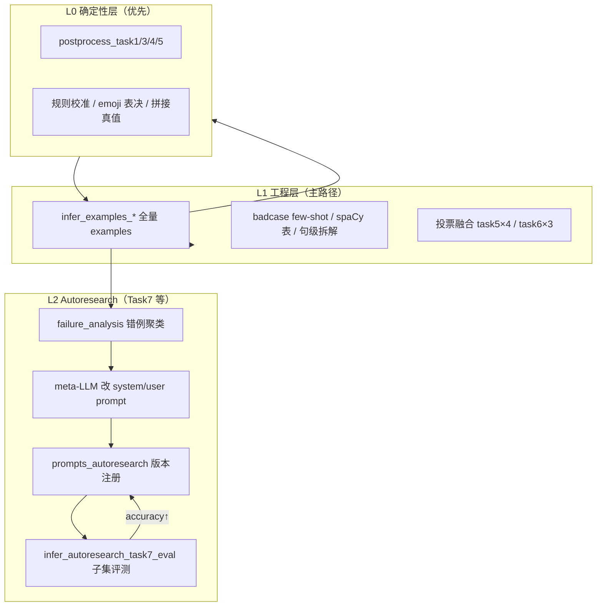
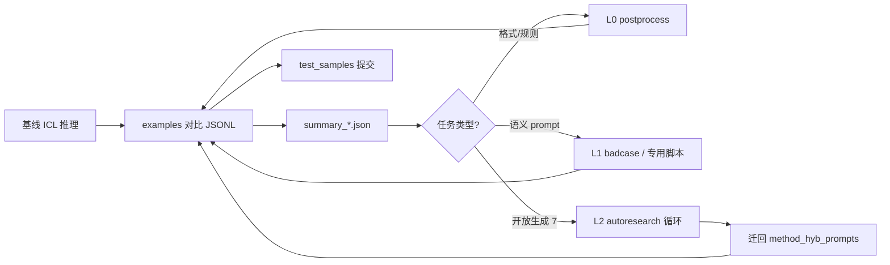

# 超长长上下文场景中LLM自动数据标注挑战赛

---

## 消息
<!-- BEGIN NEWS -->
- **[2026-01-20] `发布`：** 赛事信息已在 **Kaggle** 正式上线。详情见：[FlagOS Open Computing Global Challenge](https://www.kaggle.com/competitions/flag-os-open-computing-global-challenge).
- **[2026-01-06] `发布`：** 由 **众智 FlagOS 社区**、**北京智源人工智能研究院（BAAI）** 与 **CCF ODTC** 联合主办的综合性大赛 **FlagOS 开放计算全球挑战赛** 正式发布。详情见：  
  [FlagOS开放计算全球挑战赛- AI赛事通 | 数据算法赛](https://www.competehub.dev/zh/competitions/modelscope180)
<!-- END NEWS -->

---


## 快速开始
### 1. 环境

```bash
openai
torch
flagScale
```

### 2. 下载模型权重
```bash
hf download Qwen/Qwen3-4B --local-dir Qwen3-4B
# or
modelscope download --model Qwen/Qwen3-4B 
```
### 3. 长文本配置
在`Qwen3-4B/config.json`将原有配置替换为：
```json
"rope_scaling": {
    "rope_type": "yarn",
    "factor": 4.0,
    "original_max_position_embeddings": 32768
}
```
### 4. 模型部署

请根据实际需求，配置 `llm_config.yaml` 文件。启动配置  

```bash
cd FlagScale
python run.py --config-path .. --config-name llm_config action=run
```

在模型服务启动后，可通过以下方式测试本地 API：

```bash
python api_test.py
```

如需停止服务，请执行：

```bash
python run.py --config-path .. --config-name llm_config action=stop
```

### 5. 运行/改进基线方法（Baseline）

启动如下命令开始模型标注
```bash
python main.py
```

实现新的标注方法，请修改`method.py`文件。你可以在该文件中：  
* 定义新的指令模板、
* 定义新的上下文示例选择策略
* 定义新的模型推理、标注方案
* 添加自定义后处理逻辑

---

## 实验记录与准确率优化报告

> **完整技术报告**（含 `examples/` 下各实验 JSONL 实测数据、badcase 与 Autoresearch 方法论）：见 **[TECH_REPORT_cn.md](TECH_REPORT_cn.md)**。

本文档汇总 Task 1–8 在 **examples 集**（带金标）上的迭代路径、对比文件与当前最佳准确率。评测口径统一为 JSONL 字段 `is_match`（`model_output` 与 `expected_output` 一致）；Task 8 另有执行器判据（见下文）。

### 总览（当前最佳 / 提交侧参考）

| Task | 任务简述 | examples 最佳准确率 | 主要手段 | 对比/汇总文件 |
|------|----------|---------------------|----------|----------------|
| **1** | 最近整数对最小差 | **≈97.9%** → 后处理可达 **≈99.95%** | main1 ICL + `postprocess_task1_outputs` 清洗 `<label>` | `examples_main1_ranktest/.../openseek-1-examples-main1-compare.jsonl` |
| **2** | 名词/动词计数 | **≈86.6%**（v3 零样本）；prompt2 **≈89.2%** | spaCy 词性说明 + 零样本专用 prompt | `examples_main1/summary_main1_task2_spacy_v3_zeroshot.json` |
| **3** | Collatz 列表变换 | **≈98.9%** → 后处理 **≈100%** | ICL + `postprocess_task3_outputs` 抽列表 | `examples/openseek-3-examples-compare.jsonl` |
| **4** | 字符串拼接 | **100%**（checked） | 规则后处理：用 `input` 列表拼接覆盖 | `examples_main1_task24/...-checked.jsonl` |
| **5** | 推文悲伤二分类 | **≈78.9%**（v2）；投票 **≈75.9%**；提交参考 **≈79%** | badcase few-shot + emoji/hashtag + 文本校准后处理 | `examples_v2/`、`examples/summary_task5opt*.json` |
| **6** | MNLI 同体裁 | **≈83.1%**（v3 句级+后处理） | 句级 Y/N + v2/v3 后处理 + 三路投票融合 | `examples/summary_task6_v3.json` |
| **7** | Jeopardy 答案生成 | **≈37.8%**（stept）；v6 **≈36.2%** | 多版 prompt + 外循环审核 ReAct | `examples_task7/`、`examples/summary_task7opt*.json` |
| **8** | Triton 算子生成 | **≈74.5%**（thinking + `exec_dual_pass`） | v3 契约 + AST/ReAct + BM25 ICL | `examples_thinking/summary_task8opt.json` |

> **说明**：上表 examples 数与 test_samples（各 500，Task8 为 166）不同；test 侧无金标时以 examples 调参、test 提交。文末「复现命令」列出主要入口脚本。

### 整体解决方案：三层 + Autoresearch

本仓库采用 **「确定性后处理 → 人工/半自动 prompt 工程 → LLM 自主 prompt 优化」** 三层架构，由 `autoresearch_prompt.py` 在 **prompt 敏感且错例可解释** 的任务上闭合自动迭代环。



| 层级 | 适用任务 | 手段 | 典型收益 |
|------|----------|------|----------|
| **L0** | 1、3、4；5 部分 | 解析清洗、规则覆盖、emoji/正则 | 格式假阴性 → 近 100% |
| **L1** | 2、5、6、8 | 专用 prompt、ICL 检索、管线拆解、ReAct | 语义与结构错误 |
| **L2** | **7**（可扩 5） | `autoresearch_prompt.py` 闭环 | 开放式 Jeopardy prompt 迭代 |

#### Autoresearch 如何接入（`autoresearch_prompt.py`）

参照 [karpathy/autoresearch](https://github.com/karpathy/autoresearch)：**一条命令** 循环 `分析 → 提案 → 注册 → 子集评估 → 记录`，无需每轮人工改 prompt。

| 步骤 | 模块 | 说明 |
|------|------|------|
| 1. 评测 | `src/infer_autoresearch_task7_eval.py` | 固定 seed 抽 N 条 examples，输出带 `is_match` / `correct` 的 JSONL |
| 2. 分析 | `src/failure_analysis.py` | 聚类：`empty_or_unparseable`、`too_verbose`、`wrong_entity` 等 |
| 3. 提案 | meta-LLM（默认 DeepSeek） | 读当前 system/user + 每类 1 条错例，输出 `### SYSTEM` / `### USER` / `### DESCRIPTION` |
| 4. 注册 | 写入 `src/prompts_autoresearch.py` | 版本号递增，内存 `_REGISTRY` 同步 |
| 5. 日志 | `autoresearch/task7/experiments_log.tsv` | 每轮 accuracy、none_rate、keep/improved |

```bash
# 持续自主优化 Task7 prompt（默认 100 条/轮，最多 10 轮）
python autoresearch_prompt.py --continuous --max-iterations 10

# 从已有 compare 结果起跑（跳过 baseline）
python autoresearch_prompt.py --continuous \
  --results examples/openseek-7-examples-compare-task7opt-stept-prompt.jsonl

# 仅预览：分析 + 生成提案，不注册不评估
python autoresearch_prompt.py \
  --results examples/openseek-7-examples-compare-task7opt-v3.jsonl --dry-run
```

**与 L1 手工方案的关系**：

- **stept / v6**（`infer_examples_compare_task7_*`）：在全量 examples 上验证，准确率最高约 **37.8%**（stept）。
- **Autoresearch**：在 **子集** 上快速试错，收敛后再把最优 `prompts_autoresearch` 版本手工迁入 `method_hyb_prompts.register_task_prompt(7, ...)` 做全量复评。
- **v6 外循环审核** 与 autoresearch **可叠加**：autoresearch 改「静态模板」，v6 改「单条 ReAct」。

#### 各任务推荐路径（合并表）

| Task | L0 | L1 主手段 | L2 Autoresearch |
|------|----|-----------|-----------------|
| 1 | ✅ label 抽整数 | main1 ICL | 不必（已 98%+） |
| 2 | — | spaCy v3 零样本 | 可选（prompt 变体枚举） |
| 3 | ✅ 列表抽取 | ICL | 不必 |
| 4 | ✅ join 覆盖 | ICL | 不必 |
| 5 | ✅ emoji/text_calib | badcase 8-fs + hybrid + 投票 | 可扩：对 FP/FN 类自动改 task-specific 段 |
| 6 | — | 句级 + v2/v3 后处理 + 三路融合 | 不推荐（结构管线为主） |
| 7 | — | stept / v6 + hybrid ICL | **✅ 首选 autoresearch** |
| 8 | 执行器门控 | v3 契约 + ReAct + BM25 | 不推荐（代码生成，非纯 prompt） |

### 通用工作流（人工 + 自动）



1. **推理对比**：`src/infer_examples_*.py` → `openseek-{task}-examples-compare-*.jsonl`。
2. **指标汇总**：`summary*.json` 或 `_compute_metrics_from_jsonl`。
3. **错例驱动（L1）**：Task5 人工 curated `FIXED_TASK5_FS_SHOTS`；Task2 spaCy 表；Task6 句级拆解。
4. **自主 prompt（L2）**：`failure_analysis.analyze_results` + `autoresearch_prompt.py --continuous`。
5. **test 提交**：`infer_task*_test_samples*.py` → `outputs/` + `postprocess_*` / `run_*_vote*.sh`。

---

### Task 1：closest_integers

**任务**：给定整数列表，求任意两数最小绝对差，输出单个整数。

| 阶段 | 做法 | examples 准确率 |
|------|------|-----------------|
| 基线 | `infer_examples_main1.py` + `method_hyb` ICL | **97.93%**（5386/5500，`examples_main1_ranktest`） |
| 后处理 | `postprocess_task1_outputs.py`：剥 `<label>`、抽末位整数、`count_answer` | 理论 **≈99.95%**（114 错中约 111 为格式假阴性） |

**错例结论**（见历史分析 [task1/3 错例分析](0df3e1ce-70d3-4ff6-940f-737e01b6663c)）：

- **标签残留**（如 `5</label>`）：78%
- **空输出**（API/解析失败，多集中在文件末尾）：19%
- **真实算错**：仅 3 条

**关键文件**：`src/postprocess_task1_outputs.py`、`examples_main1_ranktest/examples_main1/openseek-1-examples-main1-compare.jsonl`

---

### Task 2：count_nouns_verbs

**任务**：按题干要求统计文本中名词或动词个数（整数）。

| 阶段 | 脚本 / 配置 | examples 准确率 |
|------|-------------|-----------------|
| 基线 main1 ICL | `infer_examples_main1.py` | **70.4%** |
| 独立 task2 v2/v3 | `infer_examples_main1_task2_v2.py` 等 | **69.8%–70.8%** |
| **spaCy v3 零样本** | `infer_examples_main1_task2_spacy_v3.py`：无 few-shot，题干内注入 Universal POS / `en_core_web_sm` 标签说明 | **86.58%** |
| spaCy v3 prompt2 | 枚举式输出约束变体 | **89.17%** |
| spaCy v2.1 | 早期 spaCy 提示 | **82.2%** |
| spaCy v5a（失败分支） | 过度约束枚举 | **46.6%**（负例，未采用） |

**优化要点**：

- 长上下文 ICL 对「数词性」帮助有限，**零样本 + 显式 POS 表** 更稳。
- 按题干解析「只数名词 / 只数动词」，prompt 分节避免混杂。
- 后处理：`postprocess_main1_task2_uppercase_rerun_spacy_v3.py` 处理大小写/重跑（辅助）。

**关键文件**：`src/infer_examples_main1_task2_spacy_v3.py`、`examples_main1/summary_main1_task2_spacy_v3_zeroshot.json`

---

### Task 3：collatz_conjecture

**任务**：对输入整数列表做 Collatz 规则变换，输出新列表。

| 阶段 | 做法 | examples 准确率 |
|------|------|-----------------|
| 基线 ICL | `infer_examples_compare.py`（task3） | **98.92%**（3954/3997） |
| 后处理 | `postprocess_task3_outputs.py`：处理 `[in] [out]` 复述、`<label>`、列表规范化 | **≈100%**（43 错均为格式/复述，无真实算错） |

**关键文件**：`src/postprocess_task3_outputs.py`、`examples/openseek-3-examples-compare.jsonl`

---

### Task 4：conala_concat_strings

**任务**：将 `input` 中的字符串列表无分隔拼接。

| 阶段 | 做法 | examples 准确率 |
|------|------|-----------------|
| 基线 ICL | main1 推理 | 接近全对 |
| **规则后处理** | `postprocess_task4_outputs.py`：若模型输出含空格或 ≠ `''.join(input)`，用拼接真值覆盖 | **100%**（2815/2815，`-checked`） |

**关键文件**：`src/postprocess_task4_outputs.py`、`examples_main1_task24/openseek-4-examples-main1-compare-checked.jsonl`

---

### Task 5：tweet sadness（SemEval 2018）

**任务**：判断推文作者是否悲伤（`Sad` / `Not sad`）。难点：emoji/ hashtag 干扰、假阳性（感激+😭、歌词、推广）与假阴性（平淡倒霉、口语双关）。

#### 准确率演进（examples，1899 条）

| 版本 | 配置摘要 | 准确率 |
|------|----------|--------|
| 基线 compare | 原始 `infer_examples_compare` | **≈74.1%**（1407/1899） |
| task5opt | 去偏置 prompt + hybrid 类平衡检索 + strip `#` | **75.09%** |
| emoji-off + striphash-on | 同上 + 推理内后处理 | **75.09%**（task5opt 同名配置） |
| examples_task5 / v2 | 迭代 emoji 与召回策略 | **78.15%** / **78.94%** |
| **四路投票** | strip×postemoji 四组合 + 多数票 | **75.93%**（`task5vote`，strip on + postemoji off） |
| fixed badcase 8-shot | 固定 8 条 curated few-shot，无检索 | **73.57%** |
| 中文 emoji 释义 | `--task5_emoji_mode zh` | **75.57%** |
| DeepSeek 8-fs + ret4 | 云端模型对照 | examples **68.6%** |

提交侧参考：**≈79%**（`test_samples` + 后处理，与 examples 分布略有差异）。

#### Badcase 分析与 prompt 优化

1. **错例统计**：对 `openseek-5-examples-compare-*.jsonl` 中 FP（预测 Sad、金标 Not sad）与 FN 聚类。
2. **固定 few-shot**（`infer_examples_compare_task5_fixed_badcase_fs.py` 中 `FIXED_TASK5_FS_SHOTS`，8 条）：
   - **假阳性**：中奖感激+😭、歌词式、愤怒吐槽非悲伤、推广/噪声英文等 → 金标 `Not sad`
   - **假阴性**：丢钥匙、被吵醒、口语 “want … so bad” 等 → 金标 `Sad`
3. **输入侧**：`--task5_strip_hashtag on`；`emoji_mode` off/alias/zh；可选中文 emoji 释义表。
4. **专用 prompt**：`method_task5.py` + `infer_examples_compare_task5.py`（类平衡 hybrid 检索）。

#### 后处理（`postprocess_task5_outputs.py`）

基于 `data/openseek-5_*.json` **原文** + examples 先验，可单独开关：

1. **normalize_task5_label**：从 `<label>` / 碎片抽 `Sad`|`Not sad`
2. **emoji 表决**：多 emoji 共现比例；单 emoji 高置信覆盖；感激语境下 😭 压 FP
3. **text_calib**：边界正则 + examples 短语挖掘 + **fp_suppress**（默认只把误判 Sad 改回 Not sad，面向 recall 偏高）

推荐组合（examples 召回向）：`--text-calib --strip-hashtag --prob-ge`

**投票**：`scripts/run_task5_vote_ensemble.py` 顺序跑四路 `infer_examples_compare_task5_vote_*`，再融合。

**关键文件**：

- 推理：`src/infer_examples_compare_task5.py`、`src/infer_examples_compare_task5_fixed_badcase_fs.py`
- 后处理：`src/postprocess_task5_outputs.py`、`src/task5_eval_emoji_postprocess_compare.py`
- 汇总：`examples/summary_task5opt.json`、`examples/summary_openseek-5-examples-compare-task5vote-*.json`

---

### Task 6：mnli_same_genre_classification

**任务**：判断两句是否同体裁（Y/N）。输入含 `Sentence 1/2` 与 `Genre`。

#### 准确率演进

| 阶段 | 做法 | examples 准确率 |
|------|------|-----------------|
| 基线 task6 | 整段 ICL | 较低 |
| **v2 句级** | 每句单独判 genre（`method_task6_v2.py`）再 AND | **≈69.0%**（base，`summary_task6_v3.json`） |
| **+ postprocess v2** | N+N 同领域补 Y；Y+N / N+Y 带上下文重判另一句 | 提升 |
| **+ postprocess v3** | 对仍为 N：语篇连贯判定，可选 `flip_gate=not_fiction` | **83.11%**（4571/5500） |
| 三路投票融合 | v2_baseline + taskdef_joint + pair_cross → `fuse_task6_vote.py` | test 侧见 `outputs/task6_vote_fusion/` |

**v2 后处理**（`postprocess_task6_v2.py`）：

- `sentence1_pred=N` 且 `sentence2_pred=N` → LLM 判是否同领域
- `Y+N` / `N+Y` → 以 Y 句为上下文重判另一句

**v3 后处理**（`postprocess_task6_v3.py`）：

- 仅当合成结果为 N：判两句是否同一语篇/对话；是则升为 Y
- `flip_gate`：`not_fiction` 等门控，减少 fiction 误翻转

**扩展管线**：`infer_task6_v2_vote_taskdef_joint.py`（任务定义联合）、`infer_task6_v2_vote_pair_cross.py`（交叉句对）、`scripts/run_task6_vote_fusion.py`。

**关键文件**：`src/infer_examples_compare_task6_v3.py`、`src/postprocess_task6_v2.py`、`src/postprocess_task6_v3.py`、`examples/summary_task6_v3.json`

---

### Task 7：jeopardy_answer_generation

**任务**：根据 Category + Clue 生成短答案（开放式匹配，准确率天然偏低）。

| 版本 | 做法 | examples 准确率 |
|------|------|-----------------|
| task7opt 基线 | `infer_examples_compare_task7.py` | **28.81%** |
| v3 | 提示迭代 | **31.10%** |
| v5 | 进一步约束输出 | **34.46%** |
| **stept prompt** | 系统式 step 模板 | **37.81%**（当前 L1 最高） |
| v6 auto-agent | 外循环审核 + ReAct（不用 gold 停机） | **36.17%** |
| **autoresearch vN** | `autoresearch_prompt.py` 自动改 system/user | 子集迭代，见 `autoresearch/task7/` |

**推荐组合方案**：

1. **L2**：`python autoresearch_prompt.py --continuous` 在 100–500 条子集上迭代 `prompts_autoresearch` 版本。
2. **L1 全量验证**：将最优版本迁入 `register_task_prompt(7, get_builder(7, best_v))`，跑 `infer_examples_compare_task7_v3.py` 或 stept 脚本。
3. **可选增强**：对难例启用 v6 外循环审核（`infer_examples_compare_task7_v6.py`），与静态 prompt 正交。

**Autoresearch 相关文件**：

- `autoresearch_prompt.py`（仓库根目录）
- `src/failure_analysis.py`、`src/prompts_autoresearch.py`、`src/infer_autoresearch_task7_eval.py`
- 产出：`autoresearch/task7/results_v*.jsonl`、`experiments_log.tsv`

**关键文件（L1）**：`src/infer_examples_compare_task7_v6.py`、`examples_task7/summary_task7opt_stept_prompt.json`

> 提交参考约 **28%**：开放式生成与评测归一化敏感；优先用 autoresearch 抬子集指标，再全量 stept/v6 定型后提交 test。

---

### Task 8：kernel_generation（Triton）

**任务**：根据自然语言指令生成可执行 Triton kernel + wrapper。

| 版本 | 判据 | examples 准确率 |
|------|------|-----------------|
| task8opt（早期） | 字符串匹配 | **0%**（未通过执行器） |
| **thinking + task8opt** | `exec_dual_pass`（参考与预测均执行通过） | **74.46%**（137/184） |
| **v3** | `exec_outcome_match` + AST 门控 + ReAct + BM25 ICL | 见 `infer_examples_compare_task8_v3.py` |

**v3 要点**（`infer_examples_compare_task8_v3.py`）：

1. **输出契约**：`<label>` 内完整可 `ast.parse` 的 Python，含 `@triton.jit` + 可调用 wrapper
2. **Thinking 剥离** + `_extract_code_candidate`
3. **AST 门控**：syntax / 无顶级 def → 触发 ReAct
4. **ReAct**：结构错误带行号；前向探针失败写入报错上下文
5. **ICL**：默认 `bm25_lexical`；可选 `bm25_llm` 精排带完整代码示例
6. 可选 `tensor_allclose` 数值探针

**关键文件**：`src/infer_examples_compare_task8_v3.py`、`src/task8_label_executor_eval.py`、`examples_thinking/summary_task8opt.json`

---

### 复现命令（节选）

```bash
# Task 1 后处理
python src/postprocess_task1_outputs.py --input examples_main1_ranktest/examples_main1/openseek-1-examples-main1-compare.jsonl --inplace

# Task 2 spaCy v3 零样本 examples
python src/infer_examples_main1_task2_spacy_v3.py --task_start 2 --task_end 2

# Task 3/4 后处理
python src/postprocess_task3_outputs.py --input examples/openseek-3-examples-compare.jsonl --inplace
python src/postprocess_task4_outputs.py --input examples_main1_task24/openseek-4-examples-main1-compare.jsonl

# Task 5：优化推理 + 后处理 + 投票
python src/infer_examples_compare_task5.py --task5_strip_hashtag on --task5_emoji_mode off
python src/postprocess_task5_outputs.py --input examples/openseek-5-examples-compare-task5opt-emoji-off-striphash-on.jsonl --text-calib
python scripts/run_task5_vote_ensemble.py

# Task 5：badcase 固定 few-shot
python src/infer_examples_compare_task5_fixed_badcase_fs.py --task5_shot_k 0

# Task 6：v3 + 投票融合（见 run.sh）
python src/infer_examples_compare_task6_v3.py --batch_size 16
python scripts/run_task6_vote_fusion.py

# Task 7：Autoresearch 自主 prompt 优化
python autoresearch_prompt.py --continuous --max-iterations 10
python src/infer_autoresearch_task7_eval.py --prompt-version 1 --max-samples 100 --seed 42

# Task 7 v6（全量 + 外循环审核）
python src/infer_examples_compare_task7_v6.py

# Task 8 v3
python src/infer_examples_compare_task8_v3.py --infer_split examples
```

### 对比结果文件索引

| Task | 推荐查看的 summary / compare |
|------|------------------------------|
| 1 | `examples_main1_ranktest/.../openseek-1-examples-main1-compare.jsonl` |
| 2 | `examples_main1/summary_main1_task2_spacy_v3*.json` |
| 3 | `examples/openseek-3-examples-compare.jsonl` |
| 4 | `examples_main1_task24/*-checked.jsonl` |
| 5 | `examples/summary_task5opt*.json`、`examples_v2/summary.json`、`examples/summary_openseek-5-examples-compare-task5vote-*.json` |
| 6 | `examples/summary_task6_v3.json`、`outputs/task6_vote_fusion/` |
| 7 | `examples/summary_task7opt*.json`、`examples_task7/summary_task7opt_stept_prompt.json` |
| 8 | `examples_thinking/summary_task8opt.json` |

---

### 提交侧准确率参考（test_samples，无金标时来自 leaderboard / 本地估测）

| Task | 参考准确率 |
|------|------------|
| 1、3、4 | **97%–99%** |
| 2 | **≈86%** |
| 5 | **≈79%** |
| 6 | **≈83.6%** |
| 7 | **≈28%** |
| 8 | **≈70%** |

迭代原则：

1. **L0 先行**：格式/解析类错误用 `postprocess_task*` 一次清掉。
2. **L1 定型**：专用管线（spaCy、句级 task6、task5 badcase、task8 执行器）在 **全量 examples** 上对比。
3. **L2 加速**：Task7 等开放 prompt 任务用 `autoresearch_prompt.py` 在子集上自动改稿，最优版本再迁回 `method_hyb_prompts` 全量复评。
4. **提交**：`test_samples` 仅跑冻结配置，避免在 test 上调参。