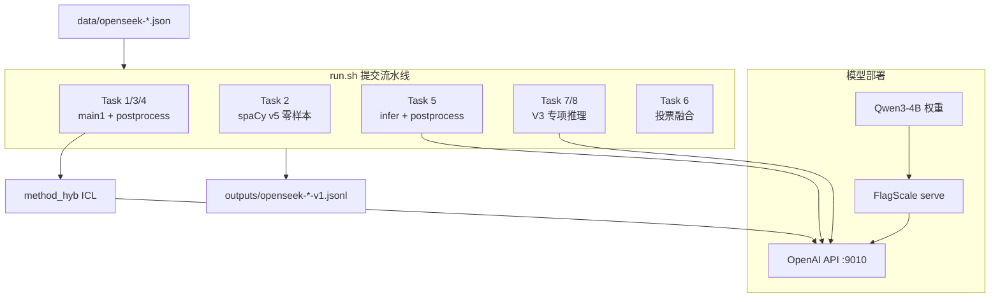

# LongContext-ICL-Annotation — 可复现方案说明

超长长上下文场景下的 **OpenSeek 八任务（Task 1–8）** 自动标注方案。各任务按最优路径分流：**Task 1/3/4** 走 `main1` ICL + 后处理，**Task 2** 走 spaCy v5 零样本，**Task 5/7/8** 走专项推理脚本，**Task 6** 走多路投票融合。LLM 推理后端为本地 **FlagOS** OpenAI 兼容服务（默认 `http://localhost:9010/v1`，模型 `Qwen3-4B-ascend-flagos`），ICL 示例经 **BM25 + 语义向量 + Cross-Encoder 重排** 混合检索选取。一键提交入口为根目录 **`run.sh`**。

更完整的实验记录与 Task 专项优化见 [READMD_cn.md](READMD_cn.md)、[TECH_REPORT_cn.md](TECH_REPORT_cn.md)。

---

## 1. 方案总览



| 组件 | 路径 | 作用 |
|------|------|------|
| 一键提交 | `run.sh` | Task 1–8 `test_samples` 推理 + 后处理 → `openseek-{id}-v1.jsonl` |
| 提示词 | `src/method_hyb_prompts.py` | 按 `task_id` 构造标注 prompt，占位符 `[[EXAMPLES]]` |
| 核心方法 | `src/method_hyb.py` | ICL 混合检索、`annotate_nvidia` 调 FlagOS、`<label>` 解析 |
| Thinking 默认开 | `src/method_hyb_thinking_default.py` | 同上，`DASHSCOPE_ENABLE_THINKING` 默认 `1` |
| Task 1/3/4 提交 | `src/main1.py` + `postprocess_task{1,3,4}_outputs.py` | ICL + FlagOS + 格式/规则后处理 |
| Task 2 提交 | `src/infer_task2_test_samples_spacy_v5.py` | spaCy v5 零样本（无需 LLM） |
| Task 5 提交 | `src/infer_task5_test_samples.py` + `postprocess_task5_outputs.py` | 零样本推理 + 文本校准 |
| Task 7 提交 | `src/infer_task7_test_samples_v3.py` | Jeopardy + hybrid ICL |
| Task 8 提交 | `src/infer_task8_test_samples_v3.py` | AST/ReAct 专项推理 |
| Task 6 提交 | `scripts/run_task6_vote_fusion.py` | 多路投票融合 |
| Examples 评测 | `src/infer_examples_main1.py` | 在带金标 `examples` 上算准确率 |
| 环境变量模板 | `configs/env.flagos.example` | FlagOS 端点与 ICL 开关 |
| 服务配置 | `configs/llm_config_flagos.yaml` | FlagScale 启动端口 9010 |
| 依赖 | `requirements.txt` | Python 包 |

---

## 2. 目录结构

```
LongContext-ICL-Annotation/
├── README.md                    # 本文档（可复现入口）
├── run.sh                       # 一键：Task 1–8 test_samples 提交
├── requirements.txt
├── configs/
│   ├── llm_config_flagos.yaml   # FlagOS 部署配置（端口 9010）
│   └── env.flagos.example       # 推理环境变量示例
├── scripts/
│   ├── deploy_flagos.sh         # Linux：启动/停止 FlagOS
│   ├── deploy_flagos.ps1        # Windows：启动/停止
│   ├── api_test_flagos.py       # API 连通性测试
│   ├── run_inference.sh         # 测 API + 调用 run.sh 完整提交
│   ├── run_infer_examples.sh    # 测 API + examples 准确率
│   └── run_task6_vote_fusion.py # Task 6 投票融合
├── data/                        # openseek-1..8 任务 JSON
├── src/
│   ├── method_hyb.py            # 核心：ICL + annotate_nvidia
│   ├── method_hyb_prompts.py
│   ├── main1.py                 # Task 1/3/4 ICL 提交
│   ├── postprocess_task1_outputs.py
│   ├── postprocess_task3_outputs.py
│   ├── postprocess_task4_outputs.py
│   ├── infer_task2_test_samples_spacy_v5.py
│   ├── infer_task5_test_samples.py
│   ├── postprocess_task5_outputs.py
│   ├── infer_task7_test_samples_v3.py
│   ├── infer_task8_test_samples_v3.py
│   ├── infer_task6_v2.py
│   ├── infer_examples_main1.py
│   └── llm_config.yaml          # 旧版 NVIDIA 2026 端口（可选）
├── Qwen3-4B/                    # 需自行下载的生成模型权重
└── outputs/                     # 推理输出（运行后生成）
```

---

## 3. 环境准备

### 3.1 Python 虚拟环境

```bash
cd LongContext-ICL-Annotation
python -m venv .venv

# Linux / macOS
source .venv/bin/activate

# Windows PowerShell
.\.venv\Scripts\Activate.ps1

pip install -U pip
pip install -r requirements.txt
```

### 3.2 无 Embedding/Reranker 权重时的轻量模式

若仅验证 FlagOS 连通性与主流程，可关闭语义检索与重排（仍保留 BM25 + 关键词 ICL）：

```bash
export ICL_DISABLE_SEMANTIC=1
export ICL_DISABLE_RERANK=1
```

Windows PowerShell：

```powershell
$env:ICL_DISABLE_SEMANTIC = "1"
$env:ICL_DISABLE_RERANK = "1"
```

### 3.3 FlagScale / FlagOS 推理服务（模型部署侧）

生成模型需通过 **FlagScale** 以 OpenAI 兼容方式暴露。请按 [FlagScale 官方仓库](https://github.com/FlagOpen/FlagScale) 完成 **NVIDIA CUDA** 或 **华为 Ascend** 环境安装；NVIDIA 可参考 `src/create_env_nvidia.sh`。

```bash
git clone https://github.com/FlagOpen/FlagScale.git
# 按 FlagScale 文档安装依赖后：
```

本仓库已提供与 `method_hyb.py` 对齐的配置 `configs/llm_config_flagos.yaml`（端口 **9010**，对外模型名 **Qwen3-4B-ascend-flagos**）。

---

## 4. 模型权重与长上下文

### 4.1 下载 Qwen3-4B

```bash
# Hugging Face
pip install huggingface_hub
huggingface-cli download Qwen/Qwen3-4B --local-dir Qwen3-4B

# 或 ModelScope
# modelscope download --model Qwen/Qwen3-4B --local_dir Qwen3-4B
```

权重目录放在**项目根**下 `Qwen3-4B/`，与 `configs/llm_config_flagos.yaml` 中 `model: ../Qwen3-4B` 一致。

### 4.2 YaRN 长上下文（赛题要求）

编辑 `Qwen3-4B/config.json`，将 `rope_scaling` 设为：

```json
"rope_scaling": {
    "rope_type": "yarn",
    "factor": 4.0,
    "original_max_position_embeddings": 32768
}
```

---

## 5. 模型部署（FlagOS 服务）

### 5.1 启动服务

**Linux / macOS：**

```bash
chmod +x scripts/deploy_flagos.sh
./scripts/deploy_flagos.sh run
```

**Windows PowerShell：**

```powershell
.\scripts\deploy_flagos.ps1 -Action run
```

等价手动命令（在 `FlagScale` 目录内）：

```bash
cd FlagScale
python run.py --config-path .. --config-name llm_config_flagos action=run
```

### 5.2 停止服务

```bash
./scripts/deploy_flagos.sh stop
# 或
.\scripts\deploy_flagos.ps1 -Action stop
```

### 5.3 默认端点与模型名

| 项 | 默认值 |
|----|--------|
| Base URL | `http://localhost:9010/v1` |
| API Key | `EMPTY` |
| Model ID | `Qwen3-4B-ascend-flagos` |

与 `src/method_hyb.py` 中 `_nvidia_dashscope_chat_text` 一致，可通过环境变量覆盖（见 `configs/env.flagos.example`）。

### 5.4 NVIDIA 备用端口（可选）

若使用仓库内旧配置 `src/llm_config.yaml`（端口 **2026**），需同步设置：

```bash
export FLAGSCALE_BASE_URL=http://localhost:2026/v1
export FLAGSCALE_MODEL=../Qwen3-4B
```

---

## 6. API 连通性测试

```bash
# 加载环境变量（Linux 示例）
export FLAGSCALE_API_KEY=EMPTY
export FLAGSCALE_BASE_URL=http://localhost:9010/v1
export FLAGSCALE_MODEL=Qwen3-4B-ascend-flagos

export PYTHONPATH=src
python scripts/api_test_flagos.py
```

成功时应打印含 `<label>ok</label>` 的模型回复。

---

## 7. 推理与提交

### 7.1 环境变量

复制并按需修改：

```bash
cp configs/env.flagos.example .env
# 或在 shell 中 export FLAGSCALE_* / DASHSCOPE_ENABLE_THINKING
```

| 变量 | 说明 | 默认 |
|------|------|------|
| `FLAGSCALE_BASE_URL` | OpenAI 兼容 base URL | `http://localhost:9010/v1` |
| `FLAGSCALE_API_KEY` | API Key | `EMPTY` |
| `FLAGSCALE_MODEL` | 模型名 | `Qwen3-4B-ascend-flagos` |
| `DASHSCOPE_ENABLE_THINKING` | 流式 thinking | `0`（`method_hyb`） |
| `ICL_DISABLE_SEMANTIC` | 关闭语义向量 ICL | 未设置 |
| `ICL_DISABLE_RERANK` | 关闭 Cross-Encoder 重排 | 未设置 |

### 7.2 提交推理（test_samples → jsonl）

**推荐：根目录 `run.sh` 一键跑通 Task 1–8**（需先启动 FlagOS，见第 5 节）：

```bash
chmod +x run.sh
OUTPUT_DIR=outputs ./run.sh
```

各任务路径（与 `run.sh` 一致）：

| Task | 脚本 | 提交文件 |
|------|------|----------|
| 1 | `main1` + `postprocess_task1_outputs.py` | `outputs/openseek-1-v1.jsonl` |
| 2 | `infer_task2_test_samples_spacy_v5.py`（spaCy v5 零样本） | `outputs/openseek-2-v1.jsonl` |
| 3 | `main1` + `postprocess_task3_outputs.py` | `outputs/openseek-3-v1.jsonl` |
| 4 | `main1` + `postprocess_task4_outputs.py`（规则拼接覆盖） | `outputs/openseek-4-v1.jsonl` |
| 5 | `infer_task5_test_samples.py` + `postprocess_task5_outputs.py` | `outputs/openseek-5-v1.jsonl` |
| 6 | `run_task6_vote_fusion.py`（多路投票融合） | 见脚本输出 |
| 7 | `infer_task7_test_samples_v3.py` | `outputs/openseek-7-v1.jsonl` |
| 8 | `infer_task8_test_samples_v3.py` | `outputs/openseek-8-v1.jsonl` |

可选环境变量（`run.sh` 内可调）：

| 变量 | 默认 | 说明 |
|------|------|------|
| `OUTPUT_DIR` | `outputs` | 输出目录 |
| `TASK2_BS` | `1` | Task 2 spaCy 批大小 |
| `TASK5_PARALLEL` | `8` | Task 5 并行度 |
| `TASK7_BATCH_SIZE` | `8` | Task 7 批大小 |
| `TASK8_BATCH_SIZE` | `8` | Task 8 检索批大小 |

单任务试跑示例（Task 1）：

```bash
export PYTHONPATH=src
python src/main1.py --task_start 1 --task_end 1 --log_path_prefix outputs
python src/postprocess_task1_outputs.py --input outputs/openseek-1-v1.jsonl --inplace
```

先测 API 再完整提交：

```bash
chmod +x scripts/run_inference.sh
OUTPUT_DIR=outputs ./scripts/run_inference.sh
```

输出：`outputs/openseek-{1..8}-v1.jsonl`（Task 6 除外），每行字段 `test_sample_id`、`prediction`。

### 7.3 Examples 集评测（调参用）

```bash
export PYTHONPATH=src
python src/infer_examples_main1.py --task_start 1 --task_end 1 --output_dir examples_main1
```

或：

```bash
TASK_START=2 TASK_END=2 ./scripts/run_infer_examples.sh
```

---

## 8. 方案代码说明

### 8.1 调用链

**Task 1/3/4（`main1.py`）**

1. 读取 `data/openseek-{id}_*.json` 的 `Definition`、`examples`、`test_samples`
2. `build_prompt(task_description, text2annotate, task_id=...)` → 含 `[[EXAMPLES]]` 的 prompt
3. `select_examples(..., hybrid=True, top_k=3, use_explanation=True, use_bm25_semantic_rerank=True)` → 插入 few-shot
4. `annotate_nvidia(input_prompt)` → FlagOS Chat Completions
5. `count_answer` 从回复中解析 `<label>...</label>` 作为 `prediction`
6. `postprocess_task{1,3,4}_outputs.py` 清洗格式；Task 4 另做规则拼接覆盖

**Task 2 / 5 / 7 / 8 / 6**：分别见 `run.sh` 中对应脚本；Task 2 为 spaCy 零样本，Task 6 为多脚本投票融合。

### 8.2 核心 API（`method_hyb.py`）

```python
# 本地 FlagOS（默认）
api_key = os.environ.get("FLAGSCALE_API_KEY", "EMPTY")
base_url = os.environ.get("FLAGSCALE_BASE_URL", "http://localhost:9010/v1/").rstrip("/")
model_id = os.environ.get("FLAGSCALE_MODEL", "Qwen3-4B-ascend-flagos")
```

Ascend 直连（与 `annotate_ascend` 相同端点，供对照）：

```python
import openai
openai.api_key = "EMPTY"
openai.base_url = "http://localhost:9010/v1/"
model = "Qwen3-4B-ascend-flagos"
```

### 8.3 切换 Thinking 版本

```python
# main1.py 中可改为：
from method_hyb_thinking_default import annotate_nvidia as annotate
```

### 8.4 最小可运行示例（单条标注）

```bash
export PYTHONPATH=src
export FLAGSCALE_BASE_URL=http://localhost:9010/v1
export FLAGSCALE_MODEL=Qwen3-4B-ascend-flagos

python -c "
from method_hyb import build_prompt, select_examples, annotate_nvidia
import json
from pathlib import Path
p = Path('data/openseek-1_closest_integers.json')
d = json.loads(p.read_text(encoding='utf-8'))
ex = d['examples'][:100]
td, txt = d['Definition'][0], d['test_samples'][0]['input']
prompt = build_prompt(td, txt, task_id=1)
icl = select_examples(ex, td, txt, hybrid=True, top_k=3)
inp = prompt.replace('[[EXAMPLES]]\n\n', icl + '\n\n')
print(annotate_nvidia(inp))
"
```

---

## 9. 命令速查

| 目的 | 命令 |
|------|------|
| 安装依赖 | `pip install -r requirements.txt` |
| 启动 FlagOS | `./scripts/deploy_flagos.sh run` |
| 停止 FlagOS | `./scripts/deploy_flagos.sh stop` |
| 测 API | `PYTHONPATH=src python scripts/api_test_flagos.py` |
| 一键提交 8 任务 | `OUTPUT_DIR=outputs ./run.sh` |
| 测 API + 提交 | `OUTPUT_DIR=outputs ./scripts/run_inference.sh` |
| Examples 准确率 | `PYTHONPATH=src python src/infer_examples_main1.py --task_start 1 --task_end 1` |
| Task 6 投票融合 | `python scripts/run_task6_vote_fusion.py` |

---

## 10. 常见问题

**Q: `Connection refused` / API 测试失败**  
A: 确认 FlagOS 已启动且 `curl http://localhost:9010/v1/models` 可访问；检查 `FLAGSCALE_BASE_URL` 与 `served_model_name` 是否与 `FLAGSCALE_MODEL` 一致。

**Q: `prediction` 全为空**  
A: 查看模型是否按 `<label>...</label>` 格式输出；可设 `ANNOTATE_LOG_EVERY_RESPONSE=1` 打印返回摘要。

**Q: ICL 加载 Embedding 很慢或 OOM**  
A: 设置 `ICL_DISABLE_SEMANTIC=1` 与 `ICL_DISABLE_RERANK=1`，或指定更小的 `ICL_EMBEDDING_MODEL` / `ICL_RERANK_MODEL`。

**Q: Windows 下 shell 脚本无法执行**  
A: 使用 `deploy_flagos.ps1` 启动 FlagOS；推理可逐条运行 `run.sh` 中的 Python 命令（见 7.2 任务表），或在 WSL / Git Bash 中执行 `./run.sh`。

---

## 11. 进阶实验

Task 5–8 投票融合、后处理、Autoresearch 等见 [READMD_cn.md](READMD_cn.md)「复现命令」章节；**test_samples 正式提交以根目录 `run.sh` 为准**，例如：

```bash
python src/infer_examples_compare_task5.py
python scripts/run_task6_vote_fusion.py
python autoresearch_prompt.py --continuous --max-iterations 10
```

---

## 12. 参考链接

- [FlagOS Open Computing Global Challenge (Kaggle)](https://www.kaggle.com/competitions/flag-os-open-computing-global-challenge)
- [FlagScale GitHub](https://github.com/FlagOpen/FlagScale)
- [Qwen3-4B on Hugging Face](https://huggingface.co/Qwen/Qwen3-4B)
