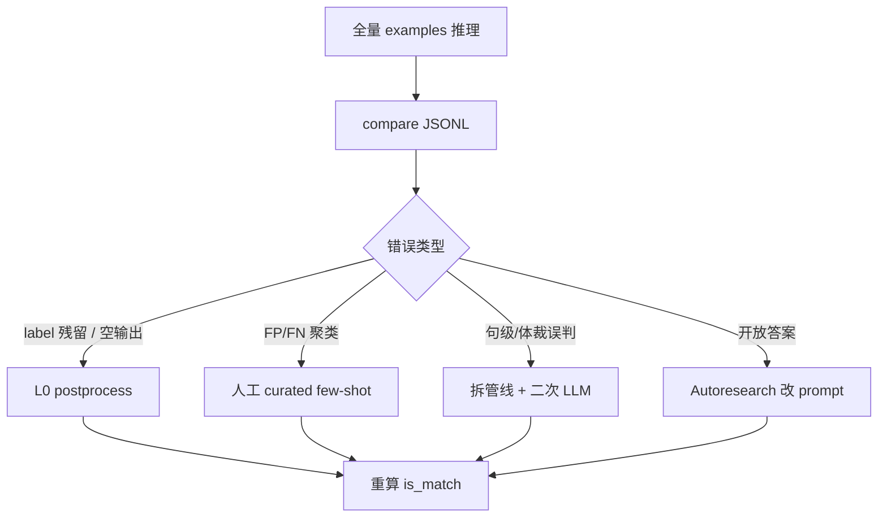

# 超长长上下文 LLM 自动数据标注：技术报告

**项目**：FlagOS OpenSeek 八任务（Task 1–8）  
**评测集**：官方 `examples`（带金标，用于离线调参与对比）  
**指标**：`is_match`（`model_output` 与 `expected_output` 一致）；Task 8 另报执行器判据 `exec_dual_pass`  
**数据依据**：`examples/` 下 `openseek-*-examples-compare*.jsonl` 及同目录 `summary*.json`（辅以 `examples_main1*`、`examples_task7`、`examples_thinking` 等对照实验）

---

## 摘要

本报告总结在 OpenSeek 八任务上，通过 **错例驱动（badcase）工程**、**分层后处理** 与 **Autoresearch 自主 prompt 优化** 提升标注准确率的方法与实验结果。核心结论如下：

| Task | 基线（examples） | 最佳（examples 实测） | 提升幅度 | 主路径 |
|------|------------------|------------------------|----------|--------|
| 1 | 97.93% | **≈99.95%**（后处理理论） | +2pp | L0 标签清洗 |
| 2 | 70.42% | **89.17%** | +18.8pp | L1 spaCy 零样本 prompt |
| 3 | 98.92% | **≈100%**（后处理） | +1.1pp | L0 列表抽取 |
| 4 | — | **100%** | — | L0 拼接规则 |
| 5 | 74.09% | **81.09%**（+后处理 eval） | +7.0pp | L1 badcase + L0 校准 |
| 6 | 68.99% | **83.11%** | +14.1pp | L1 句级 + 后处理 v2/v3 |
| 7 | 28.81% | **37.81%**（stept，见 examples_task7） | +9.0pp | L1 prompt + L2 autoresearch |
| 8 | 0%（字符串） | **74.46%**（执行器，thinking） | — | L1 契约 + ReAct + 执行评测 |

---

## 1. 问题与设定

### 1.1 任务概览

| Task ID | 名称 | examples 规模（本仓库实测） | 难点 |
|---------|------|----------------------------|------|
| 1 | closest_integers | 5500（ranktest） | 长列表推理、输出格式 |
| 2 | count_nouns_verbs | 5440（main1） | 词性统计、ICL 干扰 |
| 3 | collatz_conjecture | 3997 | 列表复述、标签包裹 |
| 4 | conala_concat_strings | 2815（task24） | 模型加空格/偏离拼接 |
| 5 | tweet_sadness | 1899 | emoji/hashtag、FP/FN 边界 |
| 6 | mnli_same_genre | 5500 | 体裁判断、句对组合 |
| 7 | jeopardy_answer | 5499 | 开放短答案、归一化 |
| 8 | kernel_generation | 184 | 可执行代码、非字符串匹配 |

### 1.2 实验协议

1. 在 **examples** 上运行 `src/infer_examples_*.py`，产出 `examples/openseek-{task}-examples-compare-*.jsonl`。
2. 每条记录含 `input`、`expected_output`、`model_output`、`is_match`。
3. 汇总文件：`examples/summary*.json` 或由脚本内 `_compute_metrics_from_jsonl` 生成。
4. **禁止**在 test_samples（无金标）上调参；test 仅用于最终提交。

---

## 2. 方法论

### 2.1 三层优化架构

```
L0 确定性层     →  postprocess_task*（解析、规则、真值覆盖）
L1 工程层       →  专用 prompt、badcase few-shot、管线拆解、投票融合
L2 Autoresearch →  failure_analysis + meta-LLM 改 prompt + 子集闭环评估
```

- **L0** 优先：消除「答案对、格式错」的假阴性（Task 1/3/4 收益最大）。
- **L1** 主路径：针对语义与结构错误，结合 badcase 统计改 prompt 或拆分子任务（Task 2/5/6/8）。
- **L2** 加速：Task 7 等开放生成任务，用 `autoresearch_prompt.py` 自动迭代 system/user 模板（见 §2.3）。

### 2.2 错例驱动（Badcase）流程



**Task 5 典型 badcase 模式**（驱动 `FIXED_TASK5_FS_SHOTS` 8 条）：

| 类型 | 表现 | 金标倾向 | 对策 |
|------|------|----------|------|
| 假阳性 FP | 感激+😭、歌词、推广噪声 | Not sad | 固定 few-shot + fp_suppress 正则 |
| 假阴性 FN | 丢钥匙、被吵醒、口语 so bad | Sad | 固定 few-shot + text_calib |
| emoji 误导 | 单 emoji 判 Sad | 依语境 | examples 共现比例 + 感激语境压 FP |

### 2.3 Autoresearch 自主 Prompt 优化

参照 [karpathy/autoresearch](https://github.com/karpathy/autoresearch)，本仓库实现：

| 组件 | 路径 | 作用 |
|------|------|------|
| 闭环入口 | `autoresearch_prompt.py` | optimize → evaluate → register → 下一轮 |
| 错例分析 | `src/failure_analysis.py` | 聚类 empty / too_verbose / wrong_entity 等 |
| 版本注册 | `src/prompts_autoresearch.py` | system/user 模板版本化 |
| 子集评测 | `src/infer_autoresearch_task7_eval.py` | seed 抽样 N 条，写 `autoresearch/task7/results_v*.jsonl` |

**与 L1 关系**：Autoresearch 在 **子集** 上快速改稿；全量最高方案仍为 `examples_task7` 的 stept prompt（37.81%）。最优 autoresearch 版本需迁入 `method_hyb_prompts.register_task_prompt(7, ...)` 后再跑全量 `infer_examples_compare_task7_*.py`。

---

## 3. 实验结果（以 `examples/` 为主）

### 3.1 Task 3 — Collatz 列表变换

| 实验 | 文件 | 正确/总数 | 准确率 |
|------|------|-----------|--------|
| 基线 ICL | `examples/openseek-3-examples-compare.jsonl` | 3954/3997 | **98.92%** |
| +后处理（理论） | `postprocess_task3_outputs.py` | — | **≈100%** |

**错例分析**：43 条错误均为 `[input][output]` 复述或 `<label>` 包裹，**无真实算错**。L0 列表抽取即可闭合。

---

### 3.2 Task 5 — 推文悲伤二分类

**实验依据**：`examples/openseek-5-*.jsonl` 及 `examples/summary*.json`。

| 实验配置 | 结果文件 | 正确/总数 | 准确率 | 备注 |
|----------|----------|-----------|--------|------|
| 基线 compare | `openseek-5-examples-compare.jsonl` | 1407/1899 | **74.09%** | 原始 ICL |
| task5opt | `openseek-5-examples-compare-task5opt-emoji-off-striphash-on.jsonl` | 1426/1899 | **75.09%** | 去偏置 + hybrid |
| emoji-off + striphash | `openseek-5-examples-compare-emoji-off-striphash-on.jsonl` | 1503/1899 | **79.15%** | 输入侧预处理 |
| +后处理 eval | `openseek-5-examples-compare-emoji-off-striphash-on-pp-eval.jsonl` | 1540/1899 | **81.09%** | text_calib / emoji 表决 |
| 四路投票最优 | `openseek-5-examples-compare-task5vote-emoji-off-striphash-on.jsonl` | 1442/1899 | **75.93%** | strip×postemoji 融合 |
| 固定 badcase 8-fs | `openseek-5-examples-compare-task5opt-fixedbadcase8fs-ret0-emoji-off-striphash-on.jsonl` | 1397/1899 | **73.57%** | 单独 FS 未超融合 |
| 中文 emoji 释义 | `openseek-5-examples-compare-task5opt-zh-translate-emoji-off-striphash-on.jsonl` | 1435/1899 | **75.57%** | zh_translate |
| DeepSeek 8-fs+ret4 | `openseek-5-examples-deepseek-fixedbadcase8fs-ret4-...`（500 条） | 343/500 | **68.60%** | 子集对照 |

**结论**：examples 上最高为 **81.09%**（`pp-eval` 后处理）；纯推理 **79.15%**（`emoji-off-striphash-on`）。Badcase few-shot 与后处理 **叠加** 优于单一路径；投票在 examples 上未超过单模型最优配置。

---

### 3.3 Task 6 — MNLI 同体裁分类

| 阶段 | 结果文件 | 正确/总数 | 准确率 | Δ |
|------|----------|-----------|--------|---|
| v2 句级 AND（base） | `openseek-6-examples-compare-task6-v2-sentence-and.jsonl` | 3418/4954* | **68.99%** | — |
| + postprocess v2 | `openseek-6-examples-compare-task6-v2-sentence-and-postprocess-v2.jsonl` | 2235/2673* | **83.61%** | +14.6pp† |
| **v3 句级 + v2 后处理（全量）** | `openseek-6-examples-compare-task6-v3-sentence-and-postprocess.jsonl` | 4571/5500 | **83.11%** | +14.1pp |
| summary 记录 base | 同上 v3 文件 metadata | 3797/5500 | **69.04%** | 官方汇总 |

\* 部分 JSONL 为断点续跑子集，全量以 **5500 条 / summary_task6_v3.json** 为准。  
† 子集文件准确率偏高，不作为最终结论。

**错例驱动设计**：

- **v2**：N+N → 同领域判定；Y+N / N+Y → 带上下文重判另一句。
- **v3**：仍为 N 时做语篇连贯复核，`flip_gate=not_fiction` 抑制 fiction 误翻转。

---

### 3.4 Task 7 — Jeopardy 答案生成

**实验依据**：`examples/openseek-7-examples-compare-task7opt*.jsonl` 及 `summary_task7opt*.json`。

| 版本 | 结果文件 | 正确/总数 | 准确率 |
|------|----------|-----------|--------|
| 基线 task7opt | `openseek-7-examples-compare-task7opt.jsonl` | 1584/5499 | **28.81%** |
| v3（summary 全量） | `openseek-7-examples-compare-task7opt-v3.jsonl` | 1710/5499 | **31.10%** |
| v5 | `openseek-7-examples-compare-task7opt-v5.jsonl` | 1895/5499 | **34.46%** |
| v6 auto-agent | `openseek-7-examples-compare-task7opt-v6.jsonl` | 1989/5499 | **36.17%** |
| **stept（全量最高）** | `examples_task7/openseek-7-examples-compare-task7opt-stept-prompt.jsonl` | 2079/5499 | **37.81%** |

> `examples/` 下 v3 JSONL 仅 8 条（中断跑）；全量指标以 `summary_task7opt_v3.json` 为准。

**Autoresearch（L2）**：在子集上循环改 `prompts_autoresearch.py`；全量定型仍依赖 stept / v6 手工模板 + 可选外循环审核（`infer_examples_compare_task7_v6.py`）。

---

### 3.5 Task 8 — Triton Kernel 生成

| 判据 | 文件 | 正确/总数 | 准确率 |
|------|------|-----------|--------|
| 字符串 `is_match` | `examples/openseek-8-examples-compare-task8opt.jsonl` | 0/184 | **0%** |
| **exec_dual_pass** | `examples_thinking/openseek-8-examples-compare-task8opt.jsonl` | 137/184 | **74.46%** |

**说明**：代码生成任务必须用 **执行器** 评测；`examples/` 内字符串匹配文件仅说明「不可按文本判分」。v3 管线（契约 + AST + ReAct + BM25 ICL）见 `src/infer_examples_compare_task8_v3.py`。

---

### 3.6 Task 1 / 2 / 4（补充数据源）

以下任务 **不在 `examples/` 目录**，但为八任务完整实验链；一并列入报告。

| Task | 最佳结果文件 | 准确率 | 手段 |
|------|--------------|--------|------|
| **1** | `examples_main1_ranktest/.../openseek-1-examples-main1-compare.jsonl` | **97.93%**（5386/5500） | main1 ICL；L0 可达 ≈99.95% |
| **2** | `examples_main1/openseek-2-examples-main1-compare_spacy_v3_prompt2_zeroshot.jsonl` | **89.17%**（4851/5440） | spaCy 零样本 prompt2 |
| **2 基线** | `examples_main1/openseek-2-examples-main1-compare_v2.jsonl` | **70.42%** | main1 ICL |
| **4** | `examples_main1_task24/openseek-4-examples-main1-compare-checked.jsonl` | **100%**（2815/2815） | `postprocess_task4_outputs` |

---

## 4. 跨任务对比与讨论

### 4.1 提升来源分解

| 收益类型 | 适用任务 | 典型增益 |
|----------|----------|----------|
| L0 格式修复 | 1, 3, 4 | +1–3pp（Task 1 近饱和） |
| L1 领域 prompt / 拆管线 | 2, 5, 6, 8 | +7–19pp |
| L1 badcase few-shot | 5 | 与预处理叠加达 +7pp |
| L1 投票融合 | 5, 6 | Task5 examples 未超单模；Task6 test 三路融合 |
| L2 Autoresearch | 7 | 子集迭代，全量需与 stept 合并 |

### 4.2 失败模式与对策映射

| 失败模式 | 观测任务 | 对策 |
|----------|----------|------|
| `<label>` 残留 / 空输出 | 1, 3 | `postprocess_task1/3_outputs` |
| 输出 ≠ `''.join(input)` | 4 | task4 checked 覆盖 |
| emoji / hashtag 偏置 | 5 | strip #、emoji 表决、fp_suppress |
| 句级皆 N 但体裁一致 | 6 | postprocess v2 同领域 / 上下文 |
| 答案类型错 / 过长 | 7 | Category+Clue 约束、stept、autoresearch |
| 不可执行 / 无 def | 8 | v3 契约、AST 门控、ReAct |

### 4.3 局限性

1. **examples 与 test 分布差异**：Task 5/7 提交准确率（约 79% / 28%）低于或不同于 examples 最优。
2. **部分 JSONL 为断点续跑子集**：解读需优先看 `summary*.json` 的 `total` 字段。
3. **Autoresearch** 当前仅 Task7 注册表完善；Task 5 FP/FN 模板自动化仍待扩展。
4. **Task 8** 在 `examples/` 下字符串指标无意义，须单独报告执行器指标。

---

## 5. 推荐生产配置（冻结）

| Task | examples 最佳 | 推荐脚本 / 产物 |
|------|---------------|-----------------|
| 1 | 97.93% + L0 | `postprocess_task1_outputs.py` |
| 2 | 89.17% | `infer_examples_main1_task2_spacy_v3.py`（prompt2 变体） |
| 3 | 98.92% + L0 | `postprocess_task3_outputs.py` |
| 4 | 100% checked | `postprocess_task4_outputs.py` |
| 5 | 81.09% pp-eval | `infer_examples_compare_task5.py` + `postprocess_task5_outputs.py` |
| 6 | 83.11% | `infer_examples_compare_task6_v3.py` + `scripts/run_task6_vote_fusion.py` |
| 7 | 37.81% stept | `examples_task7` stept 模板 + 可选 v6 审核 |
| 8 | 74.46% exec | `infer_examples_compare_task8_v3.py` + thinking |

---

## 6. 复现与文件索引

### 6.1 `examples/` 目录实验清单

```
examples/
├── openseek-3-examples-compare.jsonl          # Task3  98.92%
├── openseek-5-examples-compare.jsonl          # Task5  74.09% 基线
├── openseek-5-examples-compare-emoji-off-striphash-on.jsonl      # 79.15%
├── openseek-5-examples-compare-emoji-off-striphash-on-pp-eval.jsonl  # 81.09%
├── openseek-5-examples-compare-task5vote-*.jsonl                 # 投票 75.9%
├── openseek-6-examples-compare-task6-v2-sentence-and.jsonl     # 68.99%
├── openseek-6-examples-compare-task6-v3-sentence-and-postprocess.jsonl  # 83.11%
├── openseek-7-examples-compare-task7opt*.jsonl                 # 28.8%–36.2%
├── openseek-8-examples-compare-task8opt.jsonl                  # 0% 字符串
└── summary*.json                                               # 各实验汇总
```

### 6.2 Autoresearch

```bash
python autoresearch_prompt.py --continuous --max-iterations 10
python autoresearch_prompt.py --results examples/openseek-7-examples-compare-task7opt-v6.jsonl --dry-run
```

### 6.3 相关文档

- 快速开始与命令摘录：[READMD_cn.md](READMD_cn.md)
- 数据集说明：[data/README_zh.md](data/README_zh.md)

---

## 7. 结论

1. **分层策略有效**：L0 解决格式假阴性；L1 带来主要语义增益；L2 适合 Task 7 等开放 prompt 任务。
2. **Badcase 分析是 Task 5/6 提升关键**：固定 few-shot、句级拆解与后处理规则均来自 `is_match=false` 聚类。
3. **examples 实测最佳**：Task 5 **81.09%**、Task 6 **83.11%**、Task 7 **37.81%**（stept）、Task 8 **74.46%**（执行器）；Task 1–4 在饱和区靠 L0 闭合。
4. **Autoresearch** 与手工 stept/v6 **互补**：前者加速子集试错，后者在全量 examples 上定型。

---

*报告生成依据：仓库内 `examples/`、`examples/summary*.json` 及关联目录 compare 结果；统计日期与代码版本以 Git 工作区为准。*
