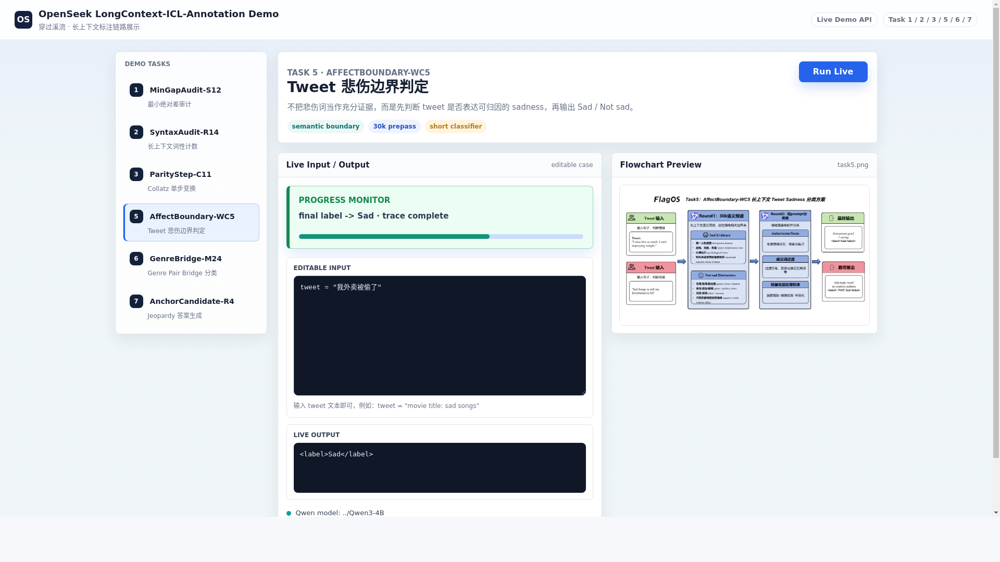

# LongContext-ICL-Annotation

本仓库是 OpenSeek / FlagOS 长上下文数据标注任务的交付目录，包含 Task 1-8 的推理代码、任务数据、技术报告和一个可交互 Demo。

技术报告为：`技术报告-穿过溪流.pdf`

## 快速开始

### 第一步：创建 Conda 环境

推荐创建名为 `flagos_chasingriver` 的 Conda 环境：

```bash
conda create -n flagos_chasingriver python=3.10 -y
conda activate flagos_chasingriver
pip install -r requirements.txt
```

如果希望把 Conda 环境直接创建在当前项目目录下，可以使用 `-p` 指定路径：

```bash
conda create -p ./flagos_chasingriver python=3.10 -y
conda activate ./flagos_chasingriver
pip install -r requirements.txt
```

### 第二步：准备 FlagScale

运行脚本会通过 FlagScale 启动本地 vLLM 服务。默认情况下，脚本会查找仓库根目录下的 `FlagScale/`：

```bash
git clone https://github.com/FlagOpen/FlagScale.git FlagScale
```

### 第三步：准备模型

默认模型目录为 `Qwen3-4B/`。如果本地还没有模型，可以下载：

```bash
hf download Qwen/Qwen3-4B --local-dir Qwen3-4B
```

或者：

```bash
modelscope download --model Qwen/Qwen3-4B --local_dir Qwen3-4B
```

### 第四步：运行任务

如果需要一次性运行 Task 1-8，激活 Conda 环境后运行：

```bash
conda activate flagos_chasingriver
VENV_DIR="$CONDA_PREFIX" bash run_1to8_full.sh
```

如果默认的 GPU 0 正在被占用，可以指定其他 GPU，例如使用 GPU 1：

```bash
GPU_ID=1 VENV_DIR="$CONDA_PREFIX" bash run_1to8_full.sh
```

如果 GPU 上还有其他进程占用显存，可以进一步降低 vLLM 的显存占用比例：

```bash
GPU_ID=1 VLLM_GPU_MEMORY_UTILIZATION=0.75 VENV_DIR="$CONDA_PREFIX" bash run_1to8_full.sh
```

如果只想运行单个任务，可以使用对应的脚本。例如：

```bash
VENV_DIR="$CONDA_PREFIX" bash run_task1.sh
GPU_ID=1 VENV_DIR="$CONDA_PREFIX" bash run_task8.sh
```

如果使用当前目录下的 Conda 环境，也就是通过 `conda create -p ./flagos_chasingriver ...` 创建的环境，则运行：

```bash
conda activate ./flagos_chasingriver
VENV_DIR="$CONDA_PREFIX" bash run_1to8_full.sh
```

当前目录环境下运行单个任务的方式同理：

```bash
conda activate ./flagos_chasingriver
VENV_DIR="$CONDA_PREFIX" bash run_task1.sh
```

### 第五步：查看输出结果

全量运行完成后，结果会保存到 `outputs/run_all_时间戳/`，每个任务对应一个子目录：

```text
outputs/run_all_时间戳/task_任务号/
```

单任务脚本会把结果保存到 `outputs/run_task任务号_时间戳/task_任务号/`。脚本结束时会在终端打印实际输出目录和生成的 `jsonl` 文件路径。

## Demo

如果要启动 Demo：

```bash
python demo/server.py --host 0.0.0.0 --port 8082
```

访问：

```text
http://服务器IP:8082/demo/
```

如果通过 SSH 使用远程服务器：

```bash
ssh -L 8082:127.0.0.1:8082 用户名@服务器地址
```

Demo 页面示例：



## 仓库结构

仓库根目录主要结构如下：

```text
LongContext-ICL-Annotation/
├── data/
├── demo/
├── reports/
├── src/
├── Qwen3-4B/
├── outputs/
├── FlagScale/
├── README.md
├── READMD_cn.md
├── requirements.txt
├── run_1to8_full.sh
├── run_task_common.sh
└── run_task1.sh ... run_task8.sh
```

各目录和文件作用如下。

### `data/`

存放 Task 1-8 的官方数据文件，以及数据说明文档：

- `openseek-1_closest_integers.json`
- `openseek-2_count_nouns_verbs.json`
- `openseek-3_collatz_conjecture.json`
- `openseek-4_conala_concat_strings.json`
- `openseek-5_semeval_2018_task1_tweet_sadness_detection.json`
- `openseek-6_mnli_same_genre_classification.json`
- `openseek-7_jeopardy_answer_generation_all.json`
- `openseek-8_kernel_generation.json`
- `README.md`
- `README_zh.md`

### `src/`

核心代码目录，主要包括：

- `main_task1.py` 到 `main_task8.py`
  任务入口脚本，负责读取数据、加载 tokenizer、调用方法并写出结果。
- `method_task1.py` 到 `method_task8.py`
  任务方法实现，负责 prompt、检索、模型调用、解析和后处理。
- `task8_best_realtime.py`
- `task8_best_prompt.py`
- `task8_best_common.py`
- `postfix_task8.py`
  以上几项是 Task 8 的配套实现和修复逻辑。
- `api_test.py`
  用于测试本地模型 API 是否正常。
- `common.py`
  通用辅助逻辑。
- `create_env_nvidia.sh`
  NVIDIA 环境初始化参考脚本。
- `llm_config.yaml`
- `llm_config_peer.yaml`
  模型服务配置文件。

### `demo/`

Demo 目录：

- `index.html`：前端页面
- `server.py`：后端服务

Demo 会直接复用仓库中的 `method_task*.py` 逻辑。

### `reports/`

报告目录，主要包括：

- `task1_*.md` 到 `task8_*.md`：单任务技术报告
- `OpenSeek_LongContext_穿过溪流_技术报告.md`
- `OpenSeek_LongContext_穿过溪流_技术报告.pdf`
- `flowchart/`：流程图
- `team_introduction/`：团队介绍与附件

### `Qwen3-4B/`

本地模型目录。仓库默认使用这里的模型权重与 tokenizer。

### `outputs/`

运行输出目录。`run_1to8_full.sh` 会把每次运行的结果写到这里。

### Python 环境

Python 运行环境不需要提交到仓库。推荐使用 Conda 创建 `flagos_chasingriver` 环境；如果本地已有 `.venv/` 或 `myenv/`，脚本也可以通过 `VENV_DIR` 指定使用。

### `FlagScale/`

外部依赖工程目录。当前批量运行脚本和服务启动链路会依赖其中的能力。

### 根目录主要文件

- `README.md`：当前主说明文件
- `READMD_cn.md`：更完整的中文说明
- `requirements.txt`：基础依赖文件
- `run_1to8_full.sh`：Task 1-8 批量运行主脚本
- `run_task1.sh` 到 `run_task8.sh`：单任务运行脚本
- `run_task_common.sh`：单任务脚本共用的启动、运行和输出提示逻辑

## 当前环境

根据当前仓库和本机实际情况，可以把当前环境概括为：

- Environment Setup 重点包括：`openai`、`torch`、`FlagScale`
- 推荐使用 Conda 创建运行环境；`run_1to8_full.sh` 可通过 `VENV_DIR="$CONDA_PREFIX"` 使用当前 Conda 环境
- 当前开发环境的 Python 版本是 `3.10.12`
- 默认服务端口是 `2026`
- `src/llm_config.yaml` 和 `src/llm_config_peer.yaml` 默认使用 `CUDA_VISIBLE_DEVICES: 0`
- 当前仓库默认按单卡 GPU 方式运行

结合当前开发环境中已经安装的包，实际在用的核心环境包括：

- `openai==2.31.0`
- `torch==2.10.0`
- `torchaudio==2.10.0`
- `torchvision==0.25.0`
- `transformers==4.57.6`
- `triton==3.6.0`
- `vllm==0.19.0`
- `pandas==2.2.3`
- `requests==2.33.1`
- `tqdm==4.67.3`
- `sentencepiece==0.2.1`
- `huggingface_hub==0.36.0`
- `modelscope==1.35.4`

此外，完整推理环境通常还会安装较多 CUDA / NVIDIA 相关包，例如 `cuda-toolkit`、`nvidia-cudnn-*`、`flashinfer-*`、`xformers` 等，因此实际 GPU 环境会比 `requirements.txt` 中的最小 Python 依赖更复杂。

仓库还提供了另一套推荐环境参考脚本：

```bash
src/create_env_nvidia.sh
```

该脚本对应的参考环境主要是：

- Python `3.11.11`
- `torch==2.6.0`
- `torchvision==0.21.0`
- `torchaudio==2.6.0`
- CUDA 对应 `cu124`
- `vllm==0.8.5`

说明：

- 推荐使用 Conda 环境运行当前仓库
- 当前开发环境的核心推理组件版本，与 `src/create_env_nvidia.sh` 中的参考版本并不完全一致
- 当前环境里无法直接可靠读取 GPU 驱动细节，因此这里的 CUDA 版本描述以仓库脚本 `src/create_env_nvidia.sh` 为准

## 任务与代码对应关系

| Task | 数据文件 | 入口文件 | 方法文件 | 报告 |
| --- | --- | --- | --- | --- |
| 1 | `data/openseek-1_closest_integers.json` | `src/main_task1.py` | `src/method_task1.py` | `reports/task1_MinGapAudit_S12.md` |
| 2 | `data/openseek-2_count_nouns_verbs.json` | `src/main_task2.py` | `src/method_task2.py` | `reports/task2_SyntaxAudit_R14.md` |
| 3 | `data/openseek-3_collatz_conjecture.json` | `src/main_task3.py` | `src/method_task3.py` | `reports/task3_ParityStep_C11.md` |
| 4 | `data/openseek-4_conala_concat_strings.json` | `src/main_task4.py` | `src/method_task4.py` | `reports/task4_StringStitch_R17.md` |
| 5 | `data/openseek-5_semeval_2018_task1_tweet_sadness_detection.json` | `src/main_task5.py` | `src/method_task5.py` | `reports/task5_AffectBoundary_WC5.md` |
| 6 | `data/openseek-6_mnli_same_genre_classification.json` | `src/main_task6.py` | `src/method_task6.py` | `reports/task6_GenreBridge_M24.md` |
| 7 | `data/openseek-7_jeopardy_answer_generation_all.json` | `src/main_task7.py` | `src/method_task7.py` | `reports/task7_AnchorCandidate_R4.md` |
| 8 | `data/openseek-8_kernel_generation.json` | `src/main_task8.py` | `src/method_task8.py` | `reports/task8_ContextGuard_R3.md` |

## 如何运行

### 第一步：安装依赖

推荐使用 Conda 创建独立环境。这样不依赖系统的 `python3.10-venv` 包，在服务器环境中通常更稳妥：

```bash
conda create -n flagos_chasingriver python=3.10 -y
conda activate flagos_chasingriver
pip install --upgrade pip
pip install -r requirements.txt
```

如果希望把 Conda 环境直接创建在当前项目目录下，可以使用 `-p` 指定路径：

```bash
conda create -p ./flagos_chasingriver python=3.10 -y
conda activate ./flagos_chasingriver
pip install --upgrade pip
pip install -r requirements.txt
```

安装完成后，可以确认 Python 和 pip 都来自当前 Conda 环境：

```bash
python --version
which python
which pip
```

如果你没有 Conda，也可以使用 Python 自带的 `venv`：

```bash
python3.10 -m venv .venv
source .venv/bin/activate
pip install --upgrade pip
pip install -r requirements.txt
```

在 Debian / Ubuntu 系统上，如果出现 `ensurepip is not available`，说明系统缺少 `python3.10-venv` 包。此时建议优先使用上面的 Conda 方式，或者安装系统包后再创建 `.venv`。

如果你想按推荐的 NVIDIA / CUDA 环境复现，可额外参考：

```bash
src/create_env_nvidia.sh
```

### 第二步：准备模型

默认模型目录为：

```text
Qwen3-4B/
```

如果本地还没有模型，可以下载：

```bash
hf download Qwen/Qwen3-4B --local-dir Qwen3-4B
```

或者：

```bash
modelscope download --model Qwen/Qwen3-4B --local_dir Qwen3-4B
```

### 第三步：直接运行 Task 1-8

当前仓库的主运行入口是：

```bash
bash run_1to8_full.sh
```

该脚本会自动：

- 使用你指定的 Conda 或虚拟环境
- 启动或切换模型服务
- 检查服务健康状态
- 分组运行 Task 1-8
- 把结果写入 `outputs/`

它当前默认使用：

- 虚拟环境：推荐 Conda 环境 `flagos_chasingriver`
- Python 版本：`3.10.12`
- 服务端口：`2026`
- 默认任务组一：`1 3 4 6 7`
- 默认任务组二：`2 5 8`
- GPU 配置来源：`src/llm_config.yaml` 和 `src/llm_config_peer.yaml`

如果使用 Conda 环境，建议先激活环境，并在运行时把当前环境路径传给脚本：

```bash
conda activate flagos_chasingriver
VENV_DIR="$CONDA_PREFIX" bash run_1to8_full.sh
```

如果你的 FlagScale 不在仓库默认位置，也可以一起指定：

```bash
VENV_DIR="$CONDA_PREFIX" FLAGSCALE_DIR=/path/to/FlagScale bash run_1to8_full.sh
```

如果默认 GPU 被占用，可以通过 `GPU_ID` 指定其他 GPU：

```bash
GPU_ID=1 VENV_DIR="$CONDA_PREFIX" bash run_1to8_full.sh
GPU_ID=1 VENV_DIR="$CONDA_PREFIX" bash run_task1.sh
```

如果仍然出现 CUDA OOM，可以降低 vLLM 的显存占用比例：

```bash
GPU_ID=1 VLLM_GPU_MEMORY_UTILIZATION=0.75 VENV_DIR="$CONDA_PREFIX" bash run_1to8_full.sh
```

如果只需要运行单个任务，可以改用对应脚本：

```bash
VENV_DIR="$CONDA_PREFIX" bash run_task1.sh
VENV_DIR="$CONDA_PREFIX" bash run_task2.sh
VENV_DIR="$CONDA_PREFIX" bash run_task3.sh
VENV_DIR="$CONDA_PREFIX" bash run_task4.sh
VENV_DIR="$CONDA_PREFIX" bash run_task5.sh
VENV_DIR="$CONDA_PREFIX" bash run_task6.sh
VENV_DIR="$CONDA_PREFIX" bash run_task7.sh
VENV_DIR="$CONDA_PREFIX" bash run_task8.sh
```

每个单任务脚本运行结束后，都会打印该任务的输出目录和生成的 `jsonl` 文件路径。

### 第四步：查看输出结果

执行完 `run_1to8_full.sh` 后，结果会按“本次运行时间戳 + 任务编号”的方式保存在 `outputs/` 目录下，默认结构如下：

```text
outputs/run_all_时间戳/task_任务号/
```

例如：

```text
outputs/run_all_20260518_161411/task_1/openseek-1-v1.jsonl
outputs/run_all_20260518_161411/task_2/openseek-2-v1.jsonl
outputs/run_all_20260518_161411/task_3/openseek-3-v1.jsonl
outputs/run_all_20260518_161411/task_4/openseek-4-v1.jsonl
outputs/run_all_20260518_161411/task_5/openseek-5-v1.jsonl
outputs/run_all_20260518_161411/task_6/openseek-6-v1.jsonl
outputs/run_all_20260518_161411/task_7/openseek-7-v1.jsonl
outputs/run_all_20260518_161411/task_8/openseek-8-v1.jsonl
```

一次完整运行后，目录通常类似：

```text
outputs/run_all_20260518_161411/
├── task_1/
├── task_2/
├── task_3/
├── task_4/
├── task_5/
├── task_6/
├── task_7/
└── task_8/
```

其中每个 `task_x/` 目录下都会保存该任务对应的 `jsonl` 结果文件。文件名中的 `v1`、`v2` 等版本号用于避免覆盖历史结果。

## 报告

关键报告文件包括：

- `reports/OpenSeek_LongContext_穿过溪流_技术报告.md`
- `reports/OpenSeek_LongContext_穿过溪流_技术报告.pdf`
- `reports/task1_MinGapAudit_S12.md`
- `reports/task2_SyntaxAudit_R14.md`
- `reports/task3_ParityStep_C11.md`
- `reports/task4_StringStitch_R17.md`
- `reports/task5_AffectBoundary_WC5.md`
- `reports/task6_GenreBridge_M24.md`
- `reports/task7_AnchorCandidate_R4.md`
- `reports/task8_ContextGuard_R3.md`
