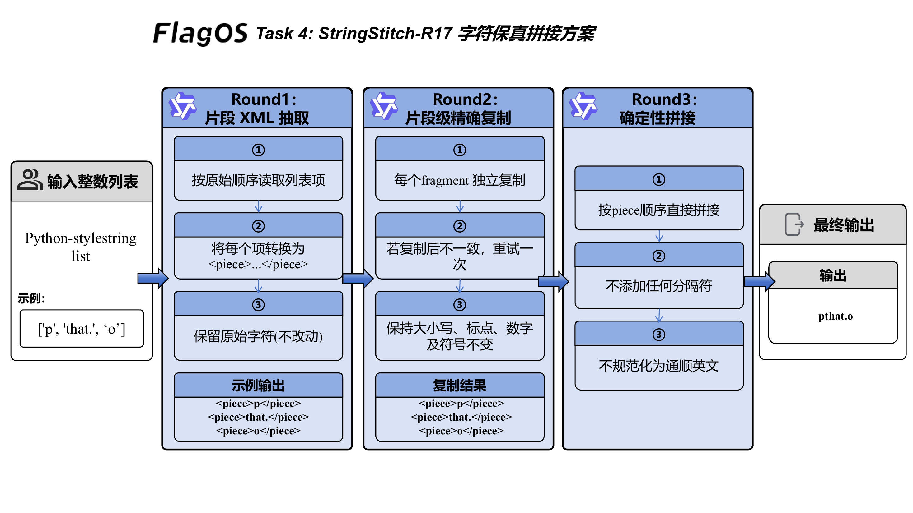
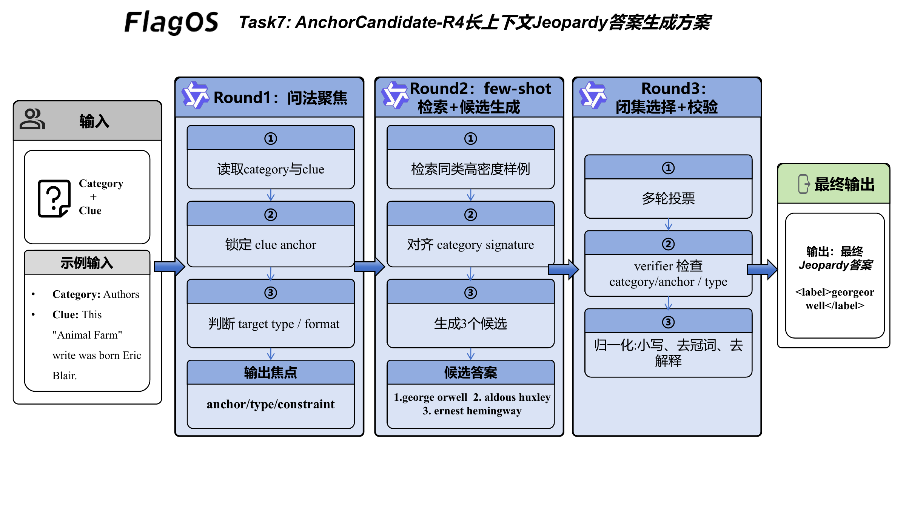

# OpenSeek LongContext-ICL-Annotation 技术报告

团队：穿过溪流

## 目录

- [团队介绍](#team)
- [任务介绍](#task-overview)
- [Task 1：MinGapAudit-S12](#task1)
- [Task 2：SyntaxAudit-R14](#task2)
- [Task 3：ParityStep-C11](#task3)
- [Task 4：StringStitch-R17](#task4)
- [Task 5：AffectBoundary-WC5](#task5)
- [Task 6：GenreBridge-M24](#task6)
- [Task 7：AnchorCandidate-R4](#task7)
- [Task 8：ContextGuard-R3](#task8)
- [Demo 展示](#demo)

<div style="page-break-before: always;"></div>

<a id="team"></a>

## 团队介绍

### 成员介绍

<table>
  <tr>
    <td align="center" width="33%">
      <br>
      <strong>岑子翰</strong><br>
      中山大学信息与通信工程硕博连读
    </td>
    <td align="center" width="33%">
      <br>
      <strong>唐业双</strong><br>
      中山大学集成电路工程硕士
    </td>
    <td align="center" width="33%">
      <br>
      <strong>郭宸璋</strong><br>
      中山大学通信工程硕士
    </td>
  </tr>
</table>

#### 岑子翰

**研究方向**

- 大模型与智能体
- 无线通信与 AI 算法

**竞赛经历**

<table>
  <tr>
    <th style="width: 68%;">赛事</th>
    <th style="width: 32%;">奖项 / 排名</th>
  </tr>
  <tr>
    <td>华为鸿蒙系统操控 Agent 竞赛</td>
    <td>优秀奖，排名 4/133</td>
  </tr>
  <tr>
    <td>华为昇腾 AI 创新大赛昇思模型开发挑战赛多模态赛道</td>
    <td>优秀奖，排名 18/173</td>
  </tr>
  <tr>
    <td>深信服“码上 AI·CoStrict 校园挑战赛”</td>
    <td>三等奖，排名 10/267</td>
  </tr>
  <tr>
    <td>“华为云杯”昇腾云血液图像处理大赛</td>
    <td>一等奖，排名 1/51</td>
  </tr>
</table>

#### 唐业双

**研究方向**

- 5G 移动通信

**竞赛经历**

<table>
  <tr>
    <th style="width: 68%;">赛事</th>
    <th style="width: 32%;">奖项</th>
  </tr>
  <tr>
    <td>全国大学生数学建模竞赛</td>
    <td>广东省二等奖</td>
  </tr>
  <tr>
    <td>全国电子设计大赛</td>
    <td>广东省三等奖</td>
  </tr>
  <tr>
    <td>全国大学生数学竞赛</td>
    <td>广东省二等奖、三等奖</td>
  </tr>
</table>

#### 郭宸璋

**研究方向**

- 大模型与多智能体工作流
- 语音识别与行业数据集构建
- 软件无线电与无线通信系统

**项目与实践**

<table>
  <tr>
    <th style="width: 36%;">经历</th>
    <th style="width: 64%;">内容</th>
  </tr>
  <tr>
    <td>联通（广东）产业互联网有限公司 AI 算法研发实习</td>
    <td>参与垂类语音识别模型、业务数据集自动化构建和多智能体工作流架构优化</td>
  </tr>
  <tr>
    <td>面向复杂电磁环境的智能扫描与信号解析系统</td>
    <td>参与软硬协同系统开发、频谱信号解析、多制式通信信号分类</td>
  </tr>
  <tr>
    <td>基于国产 SDR 的 5G 与卫星通信基带系统研发</td>
    <td>参与 5G 便携基站适配、高速数据链路设计和 SDR 工具链接入</td>
  </tr>
</table>

**竞赛经历**

<table>
  <tr>
    <th style="width: 68%;">赛事</th>
    <th style="width: 32%;">奖项 / 排名</th>
  </tr>
  <tr>
    <td>深信服 AI 创新技术大赛</td>
    <td>三等奖，排名 16/267</td>
  </tr>
  <tr>
    <td>华为鸿蒙系统操控 Agent 竞赛</td>
    <td>优秀奖，排名 4/133</td>
  </tr>
  <tr>
    <td>2025 全球“AI+无线电”挑战赛</td>
    <td>入围奖，排名 18/276</td>
  </tr>
  <tr>
    <td>全国大学生智能汽车竞赛</td>
    <td>省级一等奖</td>
  </tr>
  <tr>
    <td>广东省大学生电子设计竞赛</td>
    <td>省级一等奖</td>
  </tr>
</table>


<div style="page-break-before: always;"></div>

<a id="task-overview"></a>

## 任务介绍

8 个任务的形态差别很大。我们没有把所有任务都写成同一种 prompt，而是按错误类型拆方案：能算的任务先做本地校验，容易被表面线索误导的任务先收紧判断边界，开放生成任务则把输出空间压小，再用多轮校验收束。

| 任务 | 方案名 | 任务类型 | 主要思路 |
| --- | --- | --- | --- |
| Task 1 | MinGapAudit-S12 | 最小绝对差 | 先验证排序，再做相邻差分和最小值归约。 |
| Task 2 | SyntaxAudit-R14 | 词性计数 | 先确认 noun/verb 目标，再逐 token 审计。 |
| Task 3 | ParityStep-C11 | Collatz 一步变换 | 把列表级输出降解为可检查的奇偶转移。 |
| Task 4 | StringStitch-R17 | 字符串拼接 | 先解析列表，再按原顺序拼接并校验。 |
| Task 5 | AffectBoundary-WC5 | tweet sadness 判断 | 区分真实悲伤表达和表面负面词。 |
| Task 6 | GenreBridge-M24 | 体裁配对分类 | 先看 S1 是否是体裁 anchor，再看 S2 是否有具体配对桥梁。 |
| Task 7 | AnchorCandidate-R4 | Jeopardy 答案生成 | 先锁定 clue anchor 与目标类型，再生成候选并闭集选择。 |
| Task 8 | ContextGuard-R3 | PyTorch 代码生成 | 用规则型长上下文和门控修复稳定代码输出。 |

<div style="page-break-before: always;"></div>

<a id="task1"></a>

## Task 1：MinGapAudit-S12

Task 1 要求输出整数列表中任意两数的最小绝对差。这个任务本身不难，风险在于模型会改写数字、漏掉负号、排序出错，或者直接猜最终答案。

MinGapAudit-S12 把求解拆成三步：先让模型输出升序排列，并由本地程序检查它是否是原列表的合法重排；排序通过后，只比较相邻元素，逐对计算差值；最后用成对归约得到最小值。若中间状态不合法，系统进入重试或修复。

最终输出仍是 `<label>INTEGER</label>`。这套方案的重点是让错误停在中间环节，而不是等最终答案出来后才发现。

<p align="center">
  
  <br>
  <em>图 1：MinGapAudit-S12 长上下文最小间距审计方案</em>
</p>

图中的链路把最小差值任务拆成四个可控回合：Round 1 只让模型生成升序序列，Round 2 立刻审核排序是否仍然来自原始列表；排序可信后，Round 3 才进入相邻差计算，Round 4 再对差值进行审核和取小。输入列表、排序结果、差值列表和最终 `<label>` 都被显式隔开，避免模型把原始数字、相邻差和最终答案混在同一段自由推理里。

### 链路说明

链路从输入整数列表开始，第一步只做排序，并立刻检查排序结果是否仍是原列表的一个重排。这个检查通过后，系统才进入相邻差分；每个相邻 pair 都单独计算差值，避免模型在一长串数字里跳读。差值列表生成后，再做成对最小值归约，最终输出整数标签。如果排序、差分或归约中的任一步不可信，系统只修复当前环节，不重写整条链。

### 设计要点

**1. 超长上下文下的指令与提示策略**

Task 1 的提示不让模型一次性完成“排序、求差、取最小值”。我们把它拆成排序、相邻差分、最小值归约三个动作，并为每个动作设置固定输出格式。排序阶段强调输入守恒：不能新增数字、不能漏数字、不能改负号；差分阶段强调只看升序列表中的相邻元素；最终阶段只输出 `<label>INTEGER</label>`。这样做的目的很直接：让模型每次只处理一个低歧义动作。

**2. 标注示例很多时的长上下文构造**

最小差值任务中，原始数字样例的可迁移信息很少。把大量整数列表塞进上下文，反而会制造数字噪声。因此长上下文主要放规则清单、短 worked examples 和当前 active task。规则清单覆盖升序排列、重复值答案为 0、相邻差才可能成为最小差等边界。当前样本始终放在靠近输出的位置，让模型不要被附录里的数字带偏。

**3. 自动多轮交互与一致性控制**

系统先校验排序结果是否为原列表的合法重排，只有排序可信才进入差分。差分也不一次性全交给模型，而是逐对计算并局部检查。最后的最小值归约采用成对比较，降低长链推理出错概率。任何一步失败，都优先做局部修复，而不是重跑整题。

实现文件：

- [method_task1.py](/home/cenzihan/OpenSeek/openseek/competition/LongContext-ICL-Annotation/flagos/src/method_task1.py)
- [main_task1.py](/home/cenzihan/OpenSeek/openseek/competition/LongContext-ICL-Annotation/flagos/src/main_task1.py)

<div style="page-break-before: always;"></div>

<a id="task2"></a>

## Task 2：SyntaxAudit-R14

Task 2 要统计英文句子中的 nouns 或 verbs。模型常见错误不是不会数，而是没有先看清题目问 noun 还是 verb，或者把功能词、修饰词、动名词边界混在一起。

SyntaxAudit-R14 使用两阶段结构。Round 1 用 30k 长上下文做任务聚焦，只输出 XML 状态摘要；Round 2 回到短提示计数路径，逐 token 判断词性并输出整数。

<p align="center">
  
  <br>
  <em>图 2：SyntaxAudit-R14 长上下文词性计数方案</em>
</p>

图中的左侧是长上下文预读层，作用是把当前样本从大量规则说明中重新拉回到“本题要数什么”这个焦点上。中间的 XML 摘要不参与最终计数，只记录当前任务是否可用、目标词性是否明确。右侧的短提示计数层才真正执行逐 token 审计：先按空格和标点切分句子，再逐个判断 token 是否属于目标词性，最后把保留下来的 token 数量写入 `<label>`。这种分工让长上下文负责稳定规则，让短链路负责精确计数。

这套方案把 noun 和 verb 的规则分开处理：noun 侧重实体、人物、地点、物体和名词性概念；verb 侧重动作或事件词，保留真正表达动作的 `-ing`、`-ed` 形式。最终只输出 `<label>整数</label>`。

### 链路说明

链路左侧是长上下文预读，模型先确认当前题目问的是 noun 还是 verb，并把这个目标写入 XML 摘要。右侧是短提示计数器：先把句子拆成 token，再逐个判断是否属于目标词性，最后把保留下来的 token 数量写入标签。图里的词性规则不是额外模块，而是贯穿 Round 1 和 Round 2 的过滤标准；Round 1 负责稳住任务目标，Round 2 负责真正计数。

### 设计要点

**1. 超长上下文下的指令与提示策略**

Task 2 的核心提示先问“当前要数 noun 还是 verb”，再进入逐 token 审计。模型不能直接给一个估计值，而要按照目标词性过滤每个 token。noun 规则关注实体、人物、地点、物体和名词性概念；verb 规则关注动作、事件和真正表达动作的 `-ing`、`-ed` 形式。输出被压缩为整数标签，避免解释文本影响解析。

**2. 标注示例很多时的长上下文构造**

词性计数的长上下文不适合堆 caption 样例。我们把历史样例压缩为词性边界规则：哪些 `-ing` 应当计为 verb，哪些名词短语里的词仍应计为 noun，哪些功能词必须排除。noun 与 verb 的规则分开写，避免模型在一次判断里同时套两套标准。Round 1 的 30k 上下文只做任务聚焦，真正计数保留在短提示路径中。

**3. 自动多轮交互与一致性控制**

Round 1 输出 XML 摘要，确认任务目标和可用状态；Round 2 使用短提示做最终计数。这个设计让长上下文负责“进入正确审计框架”，让短提示负责“稳定输出整数”。如果输出无法解析，系统会回到固定格式重新约束，而不是接受自由解释。

实现文件：

- [method_task2.py](/home/cenzihan/OpenSeek/openseek/competition/LongContext-ICL-Annotation/flagos/src/method_task2.py)
- [main_task2.py](/home/cenzihan/OpenSeek/openseek/competition/LongContext-ICL-Annotation/flagos/src/main_task2.py)

<div style="page-break-before: always;"></div>

<a id="task3"></a>

## Task 3：ParityStep-C11

Task 3 要对输入整数列表逐元素执行一次 Collatz 风格变换：偶数输出 `x / 2`，奇数输出 `3 * x + 1`，最终返回与原列表等长的新整数列表。这里最容易出错的是模型把奇偶规则用反、输出公式而不是整数，或在列表顺序和长度上发生漂移。

ParityStep-C11 的思路是先尝试整表生成；如果完整列表不稳定，就把问题降解为逐位置单点变换，再按原顺序重组。系统用固定格式约束输出，必要时触发局部修复。

长上下文部分主要用来反复强调奇偶规则、顺序保持和输出格式；真正影响结果的是每个位置的变换是否可验证。最终标签保持为整数列表输出。

<p align="center">
  
  <br>
  <em>图 3：ParityStep-C11 长上下文 Collatz 步骤审计方案</em>
</p>

图中的链路先用长上下文聚焦当前任务和奇偶规则，再进入状态更新：读取当前整数、判断奇偶、选择 `x / 2` 或 `3 * x + 1`。局部一致性检测用于检查奇偶判断、数值更新和输出结构是否匹配；如果不通过，就回退到上一个可信状态重新修复。对于列表输入，系统把每个位置的局部结果按原顺序合并为最终 `<label>[...]</label>`。

### 链路说明

链路从整数列表开始，优先让模型一次性输出完整变换结果。若整表输出通过格式、长度和基本一致性检查，就直接进入最终标签；若失败，系统把列表拆成单个位置，让模型分别完成奇偶判断和一次数值更新。所有位置得到可用结果后，再按原始顺序重组列表。链路里的关键不是让模型写解释，而是让每个位置都有可复核的输入、规则分支和输出值。

### 设计要点

**1. 超长上下文下的指令与提示策略**

Task 3 的提示把 Collatz 规则写成显式的一步变换：先判断奇偶，再执行对应公式，最后只输出计算后的整数。模型每个位置都必须面对当前数字，而不是凭印象套用别的样例。对于奇数、偶数、顺序保持和列表格式，提示中都使用固定措辞，减少“规则用反”或“输出公式”的情况。

**2. 标注示例很多时的长上下文构造**

Collatz 任务的长上下文价值不在于放很多完整序列，而在于反复固定转移规则、输出格式和顺序约束。完整序列过多会让模型模仿无关数字，甚至把别的样例中间状态混进当前题。我们保留少量边界例子，例如连续偶数、奇数后变大、容易漏掉 `+1` 的情况，其余空间用于规则化说明和 active task。

**3. 自动多轮交互与一致性控制**

系统先走整表路径，失败后降级为位置级路径：当前数、奇偶判断、下一数、局部检查。若某个位置异常，可以只修复该位置，再把所有位置按原顺序合并。这样比反复重跑整张列表更稳，也便于在批量标注中定位错误来源。

实现文件：

- [method_task3.py](/home/cenzihan/OpenSeek/openseek/competition/LongContext-ICL-Annotation/flagos/src/method_task3.py)
- [main_task3.py](/home/cenzihan/OpenSeek/openseek/competition/LongContext-ICL-Annotation/flagos/src/main_task3.py)

<div style="page-break-before: always;"></div>

<a id="task4"></a>

## Task 4：StringStitch-R17

Task 4 要把输入中的字符串列表按顺序拼接。模型的风险集中在解析阶段：漏掉元素、改写转义字符、错用分隔符，或者把列表里的标点当成结构标记。

StringStitch-R17 先把输入解析成受控片段，再按原顺序拼接。提示里强调不排序、不改写、不补字符；程序侧则关注长度、顺序和输出格式。

这个任务适合规则型长上下文，不适合堆大量样例。可迁移的信息主要是“原样保留”和“按序拼接”。

<p align="center">
  
  <br>
  <em>图 4：StringStitch-R17 长上下文字符串拼接方案</em>
</p>

图中的链路先把原始输入收束成可检查的字符串片段，再进入顺序拼接。解析阶段关注列表边界、元素数量、引号、逗号、空串和转义符；拼接阶段只按原顺序合并，不新增分隔符，也不对字符串内容做语义修正。最后的校验层用元素数、顺序和输出格式拦截漏项、错序和字符改写。

### 链路说明

链路先做结构解析：从输入中识别列表边界、字符串元素和转义内容。解析结果通过后，系统按原始顺序拼接，不插入额外分隔符，也不修正看起来“不自然”的字符。最后输出阶段只接受拼接后的标签。这个流程把“看懂列表”和“拼出结果”分开，能更早发现漏项、错序和字符改写。

### 设计要点

**1. 超长上下文下的指令与提示策略**

Task 4 的提示把模型限制在“解析列表”和“按序拼接”两个动作上。它反复强调不能排序、不能补字符、不能改写字符串内容，也不能把引号、逗号或转义符当成普通说明文字。最终答案只接受拼接后的字符串标签，减少模型写解释的空间。

**2. 标注示例很多时的长上下文构造**

字符串拼接任务的样例数量再多，可迁移的也主要是结构规则。长上下文因此采用规则型压缩：如何识别列表元素、如何处理空串、引号、逗号、反斜杠和特殊字符。当前样本放在 active task 中，附录只提供边界提醒，不让大量历史字符串干扰当前拼接顺序。

**3. 自动多轮交互与一致性控制**

系统先让模型输出可检查的解析结果，再检查元素数量和顺序。若解析阶段已经漏项，后续拼接不会被直接接受。修复时只针对当前列表重新解析或重新拼接，避免因为一次错误把整个输出链路污染掉。

实现文件：

- [method_task4.py](/home/cenzihan/OpenSeek/openseek/competition/LongContext-ICL-Annotation/flagos/src/method_task4.py)
- [main_task4.py](/home/cenzihan/OpenSeek/openseek/competition/LongContext-ICL-Annotation/flagos/src/main_task4.py)

<div style="page-break-before: always;"></div>

<a id="task5"></a>

## Task 5：AffectBoundary-WC5

Task 5 判断 tweet 是否表达 sadness。难点在于很多词看起来负面，但并不代表作者真的悲伤：歌词、新闻标题、体育输赢、政治事件、hashtag 都可能制造干扰。

AffectBoundary-WC5 先判断语义主体是否真的表达 sadness，再把强度映射到 `Sad / Not sad`。Round 1 用长上下文激活边界规则，Round 2 使用稳定短提示完成最终分类。

<p align="center">
  
  <br>
  <em>图 5：AffectBoundary-WC5 长上下文情绪边界判定方案</em>
</p>

图里的链路可以分成三段看。第一段是 tweet 语义预读，模型先判断这条文本是在表达个人情绪、引用内容，还是描述外部事件。第二段是边界规则校准：`Sad Evidence` 用来保留第一人称痛苦、哭泣、无助、精神压力等强信号；`Not sad Distractors` 用来过滤歌词、标题、话题词、玩笑和公共事件。第三段才是二分类输出，把可归因的 sadness 映射到 `Sad`，其余情况压回 `Not sad`。

图中的 `Sad Evidence` 和 `Not sad Distractors` 是提示里的边界规则，不是单独模块。模型先读整体语义，只有能归因到说话者或语义主体的 sadness 才输出 `Sad`。

### 链路说明

链路先读取 tweet 的完整语义，判断表达主体是谁，以及 sadness 是否能归因到这个主体。随后再看局部线索：第一人称低落、哭泣、心理压力会增强 `Sad` 证据；歌词、标题、玩笑、公共事件和单独 hashtag 会进入干扰过滤。Round 1 只做边界聚焦，Round 2 才把语义强度映射成 `Sad / Not sad`。后处理只处理少量已知边界，不替代模型主判断。

### 设计要点

**1. 超长上下文下的指令与提示策略**

Task 5 的提示要求模型先读整体语义，再看词表线索。`sad`、`hurt`、`lost`、`dark`、emoji、hashtag 都只能作为辅助证据，不能单独触发 `Sad`。模型必须判断 sadness 是否能归因到说话者或 tweet 中的语义主体。这个顺序能压住歌词、标题、体育、政治新闻等高频误判来源。

**2. 标注示例很多时的长上下文构造**

AffectBoundary-WC5 的 30k 上下文不堆 tweet 原文，而是整理成情绪边界规则。长上下文里同时放 `Sad Evidence` 和 `Not sad Distractors`：前者保证第一人称痛苦、哭泣、精神压力等信号能被召回，后者提醒模型不要把话题词、引用、玩笑和公共事件误判为作者悲伤。这样比简单词表更密集，也更不容易过拟合某些 hashtag。

**3. 自动多轮交互与一致性控制**

Round 1 做语义预读，只让模型进入“语义优先、词表从属”的判断方式；Round 2 使用稳定短提示给出最终 `Sad / Not sad`。系统还保留轻量后处理，用于修正少数已知边界样本。长上下文和短提示各司其职，避免一个很长的 prompt 直接决定最终标签而带来漂移。

实现文件：

- [method_task5.py](/home/cenzihan/OpenSeek/openseek/competition/LongContext-ICL-Annotation/flagos/src/method_task5.py)
- [main_task5.py](/home/cenzihan/OpenSeek/openseek/competition/LongContext-ICL-Annotation/flagos/src/main_task5.py)

<div style="page-break-before: always;"></div>

<a id="task6"></a>

## Task 6：GenreBridge-M24

Task 6 判断两句子是否构成目标 genre 下的有效配对。它不是普通 genre 分类。核心是两步：Sentence 1 是否是目标体裁的 source-style anchor；Sentence 2 是否是基于 Sentence 1 的 hypothesis、rewrite、contradiction 或 simplification。

GenreBridge-M24 用 30k 长上下文做预读，让模型先进入 `S1 anchor + S2 pair bridge` 的判断框架；Round 2 再用短提示和同 genre few-shot 完成最终判定。最终输出 `Y / N`。

<p align="center">
  
  <br>
  <em>图 6：GenreBridge-M24 长上下文体裁配对分类方案</em>
</p>

图中的 Round 1 只做结构化预读：它读取 30k 规则上下文和当前样本，输出 `genre_anchor / pair_bridge / focus`，帮助模型先站到正确的判断框架里。Round 2 才是最终分类器：先检索同 genre few-shot，再判断 S1 是否能作为 source-style anchor，接着判断 S2 是否是基于 S1 的 hypothesis、rewrite、contradiction 或 simplification。右侧的有效桥梁和 N 触发条件是 Round 2 的判定准则，不是额外串行模块。

有效桥梁包括同一人物、地点、对象、机构、政策、事件框架，或者共享框架下的改写和矛盾。只有话题相似、模糊代词、S2 独立像目标体裁，都不能直接判 `Y`。

### 链路说明

链路先看输入中的 S1、S2 和目标 genre。Round 1 用长上下文预读，输出 `genre_anchor`、`pair_bridge` 和 `focus`，相当于先把注意力放到“体裁锚点”和“配对桥梁”上。Round 2 才进入最终分类：先判 S1 是否站得住，再判 S2 是否是基于 S1 的假设、改写、矛盾或简化。最后必须写出具体 bridge；如果 bridge 只能靠模糊代词或话题重叠支撑，就输出 `N`。

### 设计要点

**1. 超长上下文下的指令与提示策略**

Task 6 的提示把普通 genre 分类改成两个连续判断：Sentence 1 是否是目标 genre 的 source-style anchor，Sentence 2 是否和 Sentence 1 存在 concrete pair bridge。模型必须写出 `S1 target genre`、`S2 valid hypothesis` 和 `Pair bridge`，最后才能输出 `<label>Y/N</label>`。这样可以避免“两个句子都像 travel/government/slate 就判 Y”的误判。

**2. 标注示例很多时的长上下文构造**

GenreBridge-M24 的 30k 上下文主要注入 anchor 与 bridge 原则，而不是把 few-shot 样例全部塞进去。真正的 few-shot 留给 Round 2，并按同 genre 动态检索。长上下文负责统一规则环境：topic overlap 不够，vague pronoun 不够，独立像目标体裁也不够；短上下文负责用高密度样例校准具体边界。

**3. 自动多轮交互与一致性控制**

Round 1 输出 `genre_anchor / pair_bridge / focus` XML 摘要，不直接给最终标签。Round 2 重建短提示，恢复同 genre few-shot，执行 `S1 / S2 / Pair bridge / label` 判定。如果输出格式不合规，系统进入 retry 或 repair，重新强调 S1 anchor 和 concrete bridge。

实现文件：

- [method_task6.py](/home/cenzihan/OpenSeek/openseek/competition/LongContext-ICL-Annotation/flagos/src/method_task6.py)
- [main_task6.py](/home/cenzihan/OpenSeek/openseek/competition/LongContext-ICL-Annotation/flagos/src/main_task6.py)

<div style="page-break-before: always;"></div>

<a id="task7"></a>

## Task 7：AnchorCandidate-R4

Task 7 是 Jeopardy answer generation。答案空间开放，category 又经常带有隐藏约束，比如问人物、地点、作品、组织，或要求 before & after、homophone、one word only 等格式。

AnchorCandidate-R4 先解析 category 和 clue，得到 target type、format constraint 和 relation pattern。随后检索少量结构相近的样例，生成 3 个候选答案，再让闭集选择器只从候选里选编号。这样能减少自由生成中的解释文本和格式漂移。

系统还会做候选过滤和表面形式归一化：去掉 `who is / what is`，处理冠词、别名、过长短语和 clue fragment。若没有可用答案，最多进入 4 轮 retry，最后使用直接 `<label>` 兜底。

<p align="center">
  
  <br>
  <em>图 7：AnchorCandidate-R4 长上下文 Jeopardy 答案生成方案</em>
</p>

图中的链路把开放式答案生成压缩成“问法聚焦、检索候选、闭集选择”三段。Round 1 先读取 category 与 clue，锁定 clue anchor、target type 和 format constraint；Round 2 检索同类高密度样例，并生成少量候选；Round 3 通过多轮投票和 verifier 校验 category、anchor 与答案类型。最终只输出归一化后的 `<label>`，不保留解释文本。

### 链路说明

链路从 category 和 clue 解析开始，先判断题目问的是人名、地点、作品、组织，还是某种文字游戏。随后检索结构相近的 few-shot，生成少量候选。候选生成之后，系统会过滤明显不可提交的内容，再把候选交给闭集选择器。选择器只返回编号，verifier 再复核一次，最后由本地归一化处理冠词、大小写、`what is` 前缀和候选表面形式。

### 设计要点

**1. 超长上下文下的指令与提示策略**

Task 7 的提示先要求模型给出 `clue anchor` 和 `type/constraint`，再给答案。Jeopardy 题的 category 经常限定答案类型或格式，所以模型必须先判断题目到底问人物、地点、作品、组织，还是 wordplay 形式。候选阶段允许模型召回多个可能答案，选择阶段则只能返回候选编号，不能继续自由改写。

**2. 标注示例很多时的长上下文构造**

可用样例很多时，系统不会只按文本相似度堆例子。每个样例会被解析出 category signature、target type、format constraint、relation pattern、wordplay 标记和 clue overlap。检索优先匹配题目结构，再看词面重叠。这样选出的 few-shot 数量少，但信息密度高，能减少“词面相似但答案类型不同”的干扰。

**3. 自动多轮交互与一致性控制**

自动交互分成 candidate pass、selector votes、verifier 和 retry。模型先提出候选，程序过滤掉解释句、clue fragment、过长短语和 meta answer。选择器多次改变候选顺序并投票，verifier 再做一次闭集复核。最后通过归一化和候选闭包约束输出答案，开放问答因此变成可控的候选收束问题。

实现文件：

- [method_task7.py](/home/cenzihan/OpenSeek/openseek/competition/LongContext-ICL-Annotation/flagos/src/method_task7.py)
- [main_task7.py](/home/cenzihan/OpenSeek/openseek/competition/LongContext-ICL-Annotation/flagos/src/main_task7.py)

<div style="page-break-before: always;"></div>

<a id="task8"></a>

## Task 8：ContextGuard-R3

Task 8 根据自然语言规格生成 Python / PyTorch 代码。这里的输出不是短标签，而是完整可运行模块，因此格式、函数签名、参数默认值、`out=` 行为、广播规则、训练/推理开关和返回结构都要守住。

ContextGuard-R3 先构造 15K+ 规则型长上下文，要求模型输出纯 PyTorch 模块。首轮候选只有通过编译、签名、结构和占位代码检查才会被接受；否则丢弃，进入短上下文 R3 修复链路。

<p align="center">
  
  <br>
  <em>图 8：ContextGuard-R3 长上下文代码生成方案</em>
</p>

图里的第一段是规格解析：系统先从自然语言中抽出 wrapper、参数、shape、数学语义和返回约束。第二段是长上下文规则探针：模型在 15K+ 规则上下文中生成首轮代码，但这份代码不会被无条件接受。第三段是严格门控，检查编译、函数签名、模块结构和占位内容；只有通过才进入最终输出。若门控失败，系统丢弃首轮候选，转入短上下文生成和修复链路，最多执行 3 轮。

这套方案不鼓励模型写复杂 CUDA 或 Triton。重点是复刻 PyTorch API 语义，保证代码可编译、可调用、可复现。

### 链路说明

链路先解析自然语言规格，锁定 wrapper 名称、参数、shape 关系和数学语义。然后构造 15K+ 规则型长上下文，让模型在首轮生成完整 PyTorch 模块。首轮结果不会直接相信：系统会提取代码，检查编译、签名、函数名、返回结构和占位内容。只有通过门控才接受；未通过就进入短上下文 R3 修复，由错误信息驱动下一轮生成或修补。

### 设计要点

**1. 超长上下文下的指令与提示策略**

Task 8 的提示锁定 wrapper、函数签名、默认参数、返回结构和 PyTorch API 语义。模型必须输出完整 Python 模块，并以纯 PyTorch 实现为主；Triton、CUDA kernel、占位代码和伪实现都被禁止。提示的重点不是鼓励复杂代码，而是复刻 `out=`、broadcasting、dtype/device、training、reduction 等 API contract。

**2. 标注示例很多时的长上下文构造**

代码生成样例很多，但直接堆代码会带来算子族污染。ContextGuard-R3 把历史经验压缩成规则 digest：签名锁定、张量形状、线性代数方向、归约语义、inplace/out 行为、训练推理开关等。当前任务的 wrapper 信息单独放入 active 区块，确保长上下文提供规则底座，而不是让模型从无关样例里拼代码。

**3. 自动多轮交互与一致性控制**

首轮 15K+ 长上下文候选必须通过严格门控，包括代码提取、编译、函数名、签名、模块结构和占位内容检查。通过才接受；不通过就丢弃，不让坏候选进入后续修复。随后短上下文 R3 链路根据错误类型生成或修复代码。长上下文负责稳定规则，短链路负责最终可执行性和一致性。

实现文件：

- [method_task8.py](/home/cenzihan/OpenSeek/openseek/competition/LongContext-ICL-Annotation/flagos/src/method_task8.py)
- [main_task8.py](/home/cenzihan/OpenSeek/openseek/competition/LongContext-ICL-Annotation/flagos/src/main_task8.py)

<div style="page-break-before: always;"></div>

<a id="demo"></a>

## Demo 展示

为了方便现场展示，我们在报告之外补充了一个轻量 Web Demo。界面左侧用于切换 Task 1、2、3、5、6、7，中间是可编辑输入框和实时输出区，右侧展示对应任务的流程图。展示时可以直接修改输入内容，点击 `Run Live` 后，后端会调用正在运行的 Qwen3-4B / vLLM 服务，并复用各任务当前的 `method_task*.py` 推理链路返回结果。

Demo 的重点不是重新实现一套简化规则，而是把报告里的长上下文标注链路做成可交互入口：输入会被整理成各任务原始数据格式，再进入现有 prompt、检索、重试、后处理和标签解析流程。页面中的进度监控会显示当前请求状态和关键 trace，输出区展示最终 `<label>`，便于观察一次标注是如何收束到最终结果的。

下图展示的是 Task 5 的一次现场输入：用户把 tweet 改成“我外卖被偷了”，点击运行后，系统沿用 AffectBoundary-WC5 的悲伤边界判定链路，先判断这句话是否表达可归因的 sadness，再输出 `<label>Sad</label>`。这个例子比较直观地说明了 Demo 的作用：它不是只展示固定样例，而是可以把临时输入直接送入当前任务方法中完成一次真实标注。

<p align="center">
  
  <br>
  <em>图 9：Task 5 Demo 示例，“我外卖被偷了”被判定为 Sad</em>
</p>

当前 Demo 入口：

```text
http://服务器IP:8082/demo/
```

若通过 SSH 访问服务器，可将端口转发到本地：

```bash
ssh -L 8082:127.0.0.1:8082 用户名@服务器地址
```
