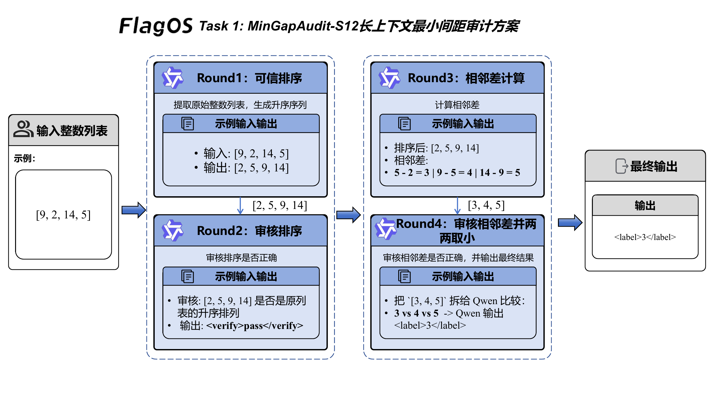
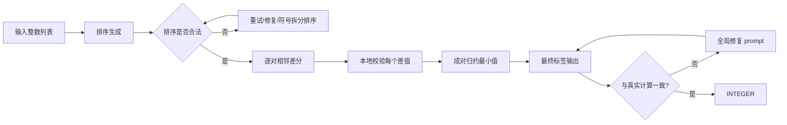

# Task 1 技术方案：MinGapAudit-S12

## 1. 任务目标

Task 1 要求模型对一个整数列表输出任意两数之间的最小绝对差，最终结果是一个整数标签。表面上看，这是一个简单的数值计算；放到大模型自动标注链路里，容易出错的反而是前面的中间状态：

- 模型是否会改写、遗漏或重复输入整数；
- 模型在排序时是否会丢失负号或拼错数字；
- 模型是否会把差值方向算反；
- 模型是否会在最终输出时直接“猜一个数”，而不是沿着可验证链路完成计算。

因此，我们没有让模型一次性自由生成答案，而是采用 **MinGapAudit-S12**：把求解拆成多个可检查的小步骤，每一步都配套局部校验与自动修复。

## 2. 方案概览

一句话概括：

> 先把输入列表变成可信的有序序列，再把最终答案拆成若干个局部可验证的微计算。

流程分为四层：

1. **排序层**
   - 先让模型只做一件事：输出原整数列表的升序排列；
   - 本地检查结果是否为原列表的合法重排；
   - 若排序失败，进入重试、修复与按符号拆分排序。

2. **相邻差分层**
   - 基于已验证排序结果，逐对计算相邻差值；
   - 每个差值都单独判断是否正确。

3. **最小值归约层**
   - 不直接让模型对整组差值“看一眼给答案”；
   - 改为成对比较、逐步归约最小值。

4. **全局兜底层**
   - 当局部链路仍存在异常时，再回退到紧凑的全局修复 prompt；
   - 并结合输入列表的真实数学结果做最终一致性判断。

这样处理后，单步漂移不会直接污染最终答案，错误会尽量停在中间环节。

## 3. 系统链路

图 1 展示了 MinGapAudit-S12 的整体执行链路。

<p align="center">
  
  <br>
  <em>图 1：MinGapAudit-S12 长上下文最小间距审计方案</em>
</p>

这张图把最小差值任务拆成“可信排序、审核排序、相邻差计算、审核差值并取小”四个回合。输入整数列表先被转成可检查的升序序列；排序通过后，系统才允许模型进入相邻差计算；最终输出只保留 `<label>` 标签。这样做的目的不是把计算藏在程序里，而是让模型每次只处理一个边界清楚的小动作。



如果后续绘制系统框图，建议突出三层结构：

- `Verified Sorting`
- `Local Gap Audit`
- `Pairwise Min Reduction`

这能更清楚地表达本方案的重点：先构造可信中间状态，再输出答案。

## 4. 提示策略设计

### 4.1 单步任务化，而不是一次性求解

Task 1 的实现没有要求模型一步完成“排序 + 差分 + 取最小值”，而是把任务拆成多个低歧义动作：

- 只排序；
- 只算两个数之间的差；
- 只比较两个候选值谁更小；
- 最后才返回整数标签。

这类拆解对于统一小模型尤其有效，因为每一步都只有一个明确目标，输出空间也更小。

### 4.2 显式约束输入守恒

排序阶段的提示反复强调：

- 不允许增加数字；
- 不允许丢失数字；
- 不允许修改负号；
- 输出必须是原输入的一个升序重排。

Task 1 的很多错误不是数学错误，而是“把 `-41` 写成 `41`”或者“把两个相邻数字拼在一起”。输入守恒是本方案最优先的约束。

### 4.3 差分方向显式化

在差分阶段，我们明确要求：

> 相邻差值必须是 `NEXT - CURRENT`，而不是 `CURRENT - NEXT`。

因为列表已经升序排列，所以差值应当全部为非负整数。这个条件既是提示规则，也是本地校验依据。

### 4.4 输出格式收紧

最终输出固定为：

```text
<label>INTEGER</label>
```

中间阶段也采用固定标签：

- `<sorted>[...]</sorted>`
- `<diffs>[...]</diffs>`

这样做可以让系统在自动运行时直接解析和复核各阶段结果。

## 5. 长上下文输入构造思路

Task 1 本身是确定性计算任务，但在超长上下文场景下，示例组织方式仍会影响稳定性。

### 5.1 为什么不堆叠大量原始示例

对于最小差值任务，直接堆叠整数列表示例收益有限。可迁移的信息主要是这几条：

- 列表必须先排序；
- 差值只看相邻元素；
- 有重复时答案为 0；
- 最终答案是差值集合中的最小值。

原始示例堆叠还会带来两类风险：

- 数字噪声增加，模型容易被无关数字干扰；
- prompt 很长，但新增信息密度很低。

### 5.2 规则优先的长上下文设计

因此，MinGapAudit-S12 更适合采用 **规则清单 + 微型 worked examples + active task** 的结构：

1. **规则清单**
   - 输入守恒
   - 升序排列
   - 相邻差分
   - 重复值对应答案 0

2. **小型示例**
   - 用少量短列表展示关键边界情况；
   - 尤其强调负数、重复值和接近值。

3. **active task**
   - 将当前样本放在最靠近模型输出的位置；
   - 保证当前任务信号始终最强。

Task 1 的长上下文价值不在于放入更多数字，而在于提供更稳定的规则环境。

## 6. 自动多轮交互与一致性设计

MinGapAudit-S12 的多轮链路是当前方案最重要的部分。

### 6.1 第一轮：排序可信化

系统先调用排序 prompt，并在本地检查：

- 长度是否一致；
- 多重集合是否一致；
- 是否单调不降。

如果不满足，则依次进入：

- 排序重试；
- 排序修复；
- backup prompt；
- 按负数/非负数拆分后分别排序再合并。

这一步的目标是优先拿到一个可信的中间状态。

### 6.2 第二轮：差分逐对修复

排序一旦可信，系统就不再让模型一次性输出全部差值，而是对每一对相邻元素单独提问。若答案错误，则进一步发起该 pair 的 retry / repair。

这一步把长链推理拆成多个短局部判断，执行更稳定。

### 6.3 第三轮：最小值归约

对差值集合不直接做全局扫描，而是做逐步归约：

- 先比较前两个差值；
- 再把较小值与下一个候选比较；
- 重复直到结束。

模型每次只需要回答“这两个数谁更小”，难度低于一次性从长列表里抽出最小值。

### 6.4 最终一致性收束

即便经过以上步骤，系统仍会在最后用真实输入列表计算标准答案，并检查最终输出是否一致。若模型给出 `0`，系统还会额外结合输入是否真的有重复值做特殊处理，避免无依据的零值预测。

## 7. 复现实现说明

当前实现位于：

- [method_task1.py](/home/cenzihan/OpenSeek/openseek/competition/LongContext-ICL-Annotation/flagos/src/method_task1.py)
- [main_task1.py](/home/cenzihan/OpenSeek/openseek/competition/LongContext-ICL-Annotation/flagos/src/main_task1.py)

公开接口保持不变：

- `build_prompt(task_id, task_description, text2annotate)`
- `select_examples(all_examples, task_description, text2annotate)`
- `annotate_nvidia(input_prompt, task_id=1, debug=False, text2annotate=...)`

其中 `annotate_nvidia` 内部实现了：

- 排序合法性校验；
- gap 局部修复；
- min 归约修复；
- 最终结果一致性验证。

复现方不需要修改外部调用方式，运行既有入口即可。

## 8. 小结

MinGapAudit-S12 的重点不是“让模型更会算”，而是把最小差值任务改造成一条可以被逐段检查的链路：

- 排序结果先验证；
- 差值逐对算；
- 最小值逐步归约；
- 最终答案再比对。

这种设计适合自动标注场景：错误尽量在中间阶段暴露，而不是等到最终答案才被发现。

## 9. 对评分问题的对应关系

### 9.1 在超长上下文场景下，如何设计有效的模型指令与提示策略？

本方案将提示拆为低歧义、强约束的小任务：排序、差分、比较最小值，各阶段都只保留一个明确目标，并使用固定标签格式约束输出。相比自由式一次生成，这种策略更能保证模型在长上下文和批量执行中的稳定性。

### 9.2 当可用标注示例数量显著超过模型上下文容量时，如何构造信息密集、结构合理的超长上下文输入？

Task 1 中可迁移的是规则而不是原始数字，因此我们主张用规则清单、短 worked examples 和 active task 区块替代低密度示例堆叠。这样可以在有限上下文中保留更高的信息密度，并减少无关数字造成的干扰。

### 9.3 在自动多轮对话或持续交互场景中，如何高效利用超长上下文，实现一致性与可扩展性兼顾的数据标注？

本方案通过“排序可信化 - 局部差分修复 - 最小值归约 - 最终一致性收束”的多轮结构，让模型每轮只处理一个局部子问题，并由本地程序校验关键中间状态。这提升了结果一致性，也便于扩展到大规模批量标注。
