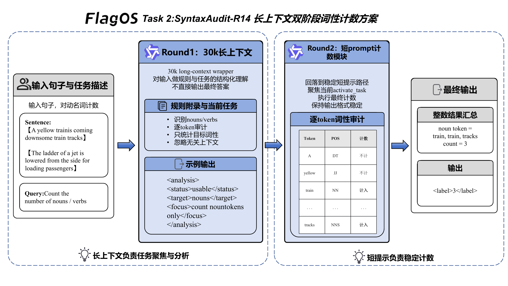

# Task 2 技术方案：SyntaxAudit-R14

## 1. 任务目标

Task 2 要求模型对英文句子中的指定词性进行计数，最终输出一个整数。这个任务看起来只是计数，但放到长上下文自动标注环境中，难点不只在“会不会数”：

- 模型是否能先识别当前问题究竟要求统计 `nouns` 还是 `verbs`。
- 模型在长输入中是否会被无关内容干扰，出现词性混淆。
- 模型在自动批量调用时是否还能持续输出可解析、可复现的整数结果。

我们采用 **SyntaxAudit-R14**，并在最终复现版本中扩展为 **30k 长上下文双阶段执行链路**：第一阶段使用约 30k token 的长上下文做结构化预读，第二阶段回到经过验证的短提示计数路径，使最终输出保持稳定。

## 2. 方案概览

一句话概括：

> 用长上下文完成“环境建模与任务聚焦”，用短提示完成“精确计数与稳定输出”。

模型不会在 30k 提示中直接给最终答案。整个流程被拆成两个职责清晰的阶段：

1. **Round 1：长上下文预读**
   - 输入一个约 30k token 的结构化上下文。
   - 上下文中包含重复但稳定的语法审计原则，以及真实的当前任务区块。
   - 模型只需输出一个紧凑 XML 结构，用来确认当前任务目标与执行状态。

2. **Round 2：短提示精确计数**
   - 使用外部已验证的最佳短提示模板执行计数。
   - 保持输出接口和判定逻辑与最佳版本一致。
   - 最终只返回整数标签。

这样既满足 30k 长上下文输入要求，也保留了原有最优方案的决策边界。

## 3. 系统链路

图 1 展示了 SyntaxAudit-R14 的整体执行链路。

<p align="center">
  
  <br>
  <em>图 1：SyntaxAudit-R14 长上下文词性计数方案</em>
</p>

从执行链路看，SyntaxAudit-R14 分为两个部分。左侧是 30k 长上下文包装器，负责任务聚焦和规则激活；右侧是经过校准的短提示执行器，负责逐 token 审计、词性过滤和最终整数输出。两者之间只传递结构化预读结果，避免把超长上下文里的噪声带入最终计数。

对应的执行步骤如下：


## 4. 提示策略设计

### 4.1 目标优先，而不是直接计数

模型先确认当前 query 的目标词性，再进入计数。这可以避免一种常见错误：模型看到句子后直接按“最显眼的词类”估计数量，却忽略当前问题到底问的是 noun 还是 verb。

### 4.2 词性审计规则显式化

对于不同目标，分别提供不同的审计准则：

- **verbs**
  - 只统计动作或事件词。
  - 保留可表达动作的 `-ing`、`-ed` 形式。
  - 排除名词、形容词、介词、限定词，以及不应计入的辅助成分。

- **nouns**
  - 统计实体、人物、地点、物体、动物及名词性概念。
  - 重复出现的 noun token 分开计数。
  - 排除动词、代词、形容词和功能词。

这种“分目标审计”比通用提示更稳：每次只保留一套局部规则，模型不需要在 noun 和 verb 两套边界之间来回切换。

### 4.3 逐 token 审计，而不是整体估计

Task 2 的很多样本是短句或 caption 风格文本，里面既有内容词，也有功能词，还有词性边界模糊的形式。逐 token 审计主要用来降低以下误差：

- 把 `coming / standing / riding` 等动作形式漏掉或误归类。
- 把 `train / tracks / side / front` 这类实体词因短语结构而漏计。
- 把功能词误计入目标词性。

### 4.4 输出格式收紧

最终格式固定为：

```text
<label>NUMBER</label>
```

解析端只接受整数，并提供轻量兜底提取策略，避免批量运行被少量格式噪声中断。

## 5. 30k 长上下文构造方法

这是本方案相对普通 prompt 的主要差异。

### 5.1 为什么不直接堆样例

当可用示例数量大于模型有效上下文容量时，直接堆叠样例会带来两个问题：

- **信息密度低**：大量样例在重复展示相似词性边界，新增信息有限。
- **干扰增强**：noun/verb 问题交替出现，容易让模型把其他样例中的目标混入当前任务。

因此，本方案没有采用“长样例堆叠”，而是使用 **规则压缩型长上下文**。

### 5.2 长上下文的结构

Round 1 的长提示由三部分组成：

1. **reference_appendix**
   - 重复但稳定的语法审计原则。
   - 明确说明应以当前 active task 为准。

2. **active_task**
   - 放入真实任务描述与待标注句子。
   - 这是唯一具有最终决策权的任务区块。

3. **XML 输出约束**
   - 只允许输出结构化摘要。
   - 禁止直接在 Round 1 给出最终自然语言答案。

这种结构既能让输入长度稳定达到约 `30k token`，也能让有效任务信号始终处在聚焦位置。

### 5.3 为什么两轮比单轮 30k 更稳

单轮 30k 直接出答案的问题在于，模型容易把“规则学习”和“最终解码”耦合起来，导致输出形式和边界决策一起漂移。

两轮拆分后：

- 长上下文只负责“看全局、聚焦任务、做预读”。
- 短提示只负责“做最终计数、走稳定输出模板”。

这样既利用了长上下文能力，也避免它直接扰动最终解码轨迹。

## 6. 自动多轮交互与一致性设计

外部接口保持单次调用形式，内部实现则是一个轻量双阶段自动交互流程。

### 6.1 Round 1：结构化预读

第一轮要求模型输出如下风格的 XML：

```xml
<analysis>
  <status>usable|fallback</status>
  <target>nouns|verbs|unknown</target>
  <focus>short hint or fallback</focus>
</analysis>
```

它不替代最终答案，只让模型先在长上下文里完成任务聚焦。

### 6.2 Round 2：回落到最佳短提示

第二轮不再继续放大上下文，而是直接复用已经验证过的短提示方案，保证：

- 词性计数边界不被新的长提示扰动。
- 输出形式与原最佳版本保持一致。
- 批量标注时前后样本的行为更稳定。

从工程上看，这种设计同时满足两类要求：

- **满足 30k 长上下文技术要求**
- **最大限度复用已验证的最优决策路径**

## 7. 复现实现说明

最终实现位于：

- [method_task2.py](/home/cenzihan/OpenSeek/openseek/competition/LongContext-ICL-Annotation/flagos/src/method_task2.py)
- [main_task2.py](/home/cenzihan/OpenSeek/openseek/competition/LongContext-ICL-Annotation/flagos/src/main_task2.py)

保持不变的公开接口如下：

- `build_prompt(task_description, text2annotate)`
- `select_examples(all_examples, task_description, text2annotate)`
- `annotate_nvidia(input_prompt)`

实现层面做了两件事：

1. 将默认输入长度窗口提升到足以容纳 30k 上下文。
2. 在 `method_task2.py` 中将默认方案改为双阶段 30k 包装器，同时保持外部调用接口不变。

复现方无需调整原有调用方式，运行既有入口即可复现本方案。

## 8. 小结

SyntaxAudit-R14 没有把提示简单写长，而是把长上下文变成稳定的前置分析层：

- 用长上下文承载统一规则框架。
- 用结构化预读避免长提示直接扰动最终答案。
- 用已验证短提示承接最终计数。
- 用固定整数标签输出保证自动评测稳定。

对于 Task 2 这类边界容易漂移的计数任务，“长上下文聚焦 + 短路径决策”在一致性、可复现性和工程稳健性上更适合比赛场景。

## 9. 对评分问题的对应关系

### 9.1 在超长上下文场景下，如何设计有效的模型指令与提示策略？

本方案通过“目标先识别、规则后执行、结果再格式化”的顺序组织提示，将模型行为约束为一条低歧义的词性审计链路。提示中不鼓励自由解释，而是明确要求先判断当前问题统计 `nouns` 还是 `verbs`，再按对应规则逐 token 检查，最后只输出整数标签。这样能够减少长上下文中因任务混淆、输出漂移和格式噪声带来的不稳定性。

### 9.2 当可用标注示例数量显著超过模型上下文容量时，如何构造信息密集、结构合理的超长上下文输入？

本方案不采用低密度样例堆叠，而是将可迁移经验压缩为规则型长上下文。超长输入由 `reference_appendix`、`active_task` 和 XML 输出约束三部分组成，其中附录部分重复稳定的语法审计原则，真实任务则放入显式的 active task 区块。这样既满足约 30k token 的长上下文要求，又保证有效任务信号始终处于主导位置，避免被大量相似样例稀释。

### 9.3 在自动多轮对话或持续交互场景中，如何高效利用超长上下文，实现一致性与可扩展性兼顾的数据标注？

本方案采用双阶段自动执行链路。第一阶段利用超长上下文完成结构化预读，使模型先在长输入中完成任务聚焦；第二阶段回落到经过验证的最佳短提示执行最终计数，避免长上下文直接扰动最终解码路径。该设计既让超长上下文承担统一规则激活职责，又让最终答案保持稳定、可批量复现，因此更适合持续交互和大规模标注部署。
