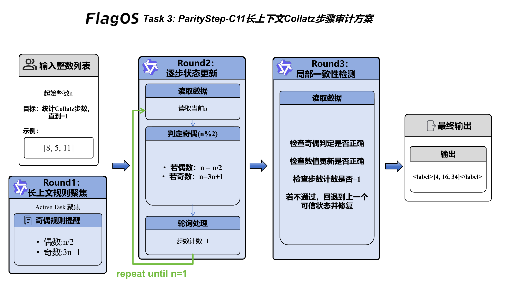
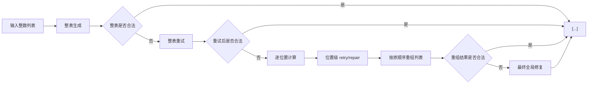

# Task 3 技术方案：ParityStep-C11

## 1. 任务目标

Task 3 要求对输入整数列表逐元素执行一次 Collatz 风格变换：

- 偶数输出 `x / 2`
- 奇数输出 `3 * x + 1`

最终结果是一个与原列表等长的新整数列表。

这个任务不需要复杂推理，但在自动标注里很容易出现三类问题：

- 某些位置算对了，某些位置算错了；
- 模型输出了公式而不是计算后的整数；
- 顺序、长度或列表格式发生漂移。

因此，我们将 Task 3 的默认方案设计为 **ParityStep-C11**：先尝试整表生成；如果失败，再切换到按位置逐项修复，把列表级错误转成一组独立的单点修复问题。

## 2. 方案概览

一句话概括：

> 能整表稳定输出时就整表输出，不能稳定时就降解为逐位置确定性修复。

方案由三层组成：

1. **整表生成层**
   - 先要求模型直接输出完整目标列表；
   - 本地检查长度、格式与每个位置的值是否正确。

2. **位置级修复层**
   - 若整表失败，对每个输入整数单独发起局部 prompt；
   - 每个位置只需要回答一个整数。

3. **列表重组层**
   - 将所有位置的局部结果重新按原顺序拼接；
   - 若仍存在异常，再进行一次全局最终修复。

这样既保留整表输出的效率，也能在需要时提供细粒度修复能力。

## 3. 系统链路

图 1 展示了 ParityStep-C11 的整体执行链路。

<p align="center">
  
  <br>
  <em>图 1：ParityStep-C11 长上下文 Collatz 步骤审计方案</em>
</p>

图中的链路先用长上下文聚焦当前任务和奇偶规则，再进入状态更新：读取当前整数、判断奇偶、选择 `x / 2` 或 `3 * x + 1`。局部一致性检测用于检查奇偶判断、数值更新和输出结构是否匹配；对于列表输入，系统把每个位置的局部结果按原顺序合并为最终 `<label>[...]</label>`。



如果要画系统框图，建议重点突出：

- `Whole-list pass`
- `Position-wise repair`
- `Reassembly`

这正是本方案与普通单轮 prompt 的区别。

## 4. 提示策略设计

### 4.1 规则极简化

Task 3 的计算规则本身非常简单，因此 prompt 也刻意保持极简：

- 保持原顺序；
- 偶数做 `/2`；
- 奇数做 `3x+1`；
- 最终输出必须是已经计算完成的整数列表。

这里刻意避免让模型输出中间公式。实践中常见的错误之一，是把结果写成：

```text
<label>[(81*3)+1, 17, 78, 274]</label>
```

这种答案虽然“看起来懂规则”，但对自动评测来说仍是无效输出。

### 4.2 位置独立性显式化

当整表生成失败时，系统会把每个元素单独拿出来处理。对应 prompt 会明确告诉模型：

- 当前只处理一个位置；
- 只输出一个整数；
- 不允许输出解释、公式或占位词。

这相当于把一个长度为 `n` 的列表问题降成 `n` 个几乎互不干扰的一元算术问题。

### 4.3 顺序保持约束

因为 Task 3 的每个位置都是独立变换，系统在重组阶段强调：

- 输出列表长度必须等于输入列表长度；
- 第 `i` 个输出必须只来自第 `i` 个输入；
- 不能交换位置。

方案不是简单地“修好几个数”，而是显式维持列表结构不变。

## 5. 长上下文输入构造思路

Task 3 的长上下文设计重点不在增加示例数量，而在提高规则密度。

### 5.1 为什么不适合大规模堆叠原始样例

对于逐元素变换类任务，大量堆叠原始示例的收益会很快下降。模型需要记住的其实只有两条规则：

- even -> half
- odd -> 3x+1

如果上下文里塞入大量不同数字样例，模型反而可能被多余数字分散注意力，甚至更容易输出公式化文本。

### 5.2 规则型长上下文更合适

更合理的组织方式是：

1. **规则摘要**
   - 强调奇偶分流；
   - 强调输出必须是已计算整数。

2. **短例子**
   - 用少量正反例展示常见错误；
   - 尤其突出“不要输出公式”和“不要改变顺序”。

3. **active task**
   - 当前输入列表置于 prompt 最末端；
   - 让模型始终聚焦当前样本。

这种结构在超长上下文条件下更容易保持一致性。

## 6. 自动多轮交互与一致性设计

ParityStep-C11 的多轮机制是围绕“整表失败后局部化修复”设计的。

### 6.1 第一轮：整表直接生成

系统先让模型一次输出完整列表，再本地检查：

- 是否是合法整数列表；
- 长度是否一致；
- 每个位置是否等于真实规则计算结果。

如果首轮就通过，则直接结束。

### 6.2 第二轮：整表重试

若整表结果错误，系统会发起一次更加收紧的 retry prompt，再次强调：

- 不要输出公式；
- 不要输出占位词；
- 只返回最终整数列表。

这样可以修复一部分纯格式性错误。

### 6.3 第三轮：逐位置修复

如果整表仍然不稳定，系统就不再相信“整表一次生成”，而是逐个元素调用局部 prompt：

- 第 1 个位置算一次；
- 第 2 个位置算一次；
- ...
- 每个位置都可单独 retry / repair。

由于每轮只处理一个整数，模型更不容易受其他位置干扰。

### 6.4 第四轮：最终全局修复

如果极少数位置修复后仍无法形成合法列表，系统会再进行一次最终全局修复 prompt，显式给出期望结构，争取把最后的格式或长度问题收束掉。

## 7. 复现实现说明

当前实现位于：

- [method_task3.py](/home/cenzihan/OpenSeek/openseek/competition/LongContext-ICL-Annotation/flagos/src/method_task3.py)
- [main_task3.py](/home/cenzihan/OpenSeek/openseek/competition/LongContext-ICL-Annotation/flagos/src/main_task3.py)

外部接口保持不变：

- `build_prompt(task_id, task_description, text2annotate)`
- `select_examples(all_examples, task_description, text2annotate)`
- `annotate_nvidia(input_prompt, task_id=3, debug=False, text2annotate=...)`

内部链路包括：

- 整表预测；
- 整表 retry；
- 逐位置 prompt / retry / repair；
- 全局最终修复。

复现方不需要改动调度接口，运行原有脚本即可。

## 8. 小结

ParityStep-C11 把列表问题做成了“可降级”的结构：

- 优先整表生成，提升效率；
- 整表不稳时逐位置修复，提升正确率；
- 保证顺序、长度和数值三者同时受控。

对于逐元素确定性标注任务，“整表优先、局部兜底”比单一 prompt 更稳定，也更容易复现。

## 9. 对评分问题的对应关系

### 9.1 在超长上下文场景下，如何设计有效的模型指令与提示策略？

本方案把核心规则压缩为极少数高权重约束：奇偶分流、保持顺序、只输出已计算整数。提示目标明确、输出自由度低，能够减少长上下文中常见的解释漂移和公式化输出问题。

### 9.2 当可用标注示例数量显著超过模型上下文容量时，如何构造信息密集、结构合理的超长上下文输入？

Task 3 中重要的是变换规则，而不是大量不同数字的样本。因此，我们更强调用规则摘要、短正反例和 active task 组织上下文，而不是堆叠低密度原始示例。这种方式可以在有限容量内保留更高的信息有效性。

### 9.3 在自动多轮对话或持续交互场景中，如何高效利用超长上下文，实现一致性与可扩展性兼顾的数据标注？

本方案采用“整表生成 - 整表重试 - 逐位置修复 - 最终重组”的多轮链路。模型在大部分样本上可以高效整表输出，而在困难样本上又能退化为一组稳定的一元子问题，因此兼顾了处理效率、结果一致性和批量扩展能力。
