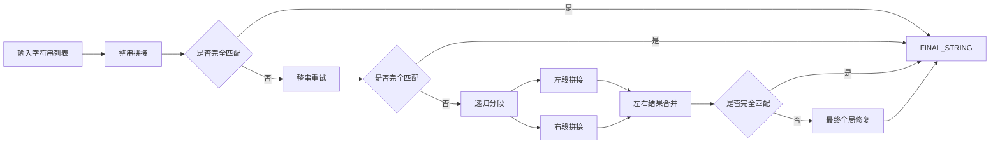

# Task 4 技术方案：StringStitch-R17

## 1. 任务目标

Task 4 要求将一个字符串列表按原顺序直接拼接，输出最终字符串。规则很直接，但在大模型自动标注中并不“天然简单”，因为模型经常会出现以下问题：

- 自动补空格、补标点或补引号；
- 把非标准片段纠正成“更像英语”的词；
- 修改大小写；
- 在长字符串上漏字符或误拼；
- 输出解释文本，而不是纯目标字符串。

因此，我们采用 **StringStitch-R17**。这套方案不要求模型“理解句子意思”，而是让它把输入严格当作原始字符片段；整串失败时，再自动切换到更短、更稳的递归分段拼接链路。

## 2. 方案概览

一句话概括：

> 整串能一次拼完就一次拼完，整串不稳时就把字符串分段拆小，再递归拼回去。

整个流程分为三层：

1. **整串拼接层**
   - 先让模型直接输出最终拼接结果；
   - 本地检查结果是否与真实字符串完全一致。

2. **递归分段层**
   - 若整串失败，则将输入列表切成更短的 segment；
   - 分别对 segment 执行局部拼接；
   - segment 仍失败时继续递归切分。

3. **最终收束层**
   - 把左右 segment 的局部结果按原顺序合并；
   - 若仍未得到完整正确字符串，再做一次全局最终修复。

难样本不再依赖一次性长输出，而是被逐层拆成更容易控制的短片段。

## 3. 系统链路

如果后续要画系统图，建议突出这三个模块：

- `Whole-string pass`
- `Recursive Segment Repair`
- `Exact Match Validation`

这基本就是该方案最适合放进图里的结构。

## 4. 提示策略设计

### 4.1 原始字符优先，而不是语言流畅性优先

Task 4 最大的风险之一，是模型会把输入当成自然语言，然后自动做“正常化”。因此 prompt 里明确强调：

- 不允许补空格；
- 不允许补分隔符；
- 不允许改大小写；
- 不允许把奇怪片段修正成正常单词；
- 单字符也必须原样复制。

这一步很重要，因为本任务评测的是字符级精确匹配，而不是语义合理性。

### 4.2 明确禁止常见错误输出

提示中专门放入了错误示例，例如：

- 给结果加引号；
- 在 token 之间插入空格；
- 输出占位词 `FINAL_STRING`。

这样可以在 prompt 里提前压制常见错误模式。

### 4.3 段级任务目标收紧

一旦进入分段修复，prompt 会进一步缩小目标：

- 当前只拼接一个 prefix 或一个短 segment；
- 输出只能是这一小段的拼接结果；
- 不允许输出解释或阶段性说明。

这相当于把长字符串复制问题拆成多个短字符串复制问题。

## 5. 长上下文输入构造思路

Task 4 也可以放很多示例，但更高效的做法仍然是规则优先。

### 5.1 为什么不适合堆很多原始字符串样例

拼接任务中，原始样例内容本身价值不高。可迁移经验主要是以下几点：

- 顺序不能变；
- 字符不能改；
- 不要插入额外内容；
- 非标准片段也必须原样保留。

如果堆入大量长字符串样例，模型反而更可能：

- 被自然语言流畅性牵引；
- 在长 prompt 中学到“补全句子”的错误倾向。

### 5.2 更适合的信息组织方式

StringStitch-R17 更适合采用以下长上下文结构：

1. **字符保真规则**
   - 原样复制；
   - 严禁空格补全、大小写修正、语义纠错。

2. **短正反例**
   - 展示“正确拼接”与“错误补空格/补引号”的差别；
   - 让模型明确什么是无效输出。

3. **active task**
   - 当前字符串列表放在末尾，靠近输出区；
   - 保证当前样本信号最强。

这一任务的长上下文重点不是放更多示例，而是让字符级规则更稳定。

## 6. 自动多轮交互与一致性设计

StringStitch-R17 的多轮链路集中体现在递归分段修复上。

### 6.1 第一轮：整串直接拼接

系统先让模型直接输出最终字符串，并检查：

- 是否成功解析标签；
- 是否和真实拼接结果完全一致。

若一次通过，则直接结束。

### 6.2 第二轮：整串重试

若首轮失败，系统发起一轮收紧版 retry prompt，再次强调：

- 不补空格；
- 不改大小写；
- 不加引号；
- 不输出占位词。

这一步通常可以修复部分纯格式性错误。

### 6.3 第三轮：递归分段修复

如果整串仍失败，系统将输入列表递归切分。核心策略是：

- 先尝试直接拼该 segment；
- 若失败，则继续把 segment 拆成左右两半；
- 左右都成功后再拼回完整字符串。

每个 segment 都更短，模型更容易保持逐字符一致。

### 6.4 第四轮：最终全局修复

当递归分段仍未完全收束时，系统会发起一个最终全局修复 prompt，以真实目标结构为约束，完成最后的统一校正。

## 7. 复现实现说明

当前实现位于：

- [method_task4.py](/home/cenzihan/OpenSeek/openseek/competition/LongContext-ICL-Annotation/flagos/src/method_task4.py)
- [main_task4.py](/home/cenzihan/OpenSeek/openseek/competition/LongContext-ICL-Annotation/flagos/src/main_task4.py)

外部接口保持不变：

- `build_prompt(task_id, task_description, text2annotate)`
- `select_examples(all_examples, task_description, text2annotate)`
- `annotate_nvidia(input_prompt, task_id=4, debug=False, text2annotate=...)`

内部实现包括：

- 整串预测与 retry；
- segment 级 prompt / retry / repair / backup；
- 递归分段合并；
- 最终全局修复。

复现方无需调整使用方式，调用原有入口即可复现完整方案。

## 8. 小结

StringStitch-R17 把“长字符串一次性复制”的高风险任务，转成“可递归拆解、逐段验证”的流程：

- 整串成功时效率高；
- 整串失败时可拆小；
- 字符级一致性始终有本地 exact-match 检查。

对于字符拼接这种对格式和细节敏感的任务，这种方法比普通 few-shot 拼接 prompt 更适合自动标注和批量复现。

## 9. 对评分问题的对应关系

### 9.1 在超长上下文场景下，如何设计有效的模型指令与提示策略？

本方案把提示重点放在字符保真而不是语言流畅性上，通过显式禁止补空格、补引号、改大小写和自动纠错来降低输出自由度。对于 Task 4 这种字符级任务，强约束比泛化解释更重要，也更适合长上下文下的稳定执行。

### 9.2 当可用标注示例数量显著超过模型上下文容量时，如何构造信息密集、结构合理的超长上下文输入？

Task 4 中高价值的信息不是大量样例文本，而是字符保真规则和典型错误模式。因此，我们更适合用规则摘要、正反例和 active task 组织上下文，而不是堆叠低密度原始样例，从而保留更高的信息密度。

### 9.3 在自动多轮对话或持续交互场景中，如何高效利用超长上下文，实现一致性与可扩展性兼顾的数据标注？

本方案采用“整串生成 - 整串重试 - 递归分段修复 - 最终收束”的多轮结构。模型在简单样本上可以直接完成输出，在困难样本上则会自动退化为多个短 segment 的局部拼接任务，因此能够兼顾效率、一致性和大规模批量处理能力。
