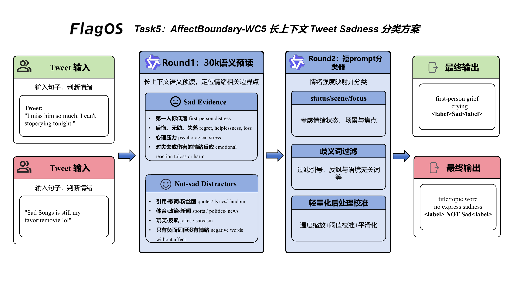

# Task 5 技术方案：AffectBoundary-WC5

## 1. 任务目标

Task 5 是 tweet sadness 二分类任务，需要判断输入 tweet 是否表达 sadness，输出 `Sad` 或 `Not sad`。相比普通情感分类，这个任务的难点不在“能不能发现负面词”，而在于：

- 很多悲伤相关词只是主题词，不代表作者真的处于悲伤状态。
- hashtags、emoji、影视/体育/政治语境会制造大量表面负面信号。
- 在长上下文自动标注场景中，模型容易把“高频词共现”误当作情绪判断依据。

因此我们采用 **AffectBoundary-WC5**，并将最终复现实现扩展为 **30k 长上下文双阶段判定链路**：第一阶段用长上下文进行语义预读与边界聚焦，第二阶段回落到经验证的短提示模板，完成最终分类。

## 2. 方案概览

本方案不做单纯的“悲伤词检测”，而是做 **情绪边界判定**：

> 模型必须判断 tweet 是否真的表达了作者可推断的 sadness，而不是仅仅出现了看起来像悲伤的词。

在工程上，我们将其拆解为两个互补层：

1. **长上下文预读层**
   - 满足约 `30k token` 输入要求。
   - 让模型先在长上下文中学习“语义主判定优先、词表线索从属”的工作方式。
   - 只输出结构化 XML 预读结果，不直接给最终标签。

2. **稳定短提示决策层**
   - 复用已验证的 `wordcloud_intensity_v5` 决策路径。
   - 保留其在 tweet sadness 边界样本上的稳定性。
   - 最终输出 `Sad / Not sad`。

这样可以同时利用长上下文和短提示能力，避免两者互相牵扯。

## 3. 系统链路

图 1 展示了 AffectBoundary-WC5 的整体流程。

<p align="center">
  
  <br>
  <em>图 1：AffectBoundary-WC5 长上下文情绪边界判定方案</em>
</p>

AffectBoundary-WC5 的主链路是两阶段：Round 1 用 30k 长上下文完成语义预读，Round 2 使用稳定短提示完成最终分类。图中的 `Sad Evidence` 和 `Not sad Distractors` 不是独立的串行模块，而是嵌入提示词的边界规则。它们先出现在 Round 1 的 `reference_appendix` 中，用来激活“语义优先、词表从属”的判断框架；随后在 Round 2 的短提示里再次压缩呈现，用于最终分类前的校准。

系统不是先跑一个 `Sad Evidence` 模块，再跑一个 `Not sad Distractors` 模块。实际流程是：模型先读 tweet，判断是否存在可归因的 sadness；如果只有标题、歌词、话题词、玩笑或公共事件描述，就会被干扰规则压回 `Not sad`。图下方的两个 case 也在说明这一点：一个样本有第一人称悲伤和哭泣行为，另一个样本只有标题/主题词，不表达作者悲伤。

对应的执行步骤如下：


## 4. 提示策略设计

### 4.1 语义优先，词表从属

AffectBoundary-WC5 要求模型先读整体语义，再看局部线索：

- 以 tweet 整体语义为主证据。
- hashtags、emoji、mentions 只能作为辅助线索。
- 单个高频词不能直接决定标签。

Task 5 的误判常来自“看见词就下结论”。例如：

- `sad / sadly / hurt / lost / dark / grim / dull`
- `#sad / #depression / #blues / #quote`
- 一些看似负面的体育、影视、歌词、政治表达

如果不先做语义归因，模型很容易把这些表面线索误分类为 `Sad`。

### 4.2 情绪强度先行，再映射二分类

方案内部先判断情绪强度，再映射到二分类标签：

- 若 tweet 不能推断出 sadness，则映射为 `Not sad`
- 若 tweet 能推断出不同程度 sadness，则统一映射为 `Sad`

模型不是直接在 `Sad / Not sad` 之间二选一，而是先判断：

> 这里是否存在可归因于说话者或语义主体的 sadness 信号？

这样能减少“只有负面话题，没有悲伤情绪”的误判。

### 4.3 场景边界显式化

提示中保留两类边界规则，分别服务于召回和误判抑制。

**Sad 高召回场景**

- 第一人称低落、无助、惊恐、后悔、失落、哭泣、哀伤
- 明确心理负担、精神压力、关系痛苦、无法承受
- mental-health 相关表达
- 对悲剧、伤害、失去的情绪化反应

**Not sad 高干扰场景**

- 影视、音乐、体育、fandom
- quote、歌词、格言、口号
- 玩笑、调侃、反讽
- 政治新闻或公共议题
- sober / drunk / lifestyle 讨论
- 客观视觉描述、日常吐槽、话题标签堆叠

这两组规则贯穿两轮提示：Round 1 中作为长上下文规则附录，Round 2 中作为短提示分类前的校准条件。它们的作用不是替代模型判断，而是让模型少受单个词的牵引。

### 4.4 输出模板稳定化

最终输出要求为：

```text
Final answer: <label>Sad</label>
```

或：

```text
Final answer: <label>Not sad</label>
```

固定输出模板便于自动解析，也能减少长批次运行中的格式漂移。

## 5. 30k 长上下文构造方法

### 5.1 为什么不直接堆叠原始示例

Task 5 的可用样本很多，但直接堆叠原始 tweet 示例会产生两个问题：

- **上下文噪声高**：tweet 本身风格碎片化、话题多样，原文堆叠会放大噪声。
- **局部相关性强、全局迁移性弱**：具体样例很多，但可迁移的往往是边界规则，而不是原句文本。

因此我们采用 **统计摘要 + 边界规则 + 结构化 active task** 的长上下文设计。

### 5.2 长上下文的组成

Round 1 的 30k 提示由三部分组成：

1. **reference_appendix**
   - 重复但稳定的情绪判定原则
   - 强调“语义主判定优先，词表只作辅助”

2. **active_task**
   - 放入当前真实任务描述与待判定 tweet
   - 明确只有 active task 具有最终权重

3. **XML 结构化输出要求**
   - 限制 Round 1 只输出简洁分析结果
   - 不允许在预读阶段直接生成最终标签解释

这种结构既满足约 `30k token` 的长上下文要求，也避免把大量无关 tweet 原文带入最终判定阶段。

### 5.3 为什么采用两轮而不是单轮 30k 直接输出

如果让模型在 30k 长提示里直接产出最终标签，容易出现两种问题：

- 输出风格漂移，开始生成过长解释
- 本来稳定的边界样本，被长上下文中的表面模式重新扰动

双阶段设计把两个任务拆开：

- **Round 1**：读长上下文，做全局任务聚焦
- **Round 2**：走稳定的短提示决策路径

长上下文承担前置分析职责，最终标签仍由短提示路径给出。

## 6. 自动多轮交互与一致性设计

外部调用接口保持不变，内部逻辑是一个轻量双轮自动流程。

### 6.1 Round 1：长上下文语义预读

第一轮要求模型输出结构化 XML，例如：

```xml
<analysis>
  <status>usable|fallback</status>
  <scene>sad|not_sad|mixed|unknown</scene>
  <focus>short hint or fallback</focus>
</analysis>
```

这一步不替代分类器，只让模型先在超长上下文中完成：

- 当前 tweet 的语义聚焦
- 情绪场景归类
- 长上下文规则激活

### 6.2 Round 2：短提示回落

第二轮直接调用已经验证过的短提示方案，尽量不对其决策路径做额外扰动。这里保留短提示，是因为分类边界已经在这一版里校准过；长上下文只负责前置聚焦，不重新接管最终分类。

这样处理后，长上下文不会把标题词、歌词、体育或政治语境中的表面负面信号继续放大，短提示也能保持原有的输出格式。

### 6.3 轻量后处理校准

除了短提示本身，方案还保留轻量后处理，用来约束最容易摇摆的边界样本：

- 对明显的心理痛苦、惊恐、负担、后悔等表达增强 `Sad` 召回
- 对影视、体育、quote、政治、玩笑等常见干扰场景抑制误判
- 对少量高频边界模式加入窄范围一致性校准

后处理不替代模型，只对高风险边界区做稳定性收束。

## 7. 复现实现说明

最终实现位于：

- [method_task5.py](/home/cenzihan/OpenSeek/openseek/competition/LongContext-ICL-Annotation/flagos/src/method_task5.py)
- [main_task5.py](/home/cenzihan/OpenSeek/openseek/competition/LongContext-ICL-Annotation/flagos/src/main_task5.py)

公开接口保持不变：

- `build_prompt(task_id, task_description, text2annotate)`
- `select_examples(all_examples, task_description, text2annotate)`
- `annotate_nvidia(input_prompt, task_id=5, debug=False, text2annotate=...)`

实现层面主要包含三项工作：

1. 提升默认上下文长度窗口，以承载约 30k token 输入。
2. 将默认方案改为“双阶段 30k 包装器”。
3. 保持第二轮短提示逻辑与已验证版本一致。

复现侧无需修改既有入口，运行原有脚本即可复现本方案。

## 8. 小结

AffectBoundary-WC5 的重点不在于“词更全”或“规则更多”，而在于对 sadness 边界做分层处理：

- 长上下文建立统一判定框架；
- 结构化预读完成任务聚焦；
- 短提示负责最终分类；
- 轻量后处理收束高风险样本。

对于 Task 5 这种高歧义、强语境依赖的情绪标注任务，“长上下文预读 + 短路径决策”比单纯扩写 prompt 或堆叠示例更适合比赛复现和稳定批量部署。

## 9. 对评分问题的对应关系

### 9.1 在超长上下文场景下，如何设计有效的模型指令与提示策略？

本方案将提示设计为“语义主判定优先、词表线索从属、输出格式固定”的三层结构。模型首先需要判断 tweet 是否真的表达了可推断的 sadness，而不是仅凭 `sad`、`dark`、`lost`、`grim`、hashtag 或 emoji 直接给标签。通过显式约束主证据与辅助证据的优先级，方案能够在超长上下文下仍保持稳定的情绪边界判断。

### 9.2 当可用标注示例数量显著超过模型上下文容量时，如何构造信息密集、结构合理的超长上下文输入？

本方案不直接堆叠大量原始 tweet，而是采用“统计摘要 + 边界规则 + active task”式的长上下文组织方式。我们将高频词共现、情绪强度映射、典型误判边界和语义优先原则压缩为稳定规则附录，并将当前 tweet 放在独立的 active task 区块中。这样构造出的 30k 上下文信息密度更高、噪声更低，也更符合情绪标注任务的结构化需求。

### 9.3 在自动多轮对话或持续交互场景中，如何高效利用超长上下文，实现一致性与可扩展性兼顾的数据标注？

本方案采用双阶段自动交互流程。第一阶段使用长上下文完成结构化预读，使模型先在统一规则框架下完成语义聚焦；第二阶段回落到已验证的短提示路径完成最终分类，并结合轻量后处理收束少数高风险边界样本。超长上下文负责提供一致的任务环境，短提示负责保持最终判定稳定，方案也因此更容易批量复现。
