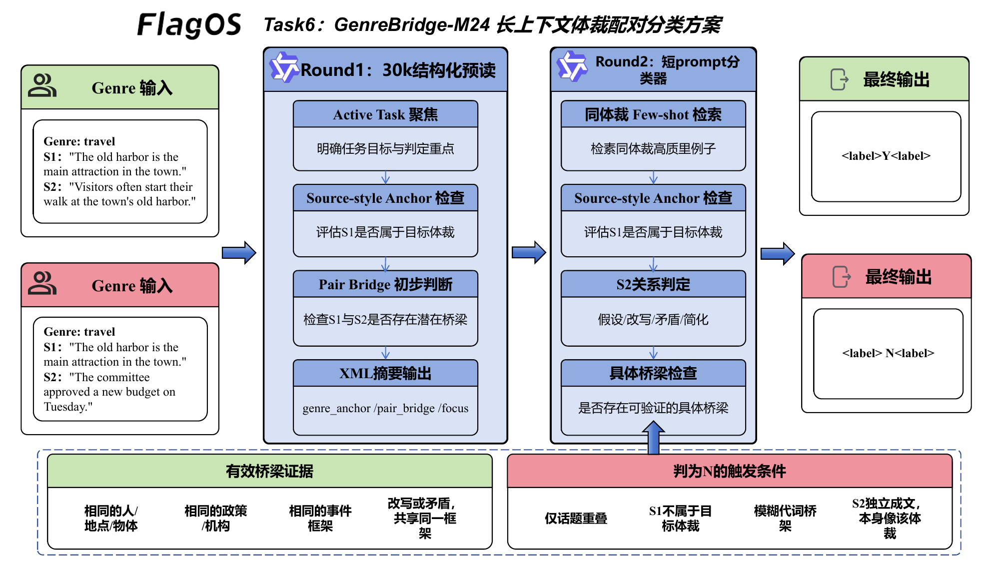
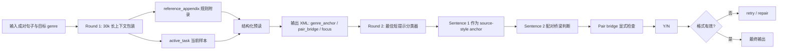

# Task 6 技术方案：GenreBridge-M24

## 1. 任务目标

Task 6 要求模型判断一对句子是否构成目标 genre 下的有效配对样本，并输出 `Y` 或 `N`。这项任务的难点不在普通话题分类，而在于它同时要求模型完成两个判断：

1. **Sentence 1 是否属于目标 genre**
2. **Sentence 2 是否是基于 Sentence 1 形成的 hypothesis / rewrite / contradiction / simplification**

因此，Task 6 不是判断“两个句子看起来像不像同一类文本”，而是一个 **source-style anchor + pair bridge** 的联合标注任务。

我们将当前默认方案命名为 **GenreBridge-M24**。其中：

- `GenreBridge` 表示方案核心是显式检查两个句子之间是否存在可解释的配对桥梁
- `M24` 表示第二阶段短提示路径最多使用 24 条高密度 few-shot 检索样例

在最终复现版本中，GenreBridge-M24 已扩展为 **30k 长上下文双阶段执行链路**：第一阶段用 30k 长上下文完成结构化预读，第二阶段回落到已验证的短路径分类器，兼顾超长上下文要求与判定稳定性。

## 2. 方案概览

一句话概括：

> 用长上下文统一激活 genre 与 pair 规则，用短提示完成稳定的最终配对判断。

整个流程被拆为两个阶段：

1. **Round 1：30k 长上下文预读**
   - 输入约 30k token 的规则型长上下文
   - 显式注入 source-style anchor 与 pair bridge 原则
   - 只输出一个简短 XML 摘要，不直接产出最终标签

2. **Round 2：短提示稳定判定**
   - 复用当前最稳的 GenreBridge 短路径
   - 动态检索最多 24 个同 genre few-shot
   - 保持原有 `S1 / S2 / Pair bridge / <label>` 结构化判定流程

第一轮满足超长上下文输入要求并完成任务聚焦，第二轮复用已验证的稳定判定链，避免让超长上下文直接扰动最终标签。

## 3. 系统链路

图 1 展示了 GenreBridge-M24 的整体流程。

<p align="center">
  
  <br>
  <em>图 1：GenreBridge-M24 长上下文体裁配对分类方案</em>
</p>

GenreBridge-M24 的主链路是两阶段：Round 1 用 30k 长上下文做结构化预读，Round 2 用短提示完成最终分类。图中的有效桥梁证据和 `N` 触发条件不是独立模块，而是嵌在提示词里的判定准则。Round 1 只负责激活“Sentence 1 anchor + Sentence 2 pair bridge”的任务框架；Round 2 才真正用这些规则判断 `S1 target genre`、`S2 valid hypothesis` 和 `Pair bridge`。



如果后续绘制系统图，这个任务最值得强调的是：

- `Sentence 1 as anchor`
- `Pair bridge`
- `30k prepass + short-path classifier`

## 4. 提示策略设计

### 4.1 Source-style anchor 优先

Prompt 明确要求：

- 先用 Sentence 1 判断 source style
- Sentence 2 不能仅凭“表面像该 genre”就获得 `Y`
- 若 Sentence 1 明显不属于目标 genre，Sentence 2 再像目标 genre 也不能强行拉成 `Y`

这一步很重要，因为该任务不是两个句子独立分类，而是判断它们是否构成目标 genre 下的成对样本。

### 4.2 Genre-specific hard rules

针对五个 genre，方案分别内置硬规则：

- **telephone**
  - spoken transcript 的 clean rewrite 仍可判为 telephone
  - vague reaction、generic pronoun、空桥梁易判 `N`

- **travel**
  - destination description、guidebook、visitor note、travel history 都可接受
  - unrelated factual sentence 不应因为看起来像 guidebook 就被判 `Y`

- **government**
  - report prose、recommendation、finding、oversight、program statement 可接受
  - 行政文体相似不等于 pair attachment

- **slate**
  - magazine commentary、media analysis、cultural-political prose 可接受
  - topic overlap 但无 concrete bridge 时判 `N`

- **fiction**
  - narration、scene action、dialogue、character-centered prose 可接受
  - unrelated story-like sentence 仍然是 `N`

这种按 genre 注入规则的方式，能让模型在长批次运行中保持更低歧义的判断标准。

### 4.3 Pair bridge 显式化

这是 GenreBridge-M24 的核心设计。

Prompt 要求模型在判 `S2 = Y` 之前，必须能说出一个 **concrete bridge**，例如：

- 相同人物
- 相同地点
- 相同机构或政策
- 相同对象
- 相同动作框架
- 同一 claim frame 的错误改写
- polarity flip 但仍保留同一语义框架

同时，prompt 明确禁止把以下情况当作 bridge：

- 只有 `it / that / them / some / thing`
- 只有 generic reaction
- 只是“像下一句”
- 只是 vaguely related topic
- 只是 independently sounds genre-like

这样能减少“模糊相似就判 `Y`”的情况，模型需要给出两个句子构成配对的结构性理由。

### 4.4 结构化输出约束

最终输出固定为：

```text
S1 target genre: Y or N
S2 valid hypothesis: Y or N
Pair bridge: concrete bridge or NONE
<label>Y or N</label>
```

这种结构化输出有两个作用：

1. 让模型显式执行一条可检查的判定链
2. 为后续 retry / repair 提供稳定中间状态

## 5. 30k 长上下文构造方法

### 5.1 为什么不直接堆叠大量样例

Task 6 的问题不在于样例数量不足，而在于：

- genre 类型多，风格差异很大
- 正负样本都可能看起来“像目标 genre”
- 大量原始样例简单堆叠会让模型学到 topic similarity，而不是 pair attachment

因此，我们没有把检索到的 few-shot 全部扩展成 30k 大样例堆，而是采用 **规则型长上下文 + 动态 short-path few-shot** 的分层设计。

### 5.2 长上下文由哪些部分组成

Round 1 的 30k 提示由三部分构成：

1. **reference_appendix**
   - 反复注入稳定的 genre / pair bridge 原则
   - 明确说明 topic overlap alone is insufficient

2. **active_task**
   - 放入当前样本的 Sentence 1、Sentence 2 和 target genre
   - 只有 active task 具有最终判定权

3. **XML 输出约束**
   - 限制第一轮只输出结构化摘要
   - 禁止在预读阶段直接给出最终 `Y/N`

这种结构让长上下文承担“统一规则环境”的职责，而不是直接承担最终分类。

### 5.3 第二阶段 few-shot 仍然保留高密度选择

第二阶段没有放弃原有最佳短路径，而是继续使用：

- same-genre filtering
- 动态相似度排序
- genre-aware 正负配比
- calibration examples
- bridge calibration examples

Task 6 的 long-context 设计不替代原 few-shot classifier，而是作为前置任务聚焦层，与高密度 short-path few-shot 形成互补。

## 6. 自动多轮交互与一致性控制

Task 6 当前实现包含一个轻量双轮加修复结构。

### 6.1 Round 1：长上下文结构化预读

第一轮输入约 30k token，上下文重点是：

- Sentence 1 as source-style anchor
- Sentence 2 requires concrete bridge
- Y 不能由文风相似单独触发

输出风格类似：

```xml
<analysis>
  <status>usable|fallback</status>
  <genre_anchor>clear|weak|unknown</genre_anchor>
  <pair_bridge>concrete|weak|none</pair_bridge>
  <focus>short hint or fallback</focus>
</analysis>
```

这一步不替代最终判定，只让模型先在超长上下文里进入正确的任务框架。

### 6.2 Round 2：稳定短路径分类

第二轮回落到原最佳短路径：

- 重建短 prompt
- 恢复同 genre few-shot
- 执行 `S1 / S2 / Pair bridge / <label>` 判定

这样可以减少超长上下文对最终分类边界的扰动。

### 6.3 Retry / repair 机制

若第二轮输出不可解析，系统仍会沿用原有轻量修复机制：

- **retry prompt**
  - 强调 source-style anchor
  - 强调 contradiction / rewrite 仍可能为 `Y`
  - 强调 vague pronoun 不能算 bridge

- **repair prompt**
  - 进一步压缩到最核心判定规则与输出格式
  - 强制回到最小稳定执行链

这对批量自动标注很有用，因为它能提高最终输出的结构稳定性。

## 7. 复现实现说明

当前实现位于：

- [method_task6.py](/home/cenzihan/OpenSeek/openseek/competition/LongContext-ICL-Annotation/flagos/src/method_task6.py)
- [main_task6.py](/home/cenzihan/OpenSeek/openseek/competition/LongContext-ICL-Annotation/flagos/src/main_task6.py)

公开接口保持不变：

- `build_prompt(task_id, task_description, text2annotate)`
- `select_examples(all_examples, task_description, text2annotate)`
- `annotate_nvidia(input_prompt, task_id=6, debug=False, text2annotate=...)`

实现层面当前已经完成：

1. 默认输入长度窗口提升到足以容纳 30k 输入
2. `build_prompt` 改为 30k 双阶段包装器
3. `select_examples` 负责缓存 short-path few-shot，不再把这些 few-shot 填进第一轮长上下文
4. `annotate_nvidia` 在第一轮做长上下文预读，第二轮回落到原稳定判定链

## 8. 对评分问题的对应关系

### 8.1 在超长上下文场景下，如何设计有效的模型指令与提示策略？

GenreBridge-M24 将提示压缩成两个核心问题：Sentence 1 是否是目标 genre 的 source-style anchor，以及 Sentence 2 是否与其存在 concrete pair bridge。通过这种低歧义提示设计，模型在超长上下文下不会被 topic similarity 牵着走，而是被迫执行结构化配对判断。

### 8.2 当可用标注示例数量显著超过模型上下文容量时，如何构造信息密集、结构合理的超长上下文输入？

本方案不把 few-shot 原文机械堆满长上下文，而是将长上下文专门用于规则注入，把 few-shot 保留在第二阶段短路径中。第一轮长上下文承担统一规则环境职责，第二轮 few-shot 继续承担样例校准职责，从而实现高密度信息组织，而不是低效率堆叠。

### 8.3 在自动多轮对话或持续交互场景中，如何兼顾一致性与可扩展性？

本方案采用“长上下文预读 + 短路径分类 + retry/repair”的模块化链路。第一轮用于规则聚焦，第二轮用于稳定输出，失败时再进入轻量修复。由于 genre hints、bridge calibration 和 few-shot 检索都是模块化组件，后续无论扩展 genre、增强 bridge rules，还是继续扩充错误样例，都不需要重写整套执行框架。

## 9. 小结

GenreBridge-M24 的重点不在于把 prompt 做得更长，而在于把不同长度层次的上下文放到合适的位置：

- 用 30k 长上下文统一激活 source-style 与 pair bridge 原则
- 用高密度 few-shot 短路径保持最终分类稳定
- 用结构化输出和 repair 机制确保批量复现一致性

对于 Task 6 这种“genre 分类 + 配对一致性”混合任务，双阶段设计比单纯堆叠样例或单轮长提示更适合比赛复现和规模化部署。
