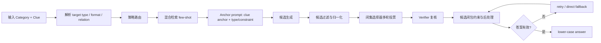

# Task 7 技术方案：AnchorCandidate-R4

## 1. 任务目标

Task 7 是 Jeopardy answer generation：输入一个 category 和 clue，输出对应的答案文本。它和前几个分类任务不一样，答案空间是开放的。模型不仅要知道事实，还要读懂 Jeopardy 的问法。

这类样本容易错在几个地方：

- category 暗含答案类型，模型却只看 clue 中最显眼的实体。
- clue 提到一个人、作品或地点，但真正要问的是作者、城市、组织、角色或上位类别。
- before & after、homophone、one word only、n-letter words 等 category 带有格式约束。
- 模型输出解释、候选列表、`what is` 前缀或过长短语，导致最终标签不可用。

因此，Task 7 不能只做“知识问答”。我们采用 **AnchorCandidate-R4**：先抓 clue anchor 与目标类型，再生成少量候选，最后用闭集选择和本地归一化收束到一个可提交答案。

## 2. 方案概览

一句话概括：

> 先确定题目到底问什么，再让模型在少量可信候选里做选择。

系统分为四层：

1. **目标解析层**
   - 从 category 和 clue 中抽取 target type、format constraint、relation pattern。
   - 粗分为 person、place、work/title、organization、wordplay、historical term 等策略类。

2. **检索校准层**
   - 对训练样例建立轻量索引。
   - 按 category、目标类型、关系模式、格式约束和 clue token overlap 排序。
   - 默认只取少量高相关样例，避免检索块淹没当前 clue。

3. **候选生成与闭集选择层**
   - 第一轮让模型输出固定数量候选，而不是直接给最终答案。
   - 后续选择器只能从候选列表中选编号，不能改写答案。
   - 多个候选排列重复选择，形成轻量投票。

4. **归一化与兜底层**
   - 去掉 `who is / what is`、多余标点和解释文本。
   - 处理冠词、同义表面形式、候选前后缀等问题。
   - 若仍无答案，进入最多 4 轮 retry，最后使用直接标签式兜底。

## 3. 系统链路

图 1 展示了 AnchorCandidate-R4 的整体执行链路。

<p align="center">
  
  <br>
  <em>图 1：AnchorCandidate-R4 长上下文 Jeopardy 答案生成方案</em>
</p>

图中的链路把开放式答案生成压缩成“问法聚焦、检索候选、闭集选择”三段。Round 1 先读取 category 与 clue，锁定 clue anchor、target type 和 format constraint；Round 2 检索同类高密度样例，并生成少量候选；Round 3 通过多轮投票和 verifier 校验 category、anchor 与答案类型。最终只输出归一化后的 `<label>`，不保留解释文本。



这条链路的核心不是让模型写更长的推理，而是减少开放生成的自由度。候选生成可以发散一点，选择阶段必须收敛。

## 4. 提示策略设计

### 4.1 clue anchor 优先

Prompt 要求输出两行短中间状态：

```text
clue anchor: 2 to 8 words
type/constraint: 2 to 8 words
Final answer: <label>lower-case answer</label>
```

`clue anchor` 用来锁定题目中的关键事实；`type/constraint` 用来提醒模型答案类型和粒度。例如 clue 里出现人物名，不代表答案一定是人物；category 也可能要求作品名、地点名或词形变化。

### 4.2 category 作为硬约束

Task 7 的 category 经常不是装饰信息。方案会显式检查：

- 是否要求 person、place、title、organization 或 word/phrase。
- 是否有 before & after、homophone、one word only、n-letter words 等格式。
- 是否需要保留冠词 `a / an / the`。
- 是否应返回完整人名，而不是 surname-only。

这一步专门处理 Jeopardy 里的“问法陷阱”：clue 里提到的实体，常常只是提示，不一定是答案。

### 4.3 候选生成后再选择

直接开放生成容易出现两类问题：答案本身可能对，但包了太多解释；或者模型在一个模糊答案上反复自圆其说。AnchorCandidate-R4 改成先生成 3 个候选，再让选择器只返回编号。

选择器 prompt 明确要求：

- 只能从候选列表中选。
- 不解释，不改写答案。
- 重新检查 category、target type、clue anchor 和 final consistency。
- 若检索样例与当前 clue 冲突，以当前 clue 为准。

多轮选择时会改变候选顺序，减少固定位置偏好。Verifier 的选择会给候选投更高权重，最终再用本地评分函数选出最稳的答案。

## 5. 检索与候选约束

Task 7 的检索不是简单文本相似度。每个样例会被解析成结构化索引，包括：

- category signature
- target type
- expected kind
- relation pattern
- format constraint
- wordplay 标记
- clue token / rare token overlap

排序时优先匹配答案类型和题目结构，再看词面重叠。这样可以减少一种常见误检索：两个 clue 共享几个词，但一个问人物，一个问地点。

候选生成后还会经过过滤：

- 删除 meta answer、解释句、候选编号残留。
- 删除过长短语、纯 clue fragment、不可提交文本。
- 对 person/place/title 等候选做表面形式检查。
- 在候选闭包中对齐冠词、省略词和常见别名。

这部分是本方案的工程重点。开放问答任务很难完全依赖模型一次生成，必须把输出表面形态管住。

## 6. 自动多轮交互与一致性控制

当前实现包含多轮自动交互：

1. **Candidate pass**
   - 生成固定数量候选。
   - 如果候选为空，进入 compact candidate retry。

2. **Selector passes**
   - 对候选做多种排列。
   - 每次只让模型返回候选编号。
   - 汇总 selector votes。

3. **Verifier pass**
   - 在候选列表上做一次更强的闭集复核。
   - Verifier 命中的候选获得更高权重。

4. **Retry / fallback**
   - 如果没有可用答案，最多重试 4 次。
   - 最后一轮可使用直接 `<label>` 兜底。

5. **Postprocess**
   - 统一小写。
   - 去掉 `what is / who is`。
   - 修正常见冠词、候选对齐和表面形式问题。

这套结构让模型负责知识召回和候选提出，让程序负责收束、过滤和一致性。

## 7. 复现实现说明

当前实现位于：

- [method_task7.py](/home/cenzihan/OpenSeek/openseek/competition/LongContext-ICL-Annotation/flagos/src/method_task7.py)
- [main_task7.py](/home/cenzihan/OpenSeek/openseek/competition/LongContext-ICL-Annotation/flagos/src/main_task7.py)

默认方案：

```text
baseline_v3_target_hybrid_fs4_2048_retry4
```

关键组件包括：

- `classify_strategy_class_nvidia`：规则型策略路由。
- `select_examples`：结构化检索与 route summary 构造。
- `build_prompt`：anchor reasoning prompt。
- `annotate_nvidia`：候选生成、选择器投票、verifier、retry 和后处理。
- `normalize_prediction` / `apply_variant_postprocess`：答案表面形式归一化。

公开运行入口：

```bash
python flagos/src/main_task7.py --task_id 7
```

## 8. 对评分问题的对应关系

### 8.1 如何设计有效的模型指令与提示策略？

Task 7 的提示先要求模型写出 clue anchor 和 type/constraint，再输出最终答案。这样做不是为了增加推理字数，而是让模型先确认答案类型和问法粒度。候选选择阶段进一步把开放生成改成闭集选择，降低格式漂移。

### 8.2 当可用标注示例数量显著超过模型上下文容量时，如何构造信息密集、结构合理的输入？

本方案没有盲目堆叠样例，而是先为样例建立结构化索引。检索时优先看 target type、format constraint、relation pattern 和 category signature，再看 clue 词面重叠。少量高相关样例比大段松散样例更有用。

### 8.3 在自动多轮对话或持续交互场景中，如何兼顾一致性与可扩展性？

系统把多轮交互拆成候选生成、闭集选择、verifier 和 retry。每一轮的输出空间都比自由问答更小。新增策略类、格式规则或后处理规则时，也只需要扩展路由、检索打分或候选过滤，不必重写整条链路。

## 9. 小结

AnchorCandidate-R4 的思路很朴素：Jeopardy 题先读懂问法，再回答事实。模型负责找可能答案，程序负责限制答案形态和选择范围。对于 Task 7 这种开放答案任务，这比单轮长推理更稳，也更容易在批量标注中复现。
