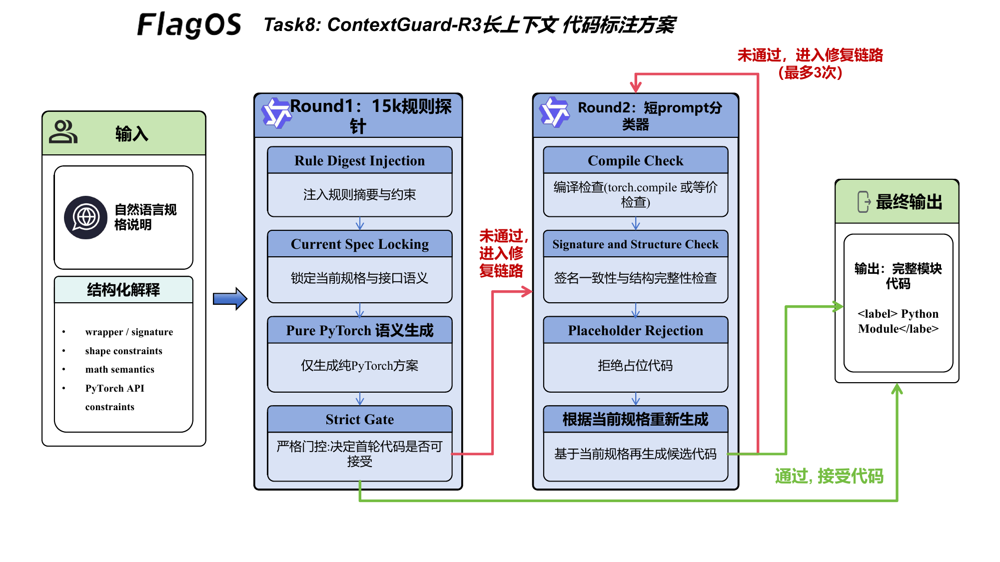
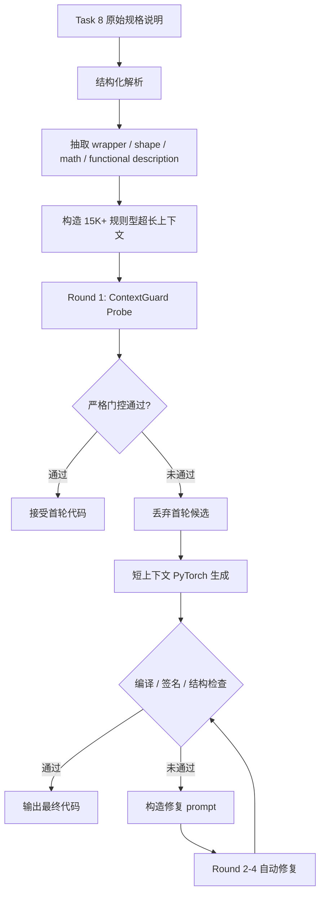

# Task 8 技术方案：ContextGuard-R3

## 1. 方案概述

Task 8 的目标是根据自然语言规格说明生成可执行的 Python / PyTorch 代码。与分类式标注不同，本任务的输出不仅要格式正确，还要满足函数签名、参数默认值、张量语义、返回结构、`out=` 行为、训练 / 推理开关、广播规则、线性代数 API 等约束。因此，我们将 Task 8 建模为“结构化代码标注”问题：最终标签不是短文本类别，而是一段完整、可执行、可复现的 Python 模块。

正式方案名为 **ContextGuard-R3**。方案围绕三个目标设计：

1. 在超长上下文条件下，用稳定、低歧义的指令结构约束模型输出。
2. 当可用示例数量超过上下文容量时，将示例经验压缩为高密度规则上下文，而不是直接堆叠原始样例。
3. 在自动多轮交互中，通过“严格首轮探针 + 短链路修复”的方式兼顾超长上下文合规性、输出一致性和工程可复现性。

方案入口已经迁移到：

```text
flagos/src/main_task8.py
flagos/src/method_task8.py
```

默认方案名：

```text
ContextGuard-R3
```

## 2. 核心链路

ContextGuard-R3 将一次标注拆成两个阶段：第一阶段使用 15K+ tokens 的超长上下文进行规则注入和稳定性探测；第二阶段在严格门控后进入短上下文精修链路，最多执行 3 轮生成 / 修复。

图 1 展示了 ContextGuard-R3 的整体流程。

<p align="center">
  
  <br>
  <em>图 1：ContextGuard-R3 长上下文代码生成方案</em>
</p>



这条链路的重点在于：超长上下文不是简单“塞满样例”，而是作为稳定的规则底座；代码生成仍围绕当前样本的结构化规格展开。这样可以降低无关内容对模型注意力的干扰。

## 3. 超长上下文下的指令与提示策略

Task 8 的提示策略遵循“强约束、低自由度、可检查”的原则。我们不让模型自由解释需求，而是在 prompt 中明确规定输出必须满足以下约束：

- 输出必须是完整 Python 模块，并放在 `<label>` 与 `</label>` 中。
- 第一行必须从 `import torch` 开始。
- 允许使用 `torch.*`、`torch.nn.functional as F`、`torch.linalg.*`、`torch.special.*`。
- 不允许引入 Triton、CUDA kernel、伪造 kernel launch 或占位代码。
- 必须保留 wrapper 的函数名、参数顺序、默认值、keyword-only marker 和返回语义。
- 必须保留 `out=`、`inplace`、`dim/keepdim`、`dtype/device`、`training`、`reduction`、`eps`、`alpha/beta`、广播和 tuple return 等 PyTorch API 细节。

Prompt 的重点是把模型从“生成代码”引导到“复刻 PyTorch 语义”。对于 Task 8 来说，很多错误并不是语法错误，而是轻微偏离 API 语义，例如：

- `out.copy_` 方向写反；
- `torch.std` 返回了 variance；
- `F.batch_norm` 参数位置错误；
- `torch.linalg.svd` 被写成非法函数名；
- `dropout` 忽略 `training`；
- 线性代数分解中矩阵乘法方向错误。

因此，ContextGuard-R3 在 prompt 中反复强调 API contract，而不是鼓励模型写复杂内核。这个策略能提升可复现性，也更适合统一硬件环境下的 Qwen3-4B。

## 4. 超长上下文输入构造

当可用标注示例超过模型上下文容量时，直接拼接全部原始样例会带来两个问题：

1. 信息冗余高：大量样例只是在重复“函数签名 + 输出代码”的表层模式。
2. 干扰风险高：不同算子族之间的实现细节可能相互污染，例如 pooling、linalg、indexing、normalization、fft 等任务的 API 语义差异很大。

因此，我们采用 **规则型长上下文压缩**。具体做法是将历史样例中可稳定复用的经验抽象成规则 digest，再填充到 15K+ token 的上下文中，使模型在长上下文条件下接收到一致、低冲突、可执行的行为约束。

长上下文内容包含：

- 纯 PyTorch 优先策略；
- wrapper 签名锁定策略；
- `out=` / `inplace` / dtype / device / broadcasting 等 API 细节；
- 禁止 Triton / CUDA / placeholder；
- 当前任务才是唯一需要求解的任务；
- 当前样本的 locked wrapper 信息。

这种构造方式相当于把大量样例压缩成一份“稳定规则记忆”。它不依赖隐藏答案，也不会把过多无关样例直接暴露给模型，因此在满足超长上下文要求的同时保留了当前样本的主导地位。

## 5. 自动多轮交互与一致性控制

ContextGuard-R3 的多轮交互采用“首轮强上下文，后续强修复”的结构。

第一轮是 15K+ 超长上下文探针：

- 构造规则型长上下文；
- 注入当前 Task8 规格；
- 要求模型直接输出纯 PyTorch 模块；
- 本地执行严格门控。

首轮候选只有在同时满足以下条件时才会被接受：

- 可提取完整代码；
- Python 编译通过；
- wrapper 名称与当前任务匹配；
- 模块结构完整；
- 不包含 `pass`、`TODO`、`...` 等占位内容；
- 不引入 Triton / CUDA；
- 本地综合分数达到阈值。

如果首轮未通过，系统会丢弃该候选，不让它进入后续 best candidate。随后进入短上下文 R3 修复链路：

- Round 2：基于当前规格重新生成纯 PyTorch 实现；
- Round 3-4：根据编译错误、结构错误或占位代码问题构造修复 prompt；
- 优先保留可编译候选；
- 一旦通过结构检查即输出。

这种设计避免了一个常见问题：长上下文首轮输出如果质量不稳定，后续修复会被错误候选牵引。我们通过“未通过即重启”，让长上下文承担合规与稳定引导职责，让短上下文承担精确实现职责。

## 6. 复现方式

默认运行方式：

```bash
python flagos/src/main_task8.py --task_id 8
```

`ContextGuard-R3` 已作为 Task 8 默认方法内置在 `method_task8.py` 中，保持原始脚本接口不变。

默认模型服务地址：

```text
http://127.0.0.1:2026/v1/completions
```

也可以通过环境变量调整：

```bash
export FLAGOS_MODEL_URL=http://127.0.0.1:2026
```

## 7. 实验与消融观察

在内部 20 样本快速复现实验中，我们比较了三类长上下文策略：

| 方案 | 核心思路 | 观察 |
| --- | --- | --- |
| 原始长上下文样例堆叠 | 填入大量训练样例摘要 | 上下文变长后容易分散注意力，质量下降 |
| 规则型 15K 上下文 | 不放答案，只放规则 digest | 调用率较好，但 mismatch 风险上升 |
| ContextGuard-R3 | 15K 规则探针 + 严格门控 + 短链路 R3 修复 | 在满足 15K 上下文要求的同时保持与最佳短链路相当的稳定性 |

这组观察说明：Task 8 的重点不是盲目增加上下文长度，而是控制长上下文的信息密度、冲突程度和后续交互策略。ContextGuard-R3 将长上下文从“答案记忆库”转成“规则稳定器”，再用多轮修复保证输出质量。

## 8. 对评分问题的对应关系

### 8.1 如何设计有效的模型指令与提示策略？

我们使用强格式约束、wrapper 锁定、纯 PyTorch 语义复刻、占位代码禁止、API contract 明确化等方式降低生成自由度。Prompt 不追求复杂实现，而是优先确保代码可编译、可调用、语义接近 PyTorch 标准行为。

### 8.2 如何构造信息密集、结构合理的超长上下文输入？

我们将大量样例经验压缩为规则 digest，并重复注入稳定、低冲突的 API 语义约束。该上下文不包含隐藏答案，也不依赖单个样例匹配，而是面向算子族共性建立长上下文规则环境。

### 8.3 如何在自动多轮对话中兼顾一致性与可扩展性？

我们将长上下文限制在首轮探针阶段，并使用严格门控决定是否接受。未通过时重启到短上下文生成，避免错误候选污染后续修复。后续 R3 修复链路只携带当前规格和上一轮问题摘要，因此更稳定，也更容易扩展到更多样本。

## 9. 小结

ContextGuard-R3 的重点是把超长上下文用于“稳定规则注入”，而不是追求更多样例堆叠。通过结构化规格抽取、15K+ 规则上下文、严格门控和短上下文多轮修复，方案在满足赛事超长上下文要求的同时，保留了 Task 8 代码标注所需的可执行性、一致性和复现友好性。
